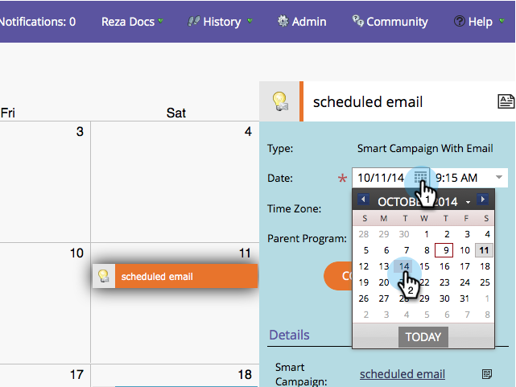

# Release Notes: October 2014 {#release-notes-october}

Check your Marketo edition for feature availability. Documentation will come at time of release.

### What's in this article? {#whats-in-this-article}

[What's in this article?](#)  
[Program Focus in Marketing Calendar](#program-focus-in-marketing-calendar)  
[New ReST API Calls](#new-rest-api-calls)  
[MSI - Send Marketo Email for Microsoft Dynamics](#msi-send-marketo-email-for-microsoft-dynamics)  
[MSI - Add to Marketo Campaigns for Microsoft Dynamics](#msi-add-to-marketo-campaigns-for-microsoft-dynamics)  
[Custom Entity Support for Microsoft Dynamics Sync](#custom-entity-support-for-microsoft-dynamics-sync)  
[Shareholder Support for Microsoft Dynamics Sync](#shareholder-support-for-microsoft-dynamics-sync)  
[RTP - Dashboard Enhancements](#rtp-dashboard-enhancements)  
[RTP - New Mobile Templates for Campaigns](#rtp-new-mobile-templates-for-campaigns)  
[RTP - User Context API](#rtp-user-context-api)

#### Program Focus in Marketing Calendar {#program-focus-in-marketing-calendar}

[Create and edit entries](../../product-docs/core-marketo-concepts/marketing-calendar/understanding-the-calendar/understand-enable-program-focus.md) directly from the marketing calendar.

#### New ReST API Calls {#new-rest-api-calls}

Use the API to pull new activities or changes to leads:

* Get Lead Changes
* Get Lead Activities
* Get Activity Types
* Get Paging Token

Full details will be available after the release at [developers.marketo.com](http://developers.marketo.com/documentation/rest/).

#### MSI - Send Marketo Email for Microsoft Dynamics {#msi-send-marketo-email-for-microsoft-dynamics}

[Send and track sales emails](../../product-docs/marketo-sales-insight/msi-for-microsoft-dynamics/setting-up-and-using/send-a-marketo-sales-email-from-microsoft-dynamics.md) to leads and contacts from Microsoft Dynamics.

#### MSI - Add to Marketo Campaigns for Microsoft Dynamics {#msi-add-to-marketo-campaigns-for-microsoft-dynamics}

[Add leads and contacts to Marketo smart campaigns](../../product-docs/marketo-sales-insight/msi-for-microsoft-dynamics/setting-up-and-using/add-a-lead-contact-to-a-marketo-campaign-from-microsoft-dynamics.md) directly from within Microsoft Dynamics. Marketing can choose which Marketo campaigns are available to sales.

#### Custom Entity Support for Microsoft Dynamics Sync {#custom-entity-support-for-microsoft-dynamics-sync}

[Use custom object data](../../product-docs/crm-sync/microsoft-dynamics-sync/microsoft-dynamics-sync-details/microsoft-dynamics-sync-custom-entity-sync/enable-sync-for-a-custom-entity.md) from Microsoft Dynamics for filtering and triggering in smart lists, smart campaigns, programs...

#### Shareholder Support for Microsoft Dynamics Sync {#shareholder-support-for-microsoft-dynamics-sync}

Sync down opportunity shareholder data from Dynamics. Also supported are opportunities connected to an account using the "Primary Account" field as well as opportunities connected to contact using the "Primary Contact" sync.

#### RTP - Dashboard Enhancements {#rtp-dashboard-enhancements}

The dashboard is now enhanced to include more at-a-glance data:

* Total organization visits
* Top 5 performing industries
* Total engaged visitors

#### RTP - New Mobile Templates for Campaigns {#rtp-new-mobile-templates-for-campaigns}

Quickly and easily [create mobile campaigns](../../product-docs/web-personalization/using-templates/using-templates-to-create-web-campaigns.md) with these new templates.

#### RTP - User Context API {#rtp-user-context-api}

Use a new call that tracks visitor's past visit history. Personalize campaigns based on the visitor's:

* Past pages viewed
* Products interested in
* What RTP campaigns they have seen

Visit [developers.marketo.com](http://developers.marketo.com/documentation/websites/rtp-js-api/) for full details.

