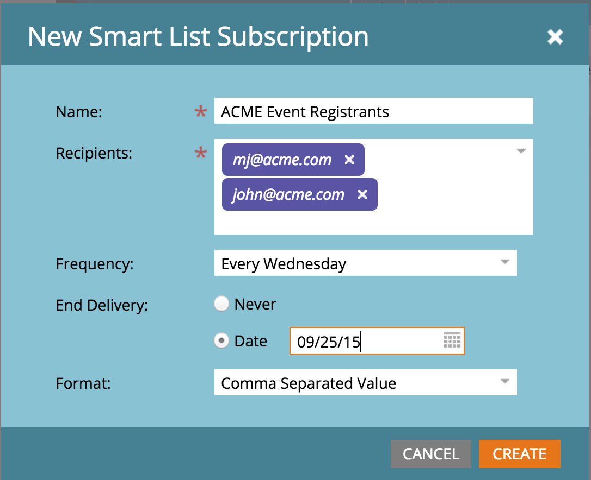
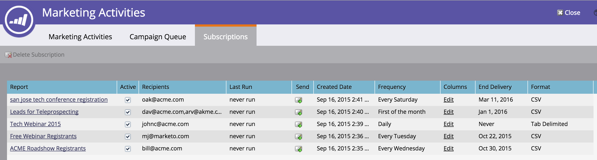
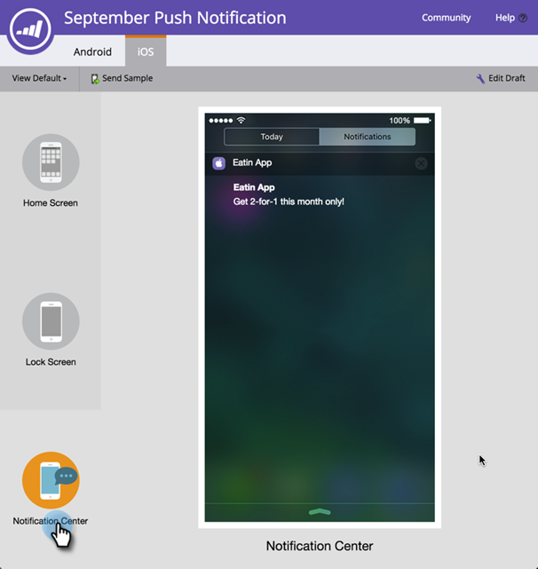
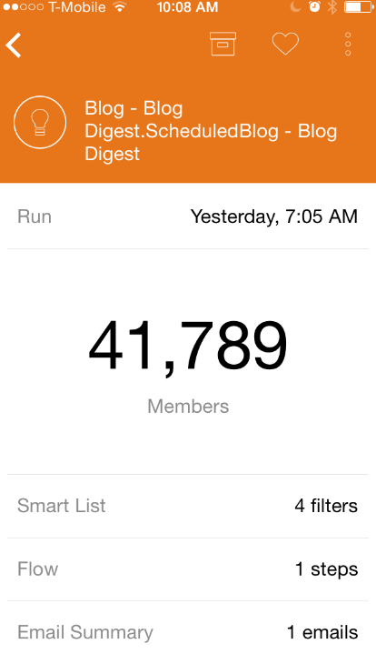
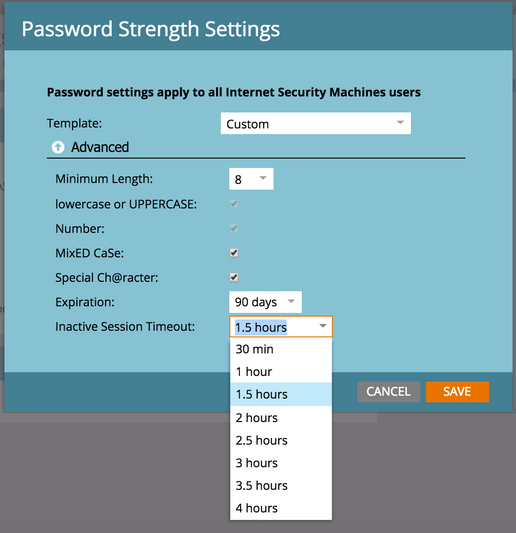

# Release Notes: Fall 2015 {#release-notes-fall}

The following features are included in the Fall '15 release. Please check your Marketo Edition for feature availability.

## Subscribe to a Smart List {#subscribe-to-a-smart-list}

[Subscribe to a Smart List](../../product-docs/reporting/basic-reporting/report-subscriptions/subscribe-to-a-smart-list.md)

Subscribe to Smart List allows marketers to export a smart list and email it to the stakeholders that are not using Marketo, for example, Sales or Telemarketing teams.

Export can be scheduled daily, weekly or monthly, can have end delivery date and can be customized to share limited number of columns.



Multiple subscriptions can be created on a smart list. There is limitation of 100 subscriptions with 100K leads per subscription, across workspaces, per Marketo instance.



## Marketo Custom Objects {#marketo-custom-objects}

[Marketo Custom Objects](http://docs.marketo.com/display/docs/marketo+custom+objects)

Easily create custom objects from the admin UI. We currently support the ability to create a 1:N custom object in Marketo and connect it to a lead or company. 

>[!NOTE]
>
>Marketo Custom Objects are not available for Spark.


## Marketo Insights for Google Chrome {#marketo-insights-for-google-chrome}

[Marketo Insights for Google Chrome](../../product-docs/marketo-sales-insight/msi-chrome-plugin/using-marketo-insights-for-google-chrome.md)

We’re excited to announce the release of an update to our Google Mail Sales Insight extension! View it in the  [Chrome Store](https://nation.marketo.com/external-link.jspa?url=https://chrome.google.com/webstore/detail/marketo-insights-for-goog/jjkfbhajlmoeegbjgjipliamplidmbjb).

This update includes many new features and functionality:

* Prior to engaging, salespeople can see relevant information about their prospects directly within Google Mail, including job titles, twitter profiles, company information, photos, and more.
* Salespeople can see in real-time what content prospects are engaging with across channels, such as emails opened or clicked, online or in-person events attended, web pages visited, eBooks downloaded and much more.
* Emails sent through Google Mail are logged in Marketo and tracked in real-time. This lets salespeople see when prospects are looking at their emails so they can follow-up at just the right time. Marketo Sales Insight for Google Mail also makes it easy for salespeople to leverage templates created by marketing in order to send beautiful invites, offers, and other types of content.


## Marketo Mobile Engagement - Tokens, Send Sample, and Preview {#marketo-mobile-engagement-tokens-send-sample-preview}

* [Tokens](../../product-docs/mobile-marketing/push-notifications/configure-mobile-push-notification.md)
* [Send Sample](../../product-docs/mobile-marketing/push-notifications/send-a-push-notification-sample.md)
* [Preview](../../product-docs/mobile-marketing/push-notifications/preview-a-push-notification.md)

Easily personalize push notifications with [tokens](https://docs.marketo.com/pages/viewpage.action?pageId=7512454).


You can also [preview](../../product-docs/mobile-marketing/push-notifications/preview-a-push-notification.md) or send out a [sample](../../product-docs/mobile-marketing/push-notifications/send-a-push-notification-sample.md) push notification before you deploy it to customers.




## Smart Campaigns in Moments {#smart-campaigns-in-moments}

[Smart Campaigns in Moments](../../product-docs/core-marketo-concepts/mobile-apps/marketo-moments/understanding-moments/understanding-smart-campaign-cards.md)

Stats on Emails sent through Smart Campaigns are now available in Moments. Other features in this upgrade include:

* Swipe-to-Done. Have too many cards in your stream? You can now swipe them away!
* Send a sample straight from the preview screen
* Smart List details added to Email Program cards
* Added support for the Aborted status for Email Programs



## RTP - Content Analytics and Recommendations {#rtp-content-analytics-and-recommendations}

[Content Analytics](../../product-docs/web-personalization/understanding-web-personalization/understanding-content-analytics.md) and Recommendations

RTP Content Analytics shows you the performance of your web content assets from regular web visits and also visits generated from RTP’s content recommendation engine.

* See which content is performing best and brings in the most leads
* Boost your content consumption by enabling content in RTP’s predictive content engine to automatically recommend the best content to the right visitors
* Drill down on each content asset to see more in-depth metrics, graphs, and performance

RTP’s Assets page is now split into Content Analytics and Content Recommendations.

* **Content Analytics:** Shows the views and direct leads of all discovered and defined web content, helping you analyze your best performing content
* **Content Recommendations**: Shows impressions and clicks from RTP’s recommended content and associated lead attribution. You can also edit and enable content recommendations from this page for the [bar](https://docs.marketo.com/display/DOCS/Enabling+the+Content+Recommendation+Engine) and [rich media](https://docs.marketo.com/display/DOCS/Enabling+the+Rich+Media+Recommendation+Engine) recommendations.

* All direct lead data in these two pages has been retrospectively updated since the start of the year (Jan 1, 2015).

## RTP - Clone an RTP Campaign {#rtp-clone-an-rtp-campaign}

[RTP - Clone an RTP Campaign](../../product-docs/web-personalization/working-with-web-campaigns/clone-a-web-campaign.md)

Cloning an RTP campaign makes it quicker and more efficient to create more personalized web campaigns. Use the clone feature in RTP’s campaign page to copy the campaign settings and change the content for split testing optimization, or clone a campaign with the same content and target it towards a different segment. Create campaigns in seconds!


## Rich Text Editor Improvements {#rich-text-editor-improvements}

We are making several improvements to the rich text editor. After we released the updated editor in July, we received great feedback and were able to work these changes into this upgrade. There’s much more to come over the next several months. Here’s a list of what’s new in Q4:

* VML is now supported within your HTML code:  

  ```
  <v:background xmlns:v="urn:schemas-microsoft-com:vml" fill="t">
  ```

  ```
  <v:fill type="tile" src="<a href="http://i.imgur.com/YJOX1PC.png" rel="nofollow">http://i.imgur.com/YJOX1PC.png</a>" color="#7bceeb"/>
  ```

  ```
  </v:background>
  ```

* Anything can now be inserted in a valid HTML comment (certain syntaxes like seen below were previously stripped):  

  ```
  <!--[if gte mso 9]> 
  ```

  ```
  <![endif]-->
  ```

* Do not pad empty table cells with `**`

* Maximize/minimize button added to the HTML source editor
* Pre-existing table properties are now identified and displayed in the Table Properties dialog
* Both rows of buttons are now shown by default.
* The editor will now accept any element (even deprecated or non-standard elements):  

  ```
  <myCustomElement>Hello World!</myCustomElement>
  ```

* The editor will now accept any attribute (even deprecated or non-standard attributes):  

  ```
  <myCustomElement myCustomAttribute="foo">Hello World!</myCustomElement>
  ```

  ```
  <td background="someImage.png"> 
  ```

## Microsoft Dynamics - Validate Sync {#microsoft-dynamics-validate-sync}

[Microsoft Dynamics - Validate Sync](../../product-docs/crm-sync/microsoft-dynamics-sync/sync-setup/validate-microsoft-dynamics-sync.md)

This new admin tool runs a series of checks to see if your sync configurations have been set up correctly.


## Add Fields to CRM Custom Object Sync {#add-fields-to-crm-custom-object-sync}

Easily add new fields to custom objects synced from Salesforce and Dynamics. You now can add new fields to your custom object sync without disabling and enabling your entire custom object.

## Changes to Security Features {#changes-to-security-features}

* Password attempts are limited to 5. After the fifth attempt the user will be locked.
* The inactive session timeout is now configurable for the subscription.



## IE 11 Support (and deprecating support for IE 9) {#ie-support-and-deprecating-support-for-ie}

We now officially support the Microsoft Internet Explorer 11 browser and are removing support for the Microsoft Internet Explorer 9 browser.

## Lightning UI support for MSI {#lightning-ui-support-for-msi}

The latest MSI package on app exchange works with both Lightning and Legacy versions of the Salesforce UI.

## New Dynamics Plug-in {#new-dynamics-plug-in}

This new plug-in runs various actions in an asynchronous mode to help increase performance.

## Search by URL of Landing Page in Design Studio {#search-by-url-of-landing-page-in-design-studio}

In the Design Studio Landing page grid, you can now search by page URL to find your landing pages. This is also exportable. 
