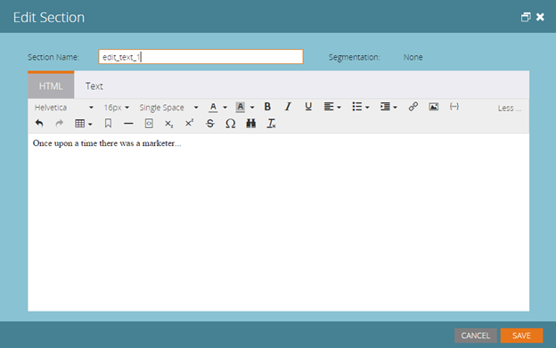
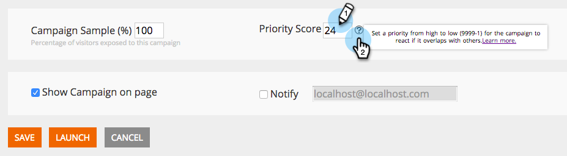

# Release Notes: July 2015 {#release-notes-july}

## Marketo Moments {#marketo-moments}

Out at lunch but need to reschedule an email? The Marketo Moments app, available from The App Store or Google Play, gives you the power to see how your email and event campaigns are performing in real time, as well as what’s coming in the future, from your iPhone, iPad or Android phone.

## Rich Text Editor Update {#rich-text-editor-update}

Updated text editor with modern look and feel, including streamlined text formatting, image editing, link insertion, and HTML editing. The HTML editor now features minimal validation, allowing for less restrictive code editing.
`<iframe width="420" height="315" src="https://www.youtube.com/embed/LmmBN6IQrII" frameborder="0" allowfullscreen></iframe>` This update will automatically roll out within a few days of the July release. Afterwards, you’ll be able to toggle between the New and Legacy versions of the editor from **Admin > Email > Edit Editor Settings**. If you notice issues with the new version of the text editor, we want to know! Please send a brief description to [`[email protected]`](http://docs.marketo.com/cdn-cgi/l/email-protection#d0bab3bfbfa0b5a2bdb1be90bdb1a2bbb5a4bffeb3bfbd).

Updated link and image dialogs.

Toggle the text editor version.

## Email Deliverability Single Sign On {#email-deliverability-single-sign-on}

When you click the email deliverability tile, you no longer need to provide your login credentials.

## Campaign Prioritization {#campaign-prioritization}

Have you set up several personalized RTP campaigns and noticed that some of them may overlap with others? Go ahead and set a priority for which campaigns’ RTP should show over others.

## Company API {#company-api}

**Company object access via the REST API**: The REST API now provides access to the Marketo Company (a.k.a. Account) object. That means you can read, update and delete company objects you created in Marketo and associate leads with such companies using the updated Lead API.

Learn [more](http://developers.marketo.com/documentation/company-api/) in our reference guide for the Company API.

## Access Email Deliverability {#access-email-deliverability}

**Access Email Deliverability Tool: **This new permission allows admins to grant users access to the Email Deliverability tool.
