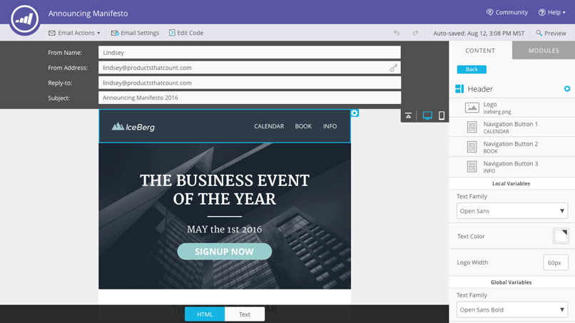
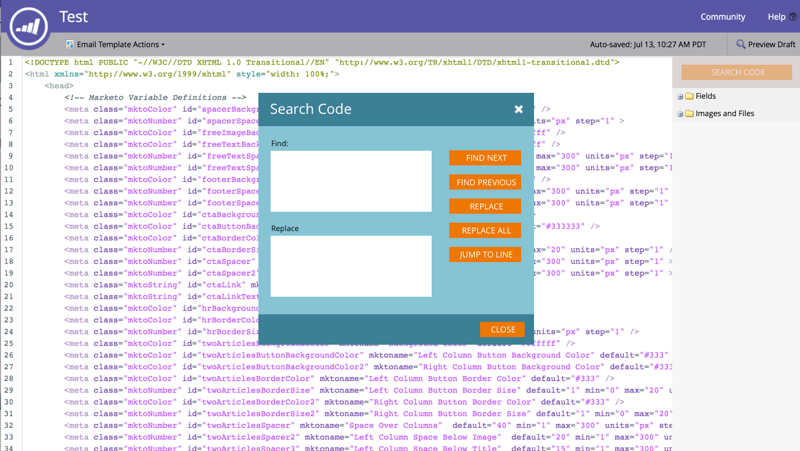
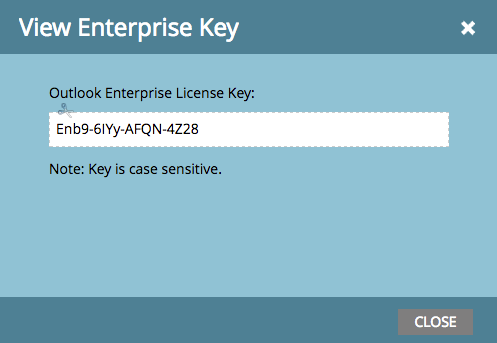

# Release Notes: Summer '16 {#release-notes-summer}

The following features are included in the Summer '16 release. Check your Marketo edition for feature availability. Please click the title links to view detailed articles for each feature.

## [Account Based Marketing](http://docs.marketo.com/display/docs/account+based+marketing) {#account-based-marketing}

Marketo Account Based Marketing provides all of the essentials in one unified platform:

* **Target** - Account Discovery, Lead-to-Account Matching, and Named Account Lists
* **Engage** - Account-based Personalization, Cross-channel engagement, and Account-specific Workflows
* **Measure** - Account and List-level Insights, Account Engagement Score, and Pipeline & Revenue Impact &nbsp;

>[!NOTE]
>
>ABM is available as an add-on to your Marketo subscription, so please contact your sales rep to have it implemented.

## [Audit Trail](http://docs.marketo.com/display/docs/audit+trail) {#audit-trail}

Audit trail provides a comprehensive history of the changes made within your Marketo subscription. It will create accountability among users and admins, help identify the cause of unexpected behavior, and provide the security of knowing who's doing what and when. This information will be available at any point in time and can be used to answer questions such as:

* What happened to this asset or setting, and who last updated it?
* What's user X been up to?
* Who's logging into our account?

## [Marketo-Vibes SMS LaunchPoint Integration](http://docs.marketo.com/display/docs/vibes+sms+messages) {#marketo-vibes-sms-launchpoint-integration}

Easily create SMS messages right within Marketo. Personalize and target your message using your rich Marketo data, and easily monitor its performance using the SMS message dashboard.

>[!NOTE]
>
>This feature requires that you have an existing Vibes SMS account.

  

## [Email 2.0 Enhancements](http://docs.marketo.com/display/docs/assets/email-editor-v2.0-overview) {#email-enhancements}

**Module-level Variables**

Previously, all variables specified in Email 2.0 Templates were “global” in scope. When using variables within modules, this isn't always desirable if you plan to use multiple instances of the module. With this release, variables can now be specified as “module level,” which allows you to indicate that the user should be able to set unique values for each module they're used in.

**Syntax Updates**

* You can now use “mktoAddByDefault” on modules specified in Email 2.0 Templates in order to indicate which modules should be displayed in new emails by default. This is much more convenient if you are building an email template with large numbers of modules.
* On image elements, you can now specify if the underlying  HTML element’s “height” and “width” properties should be locked down or editable to the end-user. mktoLockImgSize=“true” will cause height/width to be locked (even if the image is changed). Similarly, mktoLockImgStyle=“true” will cause the “style” property to be locked.

**Code Searching**

Use new search functionality to efficiently find and replace content within your email’s code. This functionality is also available in the Email Template editor.

**Token Support in Image Elements**

Tokens can now be used in the “External URL” area of the insert image experience! If you’ve specified images with {{my.tokens}}, you can now reference these tokens within Email Editor 2.0. Note that the image will still appear broken in the Email Editor 2.0 canvas. But, you will see them rendered within Preview and Send Sample before sending out your email.

## [Multiple Branding Domains](http://docs.marketo.com/display/docs/add+multiple+branding+domains) {#multiple-branding-domains}

Gone are the days where email tracking links could only be branded with a single branding domain. You can now add multiple branding domains to inspire consumer confidence, create a more streamlined look to focus on brand, improve email deliverability, and choose, on a per email basis, which branding domain to use for each email’s tracking links.

## [Program Tokens](../../product-docs/demand-generation/landing-pages/personalizing-landing-pages/tokens-overview.md) {#program-tokens}

We've created a new token type for programs. You now can render Program Name, Description, and ID in assets and smart campaign flow steps.

## [Enterprise Key](../../product-docs/marketo-sales-insight/msi-outlook-plugin/authorize-the-marketo-outlook-plugin.md) {#enterprise-key}

Requiring each person on your sales team to install our Sales Insight Plugin for Outlook can be tedious. We have introduced a new way to install the plugin for Outlook remotely using an enterprise key. Send your IT team your unique key found in the Marketo Sales Insight section of Admin and let them do the rest.

## [Web Personalization Campaigns](../../product-docs/web-personalization/working-with-web-campaigns/create-a-new-dialog-web-campaign.md) {#web-personalization-campaigns}

Specify a time delay for web campaigns to react on your website.

## [Content Analytics and Recommendations Export](../../product-docs/web-personalization/understanding-web-personalization/understanding-content-analytics.md) {#content-analytics-and-recommendations-export}

View content analytics and recommendations data offline.

## [API Support for Email Editor 2.0](http://developers.marketo.com/documentation/asset-api/) {#api-support-for-email-editor}

Pre-existing Asset APIs, previously only compatible with v1.0 emails and templates, are now enabled for v2.0 email assets.

## [Marketo Developers Site](http://developers.marketo.com/) {#marketo-developers-site}

New and improved!

## [Privacy Settings](../../product-docs/administration/settings/understanding-privacy-settings.md) {#privacy-settings}

Marketers can use privacy settings to decide whether or not to track visitors using Munchkin and Web Personalization features. Tracking level is controlled by using the browser’s Do Not Track setting, an opt-out cookie, or a non-specific IP. These methods might affect Marketo’s value and functionality in specific areas, but if the marketer doesn’t change anything, Marketo functionality remains the same.

This feature will be released to customers gradually over a period of six weeks. If you need it right away, please contact Marketo Support. 
