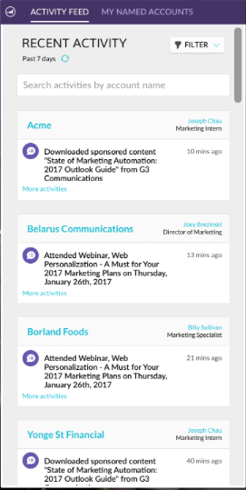
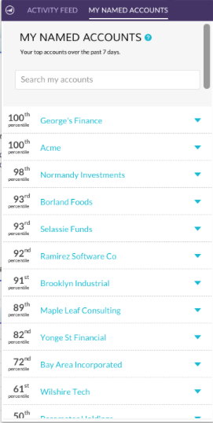
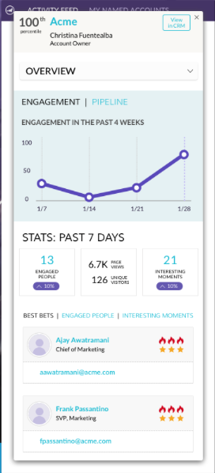

# Release Notes: August '17 ABM Enhancements {#release-notes-august-abm-enhancements}

The following features are included in the August '17 ABM enhancement release. Check your Marketo edition for feature availability.

Please click the title links to view detailed articles for each feature.

## [Account Insight](../../product-docs/account-based-marketing/setup-abm/account-insight-plug-in-overview.md)  
{#account-insight}

Account Insight is a Google Chrome plug-in that surfaces actionable ABM and account insights to your sales teams, enabling them to work closely with marketing to engage accounts effectively. Sales teams will get visibility into the data and insights generated for each of the Named Accounts they own. This will include account score percentiles, a prioritized list of their Named Accounts, engaged people within those accounts, and a live activity stream of recent activities from the account.

 

## [Dynamic Account Lists](../../product-docs/account-based-marketing/target/account-lists.md) {#dynamic-account-lists}

We are adding a new way to create account lists in ABM. In addition to existing account lists, you can now create dynamic account lists that are generated from public CRM Account Views. A CRM Account View is a set of rules that acts as a filter when displaying accounts. For example, you can use it to find accounts where Industry is Healthcare *and* Revenue is over $100M.

  

