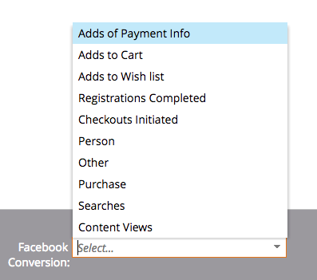

# Release Notes: Summer '17 {#release-notes-summer}

Release Notes: Summer '17 - Marketo Docs - Product Documentation

The following features are included in the Summer '17 release. Check your Marketo edition for feature availability.

Please click the title links to view detailed articles for each feature. Note: Some of the features included in this release do not have associated articles. If a topic has multiple subheadings, the links are placed there.

### What's in this article? {#whats-in-this-article}

[Additional Facebook Offline Conversion Stages](#additional-facebook-offline-conversion-stages)  
[Lock Sales Insight Template](#lock-sales-insight-template)  
[ABM Enhancements](#abm-enhancements)  
[Web Personalization Enhancements](#web-personalization-enhancements)  
[ContentAI](#contentai)  
[Analytics](#analytics)  
[Federated Identity Configuration Support](#federated-identity-configuration-support)

#### [Additional Facebook Offline Conversion Stages](https://docs.marketo.com/x/kbSt) {#additional-facebook-offline-conversion-stages}

Choose up to 7 additional offline conversion stages to map to your Marketo lifecycle stages (beyond the 3 available today). Optimize your Facebook ad spend based on conversions across your customer journey to achieve better ROI.

#### [Lock Sales Insight Template](https://docs.marketo.com/x/OhPG) {#lock-sales-insight-template}

Ensure consistency of message and content by preventing edits to your sales templates. This helps standardize templates and maintain professional communications.

#### ABM Enhancements {#abm-enhancements}

**Data Source for Japanese Company Lookup**

Match people to Japanese company names in the local language.

** [ABM and LeanData Integration](https://docs.marketo.com/x/pKmt)**

LeanData integration now allows for lead-to-account matching in Marketo. Keep marketing and sales aligned by having the same leads associated with accounts within the sales and marketing systems of record. More flexible options give Marketing and Sales Operations more control over lead-to-account matching rules, so they can achieve their desired level of precision.

#### Web Personalization Enhancements {#web-personalization-enhancements}

** [Campaign Preview Enhancements](https://docs.marketo.com/x/fQGa)**

Marketing practitioners can now ensure their web campaigns will look great across any device *before* launching them. With these enhancements, see how your web campaigns will render across desktop, mobile devices, and tablets. The new plug-in for Chrome also offers more consistent and accurate previews.

** [Widget Campaign Enhancements](https://docs.marketo.com/x/KgNI)**

New options for Widget Campaigns are now available, including:

* Triggering campaigns (delay, scroll)
* Displaying campaigns (any position around the screen)
* Change expand/minimize arrow to any CTA text

#### Content`AI` {#contentai}

** [Content`AI `Analytics and Suggestions](https://docs.marketo.com/x/1BPG)**

Increase return on your content marketing with deeper analytics and AI-powered content suggestions to elevate engagement.** **Powerful analytics show how recommended content is performing, including popular, trending, and audience-based views. You'll also see suggestions for additional content to include.

#### Analytics {#analytics}

**Email Insights Enhancements**

Get even more from your Email Insights experience with new ways to prepare and share data. You can now download your Email Insights results into Microsoft Excel and PowerPoint to work with the data outside of Marketo.

#### [Federated Identity Configuration Support](https://docs.marketo.com/x/XhzG) {#federated-identity-configuration-support}

Keep authentication (Active Directory) behind your firewall on-premises while continuing to use Microsoft Dynamics CRM in the cloud.
