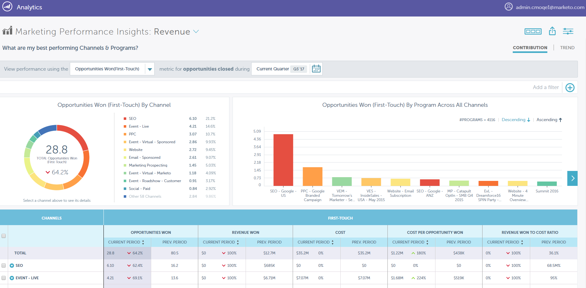

# Release Notes: Winter '18 {#release-notes-winter}

The following features are included in the Winter '18 release. Check your Marketo edition for feature availability.

Please click the title links to view detailed articles for each feature. **Note**: Some of the features included in this release do not have associated articles. If a topic has multiple subheadings, the links are placed there.

## Campaign Performance and Throughput Enhancements {#campaign-performance-and-throughput-enhancements}

Marketo is leveraging our big data architecture to increase trigger campaign throughput and improve web activity processing, so you can react to your audience's actions faster.

## Enhancements to Marketo’s Salesforce CRM Integration {#enhancements-to-marketo-s-salesforce-crm-integration}

We have two enhancements to our Salesforce CRM Integration:

* [Marketo Admin notifications](../../product-docs/core-marketo-concepts/miscellaneous/understanding-notifications/notification-types.md) for certain CRM sync failures (credentials expired, API limits reached, etc.)

* [Ability to turn off email notifications](../../product-docs/crm-sync/salesforce-sync/setup/optional-steps/turn-off-email-notifications-to-lead-owner.md) to Lead Owners upon lead assignment

These improvements will roll out over 2018.

## [Marketo Performance Insights](../../product-docs/reporting/performance-insights/performance-insights-overview.md) {#marketo-performance-insights}

>[!NOTE]
>
>**Availability**
>
>Performance Insights is an add-on product. Please contact your Marketo Customer Success Manager or Account Executive for a quote.

Explore how your campaigns and channels are impacting business results with attribution analytics, interactive visualizations, and a detailed data table.   

## Account Based Marketing Enhancements {#account-based-marketing-enhancements}

** [ABM Hierarchies](../../product-docs/account-based-marketing/target/named-accounts/abm-hierarchies.md)**

For ABM customers with Salesforce or Microsoft Dynamics, ABM will now automatically inherit (and display) the parent-child relationships established in the CRM. You'll be able to use these relationships in both roll-up reporting and campaign execution.

## Email Marketing {#email-marketing}

** [Dynamic Email Script](../../product-docs/email-marketing/general/using-tokens/create-an-email-script-token.md)**

Velocity scripting is now supported in emails using dynamic content. Combine velocity and segmentation-based dynamic content to create highly personalized emails.

**Recipient Time Zone**

* ** [Monthly Nurture Cadence](../../product-docs/email-marketing/email-programs/email-program-actions/scheduling-with-recipient-time-zone/schedule-email-programs-with-recipient-time-zone.md)**:** **We've added the ability to schedule nurture programs on a monthly cadence.

* ** [Stop Delivery](../../product-docs/email-marketing/email-programs/email-program-actions/scheduling-with-recipient-time-zone/abort-delivery-of-email-programs-scheduled-with-recipient-time-zone.md)**: You can now stop any remaining sends mid-run.

## Ad Network Integrations {#ad-network-integrations}

** [Google Customer Match Integration](../../product-docs/demand-generation/ad-network-integrations/add-google-customer-match-as-a-launchpoint-service.md)**

With this integration, you can send a Marketo audience to Google to be targeted using Google AdWords, as well as re-target audiences across YouTube, Search, and Gmail.

** [LinkedIn Matched Audiences API Enhancement](../../product-docs/demand-generation/ad-network-integrations/add-linkedin-matched-audiences-as-a-launchpoint-service.md)**

Our new LinkedIn API now enables you to re-target people in your Marketo database across multiple LinkedIn Campaign Manager accounts.

## Web Personalization {#web-personalization}

**Japanese Data Source for Web Personalization**

Marketo is adding an additional Japanese data source for Web Personalization to improve web visitor identification (reverse IP lookup) and personalization for visitors coming in from Japan. Organization names will be displayed in Japanese.

** [Create a Web Segment Using Static Lists](../../product-docs/web-personalization/using-web-segments/create-a-segment-using-a-static-list.md)**

Web Personalization can now personalize content to a known web visitor who's part of a static list defined in Marketing Activities (MLM). With this enhancement, you can now market to static lists across channels and target people on these lists with personalized content on your website.

## Content`AI` {#contentai}

**Predictive Algorithm Improvement**

Content recommended via Marketo's optimized Content`AI `algorithms generate up to twice as many clicks as random content.

## Integration {#integration}

** [Activate/Deactivate Campaign API](http://developers.marketo.com/rest-api/assets/campaigns/)**

This new API allows you to remotely activate and deactivate trigger campaigns, so you can now create fully automated program templates. Create a program template once, then automate cloning, marketing collateral updates, and now activation/scheduling of smart campaigns.

## ToutApp {#toutapp}

**Unsubscribe Update**

Beginning March 1, 2018, all emails sent from [ToutApp.com](http://ToutApp.com) (and by using the “Email with Tout” button in Salesforce) will have an unsubscribe link appended to the bottom.

**Live Feed Update**

We’ve updated the look and feel of the Engagement and Task tabs to make it easier and faster for Sales members to respond to their customers’ activities directly from the Live Feed.

**People Detail View Update**

The improved People Detail View (PDV) offers a comprehensive view of your contacts by bringing together your Tout and Salesforce CRM contact details.
