# Dynamic Chat Release Notes {#dynamic-chat-release}

Adobe Dynamic Chat releases operate on a continuous delivery model which allows for a more scalable approach to feature deployment. Sometimes there are multiple releases in a month, so please check back regularly for the most up-to-date information.

The standard Release Notes page for Marketo Engage [can be found here](/help/marketo/release-notes/current.md){target="_blank"}.

## April 2024 Release {#april-release}

**Release date: April 22, 2024**

### Conversational Flows now available for all users {#conversational-flows-available-to-all-users}

Make your forms and Landing Pages more conversational and shorten the sales funnel by allowing qualified leads to book a meeting or chat with Sales immediately after a form submission with Conversational Forms, now fully available&#42; for all Dynamic Chat users.

_&#42;Previously available as a trial feature with 100 lifetime engagements. Conversational Flow engagements will now count toward the monthly limit of 250 engaged conversations for users on the Select package._

### Callback functions {#callback-functions}

Callback functions allow you to collect Dynamic Chat analytics events in external systems, like Adobe Analytics or Google Analytics, as visitors engage with Dynamic Chat conversations. You enable Dynamic Chat analytics events by registering a callback with the API to listen to the events. This allows you to have a more holistic view of your Dynamic Chat engagement as it relates to other key data, such as web traffic. 

### Live agent availability conditions added to conditional branching {#live-agent-availability-conditional-branching}

In addition to native and custom Marketo Engage fields, you can now use conditional branching to create branches based on agent availability. This is useful if you only want to offer visitors the option to speak with a live agent when there are live agents available.  

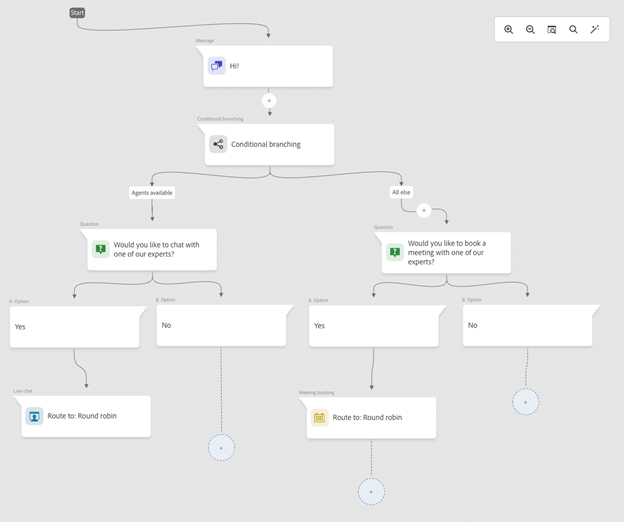

### Smart List condition added to conditional branching {#smart-list-condition}

With the addition of the new Marketo Engage Smart List condition in conditional branching, you can create branches based on pre-existing audiences you've already created in Marketo Engage rather than defining audience branching conditions in Dynamic Chat. 

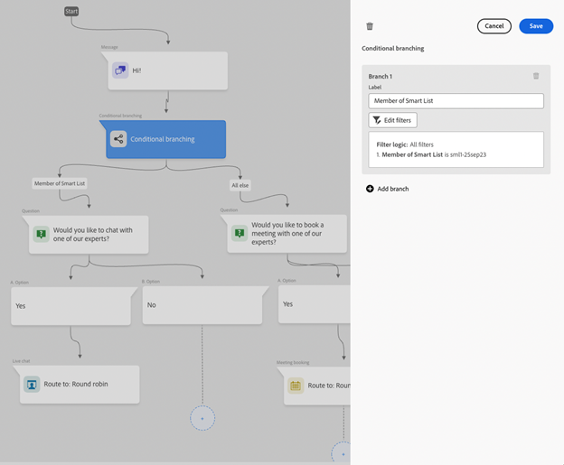

### Conditional branching for Conversational Flows {#conditional-branching-for-conversational-flows} 

We released conditional branching for Dialogues earlier this year, and now you can take advantage of conditional branching in Conversational Flows as well! Conditional branching allows you to create branches in your flow based on different conditions.  

### Live chat for Conversational Flows {#live-chat-for-conversational-flows}

We released live chat functionality for Dialogues in 2023, and now you can add live chat engagements to your Conversational Flows as well. If you're using Conversational Flows with your Marketo Engage forms, you can now allow qualified visitors to chat with a live agent immediately after form submission! 

### Recent Marketo Engage activities in Agent Inbox {#recent-marketo-engage-activities-in-agent-inbox}

We've added recent Marketo Engage activities to the Recent Activities section of the Agent Inbox, so when a site visitor requests to chat with an agent, the agent can quickly see whether the visitor engaged in any of the following Marketo Engage activities recently (last 25 activities): 

* Opened email 
* Visited webpage 
* Filled out form 
* Had interesting moment 

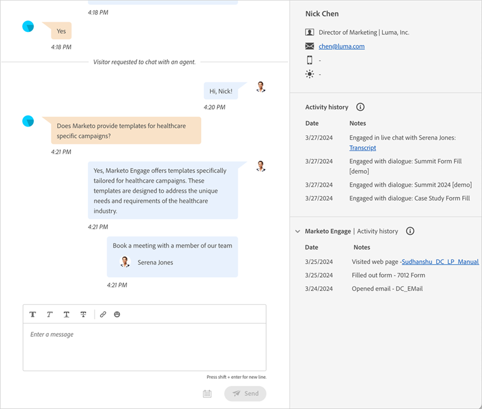

### Calendar connection status in Agent Management {#calendar-connection-status-in-agent-management} 

Admins can now easily see which agents with meeting booking permissions have connected their calendars in Dynamic Chat. This allows you to ensure your entire sales team is connected and ready to accept meeting requests from Dynamic Chat.  

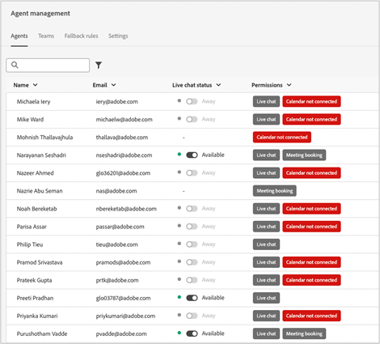

### Minimum notice setting in agent calendar configuration {#minimum-notice-setting-in-agent-calendar-configuration}

Users reported that web visitors were booking meetings on their calendar with as little as 10 minutes of advanced notice, so we introduced a minimum notice setting in the agent calendar configuration and set the default lead time to 24 hours.  

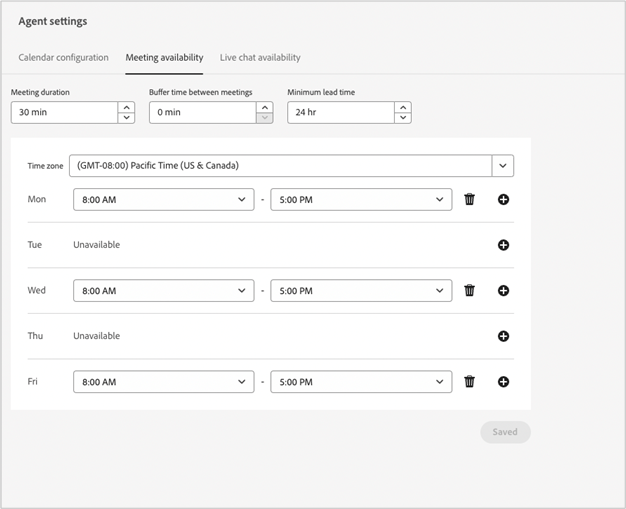

### Add/remove user behavior updated {#add-remove-user-behavior-updated}

Some users indicated they were having issues with adding and removing agents in Dynamic chat, so we made some changes to address these issues.

When a user is added to Admin Console with live chat or meeting booking permission, they'll immediately show up in the Agent Management list and be available to add to Dialogues, Conversational Flows, routing rules, and teams. 

When a user with meeting booking or live chat permissions is removed from Admin Console, they'll be immediately removed from Dynamic Chat, will no longer be available for live chat or meeting routing, and will no longer count against license limits.

### Improved conversation level report performance {#improved-conversation-level-report-performance} 

Individual Dialogue and Conversational flow level reports are now more performant and accurate. Previously, Dialogue reports could take several seconds to load and the data was occasionally inconsistent with global performance reports. Now, your individual Dialogue reports load in an instant and the data will always be aligned with global reporting data.

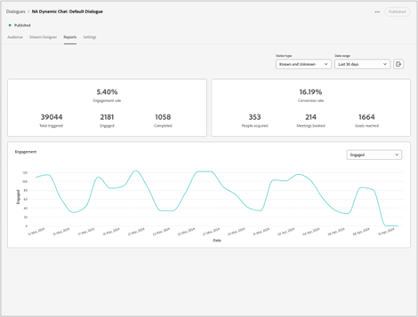 

### Permission updates {#permission-updates}

We cleaned up the permission structure and naming in Adobe Admin Console to make permission management more intuitive. 

* 'Conversation Management' category is now called 'Conversations' 
* 'Meetings' category is now called 'Activities' 
* 'Agent Settings' category is now called 'Agents' 
* 'Admin Settings' category is now called 'Configuration' 
* 'Live Chat' category was removed and all live chat permissions were moved to the Agents category 

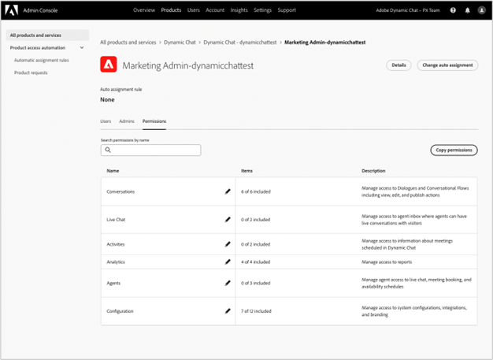

### Support for hyperlinks in Agent Inbox {#support-for-hyperlinks-in-agent-inbox}

Now, when live chat agents share URLs with visitors in the chat, those URLs will be hyperlinked so visitors can simply click on them to navigate to the page, rather than having to copy and paste the URL into their browser. 

### Enter key behavior updated in Agent Inbox {#enter-key-behavior-updated-in-agent-inbox}

We switched the return key behavior in Agent Inbox, so pressing the Return or Enter key will send your message and pressing Shift+Enter will create a line break.  

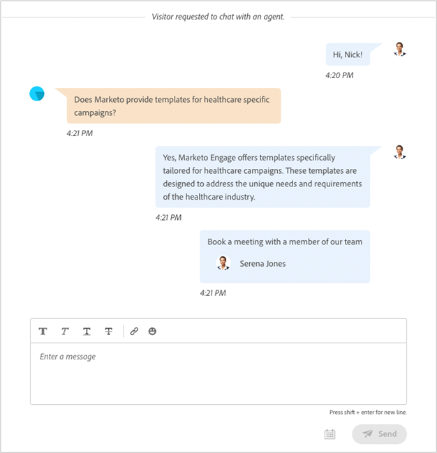

### Round robin page removed {#round-robin-page-removed}

Don't worry! Round robin routing is still fully functional and operates the same way it always has. We just removed the page that showed an often inaccurate list of agents and their order in the round robin routing queue. 

When we released Dynamic Chat in 2022, there was no support for live chat, only meeting booking, and the round robin routing page was designed with just meeting booking in mind. With the introduction of live chat last year, the round robin page became obsolete as it did not accurately reflect the more complex nature of round robin routing between agents with both meeting booking and live chat permissions. We explored a few different options to address this, but ultimately decided that removing it altogether was the best option for minimizing confusion.

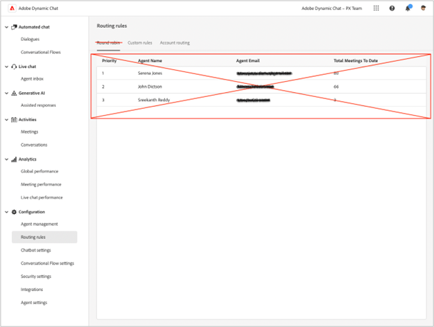

## February 2024 Release {#february-release}

**Release date: February 22, 2024**

### Conversations page {#conversations-page}

The new Conversations page provides you with a one-stop shop to view transcripts for all conversations (automated and live) that occurred for your instance, from both known and anonymous leads, providing you with better visibility into how your customers are engaging with your Dialogues, Conversational Flows, and live agents. 

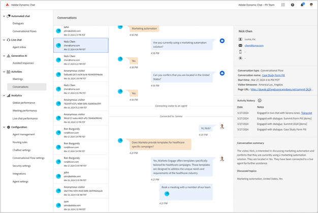

### Date range in global dashboard increased from 90 days to 24 months {#date-range-in-global-dashboard}

You asked and we delivered. You can now see Dynamic Chat engagement data for up to two years in all analytics dashboards.

### Conditional branching in Dialogues {#conditional-branching-in-dialogues}

Conditional branching allows you create branches in your Dialogue flows based on different conditions. Now, you can present different content to different people in the same Dialogue based off of lead and company attributes in Marketo Engage. 

## January 2024 Release {#january-release} 

**Release date: January 24, 2024** 

### Concurrent live chat limit setting in agent management {#Concurrent-live-chat-limit-setting}

By default, each live chat agent in your instance can engage in a maximum of 5 live chat sessions at a time. We introduced a new setting in agent management that allows you to adjust this limit from 1 to 10. 

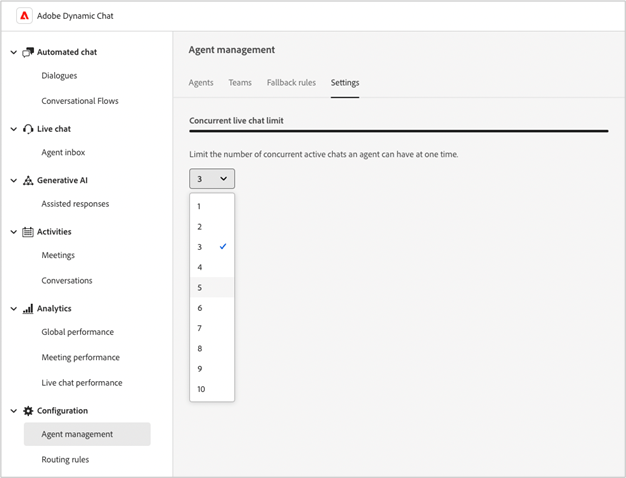
