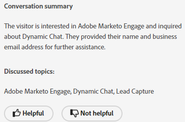

# Dynamic Chat Release Notes {#dynamic-chat-release}

Adobe Dynamic Chat releases operate on a continuous delivery model which allows for a more scalable approach to feature deployment. Sometimes there are multiple releases in a month, so please check back regularly for the most up-to-date information.

The standard Release Notes page for Marketo Engage [can be found here](/help/marketo/release-notes/current.md){target="_blank"}.

## June 2025 Release {#june-2025-release}

**Release date: June 30, 2025**

### Routing Logic Revamp {#routing-logic-revamp}

We've revamped the live chat routing logic in Dynamic Chat to ensure more intelligent and predictable engagement behavior across all routing types (Account, Custom, Team, and Round Robin). The new logic simplifies routing flows and improves fallback handling when agents are unavailable. 
 
#### Key Improvements in Routing Behavior

* **Up to two engagement attempts per session**

  * The system will try to connect with up to two agents (at most), but strictly within the primary routing rule. 

  * If an agent is available but doesn't respond (e.g., declines or misses the chat), the system will attempt to connect to a different agent from the same pool. 

  * Fallback logic (like Round Robin) is only activated if no eligible agents are found during the initial resolution, not to retry after a failed engagement. 

* **Routing Rule-Specific Behavior**

##### &mdash;Account Routing&mdash;

If a visitor's email domain maps to a known account, the mapped agent is always prioritized. 

If the agent is available, the chat is routed to them directly. 

If the agent is unavailable, the system: 

  * Does not attempt another agent, even if Round Robin is enabled as fallback. 

  * Instead, it: 

    * Shows the mapped agent's meeting calendar (if enabled), 
    -or- 
    * Falls back to a default message (worst case). 

The card-level routing rule (e.g. Team, Custom) is only considered if Account Routing is not eligible (no matching domain or agent). 

##### &mdash;Custom/Team Routing&mdash;

These rules may return multiple eligible agents. 

If the first available agent doesn't engage, the system will try one more agent from the same list. 

Round Robin fallback is not triggered just because one agent doesn't respond. 

If neither agent engages: 

  * The system shows the first tried agent's calendar (if enabled), 
  -or-
  * Displays the default fallback message. 

##### &mdash;Round Robin Routing&mdash;

When used as a primary routing rule, the system: 

  * Attempts to engage the first available agent from the round robin pool. 

  * If the first agent doesn't respond, it retries with the next best eligible agent. 

If Round Robin is used as a fallback, it activates only if no agents are resolved from the primary rule. 

##### Visitor Experience Flow

The system checks if Account Routing is applicable. 

  * If yes and agent is available, it connects immediately. 

  * If the agent is not eligible or unavailable, it proceeds to card-level routing rule. 

Card-level routing rule (Custom, Team, Round Robin) is evaluated. 

  * Eligible agents are checked for availability (permissions, status). 

  * System engages one agent, and if needed, tries a second agent from same rule. 

  * If no engagement succeeds, fallback logic is applied: 

    * Calendar fallback (if enabled), 
    -or-
    * Default message. 

Round Robin fallback is only considered when no eligible agents are found from the primary routing rule, not when individual agents fail to respond.

##### Use Cases

_**Account Routing**_

<table><thead>
  <tr>
    <th>Type</th>
    <th>Example</th>
    <th>Outcome</th>
  </tr></thead>
<tbody>
  <tr>
    <td>Ideal</td>
    <td>Visitor's domain maps to an account; mapped agent has live chat enabled and is available</td>
    <td>Chat connects directly to the mapped agent</td>
  </tr>
  <tr>
    <td>Fallback (Round Robin)</td>
    <td>Mapped agent is unavailable, Round Robin fallback is enabled</td>
    <td>System selects one available agent via Round Robin and engages them </td>
  </tr>
  <tr>
    <td>No Fallback Agent</td>
    <td>Mapped agent is unavailable, no Round Robin fallback; meeting booking is enabled</td>
    <td>System shows mapped agent's calendar or displays a default fallback message</td>
  </tr>
</tbody></table>

_**Custom Routing**_

<table><thead>
  <tr>
    <th>Type</th>
    <th>Example</th>
    <th>Outcome</th>
  </tr></thead>
<tbody>
  <tr>
    <td>Ideal</td>
    <td>Custom logic resolves a list of agents; first agent is available and accepts chat.</td>
    <td>Chat connects to the first agent.</td>
  </tr>
  <tr>
    <td>Fallback (Round Robin)</td>
    <td>Custom rule resolves no agents, Round Robin fallback is enabled.</td>
    <td>System selects one available agent via Round Robin and engages them.</td>
  </tr>
  <tr>
    <td>No Fallback Agent</td>
    <td>Two agents resolved; neither accepts chat, fallback set to meeting calendar.</td>
    <td>First tried agent's calendar is shown or default fallback message is displayed.</td>
  </tr>
</tbody></table>

_**Team Routing**_

<table><thead>
  <tr>
    <th>Type</th>
    <th>Example</th>
    <th>Outcome</th>
  </tr></thead>
<tbody>
  <tr>
    <td>Ideal</td>
    <td>Team includes agents with live chat; first available agent accepts the chat.</td>
    <td>Chat connects to that agent.</td>
  </tr>
  <tr>
    <td>Fallback (Round Robin)</td>
    <td>No team agent is available, and Round Robin fallback is enabled.</td>
    <td>System selects and connects with one agent from Round Robin pool.</td>
  </tr>
  <tr>
    <td>No Fallback Agent</td>
    <td>Two agents available, but neither engages; calendar fallback enabled.</td>
    <td>First tried agent's calendar is shown or fallback message is triggered.</td>
  </tr>
</tbody></table>

_**Round Robin Routing**_

<table><thead>
  <tr>
    <th>Type</th>
    <th>Example</th>
    <th>Outcome</th>
  </tr></thead>
<tbody>
  <tr>
    <td>Ideal</td>
    <td>Round Robin pool has multiple agents; second agent accepts chat after first doesn't.</td>
    <td>Chat connects to second agent.</td>
  </tr>
  <tr>
    <td>Fallback (Round Robin)</td>
    <td>No agents available in Round Robin pool; meeting calendar is enabled.</td>
    <td>Calendar is shown for first agent in the list (if configured), or fallback message shown.</td>
  </tr>
  <tr>
    <td>No Fallback Agent</td>
    <td>No available agents; fallback is disabled.</td>
    <td>Static fallback message is shown to the visitor.</td>
  </tr>
</tbody></table>

### Pulse Notification {#pulse-notification}

Whenever a visitor requests to connect with an agent, we provide in-app, browser notification to the agent. But sometimes, agents miss these chats.

With this release, the live agent can get an email, Slack, in-app, and browser notification when a new visitor is interested in chatting.

1. On your Adobe Experience Cloud homepage, click the Account icon and select **Preferences**.

   

1. Scroll down to _Notifications_ and make your desired Dynamic Chat selections.

   

>[!NOTE]
>
>Content for a Pulse notification can be the same as what we use for in-app, browser notifications.

## April/May 2025 Release {#apr-may-25-release}

### Message Notification Sound {#message-notification-sound}

You now have the option to enable a sound for the visitor every time the chatbot is triggered in a session. There are multiple sounds to choose from.

### Enable Poke Messages on Mobile {#enable-poke-messages-on-mobile}

"Poke," which displays the opening question next to the chat icon without the visitor having to click on it to see it, is now an option to be enabled for visitors using a mobile device.

### Default Fallback Update {#default-fallback-update}

For any custom rules/Teams as a Live Chat card&mdash;if no agents are available (or the chat can't connect), it will fall back to Round Robin for available agents (all who are available at that time regardless which routing logic/rule was put in the stream).

### Demandbase Integration {#demandbase-integration}

Demandbase users can use Demandbase person attributes for dialogue targeting, conditional branding, and custom routing in Dynamic Chat.

## September/October 2024 Release {#sep-oct-release}

### Enhanced live chat analytics {#enhanced-live-chat-analytics}

Several enhancements have been made to the Analytics Dashboard, including:

* Total Requested Live Chat Count: number of visitors requested for a "chat with agent"

* Total Connected Live Chat: number of visitors connected vs. total requested for a "chat with agent"

* Total Missed Live Chat Requests: number of visitors unattended vs. total requested for a "chat with agent"

* Average Chat Length in Minutes: analyze "average chat length" between visitors and your agents

* Average Agent Response Time in Seconds: analyze "average time taken" by agents to respond their live chat Q&A 

* Daily Dashboard: live chat requests connected successfully, live chat requests missed, sort and filter recent live chat activities

### Conversation scoring {#conversation-scoring}

Quantify your leads based on the quality of their chat interaction and use that metric as a Trigger/Filter in Marketo Engage Smart Campaigns. Use the new attribute _conversation score_ on the following activities:

* Engaged with a dialogue
* Engaged with a conversation flow
* Engaged with an agent

**Things to note:**

* The score value will be from 0, 1, 2, 3 (default value is null)

* When the conversation is completed or dropped, the scoring value cannot be edited

* Setting a score:

  * In the agent inbox - during a live chat, the agent is able to update or set a score for the conversation, which is stored in the conversation activity

  * In the stream designer - in the goal card, the user is able to update or set a score for the conversation

### New lead creation logic {#new-lead-creation-logic}
 
If a lead fills out a form with the email `abc@test.com` and is cookied as xyz, then later fills out the same form with the email `def@test.com`, a new person record gets created, but cookie xyz becomes associated with new the person and removed from person `abc@test.com`.

So, when a visitor with cookie abc lands on a page and provides an email ID as `abc@test.com`:

<table><thead>
  <tr>
    <th>Visitor</th>
    <th>Cookie</th>
    <th>Email provided</th>
    <th>Expected behavior</th>
  </tr></thead>
<tbody>
  <tr>
    <td>Anonymous</td>
    <td>abc</td>
    <td>Does not exists in Database</td>
    <td>Create a new person</td>
  </tr>
  <tr>
    <td>Anonymous</td>
    <td>abc</td>
    <td>Exists in Database</td>
    <td>Merge person</td>
  </tr>
  <tr>
    <td>Anonymous</td>
    <td>xyz</td>
    <td>Exists in Database</td>
    <td>Merge person</td>
  </tr>
  <tr>
    <td>Known person</td>
    <td>abc</td>
    <td>Same as existing person</td>
    <td>Update person</td>
  </tr>
  <tr>
    <td>Known person</td>
    <td>abc</td>
    <td>Different from existing person</td>
    <td>If already a known person exists then transfer the cookie and resolve that profile. If no person exists with this email, create a new person record and transfer the cookie</td>
  </tr>
  <tr>
    <td>Known person</td>
    <td>xyz</td>
    <td>Same as existing person</td>
    <td>Add new cookie to the same person</td>
  </tr>
  <tr>
    <td>Known person</td>
    <td>xyz</td>
    <td>Different from existing person</td>
    <td>this scenario not possible as if it's a new cookie by   default considered as new anonymous profile</td>
  </tr>
</tbody></table>

### Option to inherit font {#option-to-inherit-font}
 
You can now enable the chatbot to directly inherit the font from the web page where it's being hosted rather than managing the brand font in Dynamic Chat. When you enable this option, the chatbot will take the font that is defined on `<body>` tag of the page.

### Demandbase integration with Dynamic Chat {#demandbase-integration-with-dynamic-chat}
 
Demandbase users are able to bring their own license of Demandbase and activate the integration. Use Demandbase person attributes for dialogue targeting, conditional branding, and custom routing.

Resolution of these attribute values against a person would be done in realtime and are stored in the respective person profile.

### Optimized conversation flow load time {#optimized-conversation-flow-load-time}
 
To improve the user experience, a shimmer loader is now displayed instead of a blank space while the Conversational Flow loads.

**Before**

**After**

## August 2024 Release {#august-release}

**Release date: August 23, 2024**

### Custom format your conversation messages {#custom-format-conversation-messages}

Stream designers now support [inserting HTML](/help/marketo/product-docs/demand-generation/dynamic-chat/automated-chat/stream-designer.md#create-a-stream){target="_blank"} to customize the look and feel of your conversations. 

 

### Chatbot scroll to the bottom {#chatbot-scroll-to-bottom}

An icon has been added in the chatbot for web visitors to jump straight to the last message. This helps visitors scrolling through the text to get back to the conversation quickly. 

### Core pulse notifications {#core-pulse-notifications}

Users now get an [email notification](/help/marketo/product-docs/demand-generation/dynamic-chat/live-chat/live-chat-overview.md#failed-action-notifications){target="_blank"} when a meeting booking or live chat fails.

### Support for multiple conversations {#support-for-multiple-conversations}

The chatbot now supports multiple conversations. Website visitors can engage in different conversations on different pages at the same time, with the ability to switch between them. 

### Default sorting for content {#default-sorting-for-content}
 
By default, your conversation logs, unanswered questions, and question generation tables are sorted by created date (from most recent to oldest).

### Real-time lead resolution {#real-time-lead-resolution}

During a conversation with an anonymous lead and an email ID is provided, we resolve if a known lead record exists with that email ID, and use that record for personalization in real time. If we find multiple records, we merge them in real-time. This behavior is implemented for both Dialogues and Conversational Flows.

### Syncing leads without cookies from Marketo Engage {#syncing-leads-without-cookies}

Previously, when the Marketo Engage sync was activated, Dynamic Chat only synced known leads with one or more cookie IDs from Marketo Engage. Now, all known leads (cookie ID present or not) will be synced into Dynamic Chat and can be used for the personalization of conversations. 

### Pass additional visitor data to Conversational Flows {#pass-additional-visitor-data} 

If you're capturing visitor information through other channels like forms or login, you can now pass this information directly to Dynamic Chat.

### Refreshed inferred data {#refreshed-inferred-data}

The majority of conversations on a website are with anonymous visitors. You can still target them through inferred data, which relies on visitors IPs. We've updated our database of IPs and respective inferred data which now supports four times more IPs.

### Sound added to agent browser notification {#sound-added-to-agent-browser-notification}

When a live chat is assigned to an agent, they get a browser notification. But occasionally they don't see them. We've added a [notification sound](/help/marketo/product-docs/demand-generation/dynamic-chat/live-chat/live-chat-overview.md#when-a-live-chat-is-routed-to-an-agent){target="_blank"} to help prevent missed notifications going forward. 

### Ability to update lead profile during live chat {#update-lead-profile-during-live-chat}

During a live chat, agents want to capture information about the visitor and update the respective profile. There is now an option to update attribute values of lead and company objects. 

## June 2024 Release {#june-release}

**Release date: June 6, 2024**

### Conversational Flow Card {#conversational-flow-card}

Streamline multiple steps in a flow within your Dialogues by leveraging the Conversational Flow card.

Example: If your goal is to drive registrations for your webinar via multiple Dialogues, you'd have to recreate the same flow across all the Dialogues that have that goal. And if you have to update any detail, you'd have to edit each individual Dialogue one at a time. That is no longer the case, thanks to the Conversational Flow card.

In addition to repurposing flows across multiple Dialogues, you can also use the same transition flow to trigger through other channels, like forms and Landing Pages.

### Usage Limits {#usage-limits}

The Usage limits page shows you important information, such as package details and your usage limit status.

## May 2024 Release {#may-release}

**Release date: May 15, 2024**

### Pre-approved Response Library {#pre-approved-response-library}

[Create a marketing-approved library](/help/marketo/product-docs/demand-generation/dynamic-chat/generative-ai/response-library.md){target="_blank"} of AI-generated question and answers to help set up generative AI chat in minutes.

### Unanswered questions {#unanswered-questions}

[Use a repository of unanswered questions](/help/marketo/product-docs/demand-generation/dynamic-chat/generative-ai/unanswered-questions.md){target="_blank"} from previous conversations to generate new pre-approved responses maintaining a response library with the latest information.

### Conversation Summaries {#conversation-summaries}

[Give sales agents summarized conversations](/help/marketo/product-docs/demand-generation/dynamic-chat/live-chat/agent-inbox.md#conversation-summary){target="_blank"} including insights on key discussion topics ahead of meetings to cut down prep time and better arm sales agents with the latest information.

### GenAI Sales Shortcuts {#genai-sales-shortcuts}

[Provide live chat agents with quicker ways](/help/marketo/product-docs/demand-generation/dynamic-chat/live-chat/agent-inbox.md#shortcuts){target="_blank"} to access AI-generated responses, edit existing generated responses and search for additional content to send to buyers during conversation.

### Conversation Assist {#conversation-assist}

Help sales agents respond accurately during live conversations using responses pre-approved by your marketing team.

### Conversation nudges {#conversation-nudges}

Nudge web visitors with a call-to-action to drive conversations to conclusion.

## April 2024 Release {#april-release}

**Release date: April 23, 2024**

### Conversational Flows now available for all users {#conversational-flows-available-to-all-users}

Make your forms and Landing Pages more conversational and shorten the sales funnel by allowing qualified leads to book a meeting or chat with Sales immediately after a form submission with Conversational Forms, now fully available&#42; for all Dynamic Chat users.

_&#42;Previously available as a trial feature with 100 lifetime engagements. Conversational Flow engagements will now count toward the monthly limit of 250 engaged conversations for users on the Select package._

### Callback functions {#callback-functions}

[Callback functions](/help/marketo/product-docs/demand-generation/dynamic-chat/setup-and-configuration/callback-functions.md){target="_blank"} allow you to collect Dynamic Chat analytics events in external systems, like Adobe Analytics or Google Analytics, as visitors engage with Dynamic Chat conversations. You enable Dynamic Chat analytics events by registering a callback with the API to listen to the events. This allows you to have a more holistic view of your Dynamic Chat engagement as it relates to other key data, such as web traffic. 

### Live agent availability conditions added to conditional branching {#live-agent-availability-conditional-branching}

In addition to native and custom Marketo Engage fields, you can now use conditional branching to create branches based on agent availability. This is useful if you only want to offer visitors the option to speak with a live agent when there are live agents available.  

### Smart List condition added to conditional branching {#smart-list-condition}

With the addition of the new Marketo Engage Smart List condition in conditional branching, you can create branches based on pre-existing audiences you've already created in Marketo Engage rather than defining audience branching conditions in Dynamic Chat. 

### Conditional branching for Conversational Flows {#conditional-branching-for-conversational-flows} 

We released conditional branching for Dialogues earlier this year, and now you can take advantage of conditional branching in Conversational Flows as well! Conditional branching allows you to create branches in your flow based on different conditions.  

### Live chat for Conversational Flows {#live-chat-for-conversational-flows}

We released live chat functionality for Dialogues in 2023, and now you can add live chat engagements to your Conversational Flows as well. If you're using Conversational Flows with your Marketo Engage forms, you can now allow qualified visitors to chat with a live agent immediately after form submission! 

### Recent Marketo Engage activities in Agent Inbox {#recent-marketo-engage-activities-in-agent-inbox}

We've added recent Marketo Engage activities to the Recent Activities section of the Agent Inbox, so when a site visitor requests to chat with an agent, the agent can quickly see whether the visitor engaged in any of the following Marketo Engage activities recently (last 25 activities): 

* Opened email 
* Visited webpage 
* Filled out form 
* Had interesting moment 

### Calendar connection status in Agent Management {#calendar-connection-status-in-agent-management} 

Admins can now easily see which agents with meeting booking permissions have connected their calendars in Dynamic Chat. This allows you to ensure your entire sales team is connected and ready to accept meeting requests from Dynamic Chat.  

### Minimum notice setting in agent calendar configuration {#minimum-notice-setting-in-agent-calendar-configuration}

Users reported that web visitors were booking meetings on their calendar with as little as 10 minutes of advanced notice, so we introduced a minimum notice setting in the agent calendar configuration and set the default lead time to 24 hours.  

### Add/remove user behavior updated {#add-remove-user-behavior-updated}

Some users indicated they were having issues with adding and removing agents in Dynamic chat, so we made some changes to address these issues.

When a user is added to Admin Console with live chat or meeting booking permission, they'll immediately show up in the Agent Management list and be available to add to Dialogues, Conversational Flows, routing rules, and teams. 

When a user with meeting booking or live chat permissions is removed from Admin Console, they'll be immediately removed from Dynamic Chat, will no longer be available for live chat or meeting routing, and will no longer count against license limits.

### Improved conversation level report performance {#improved-conversation-level-report-performance} 

Individual Dialogue and Conversational flow level reports are now more performant and accurate. Previously, Dialogue reports could take several seconds to load and the data was occasionally inconsistent with global performance reports. Now, your individual Dialogue reports load in an instant and the data will always be aligned with global reporting data.

 

### Permission updates {#permission-updates}

We cleaned up the permission structure and naming in Adobe Admin Console to make permission management more intuitive. 

* 'Conversation Management' category is now called 'Conversations' 
* 'Meetings' category is now called 'Activities' 
* 'Agent Settings' category is now called 'Agents' 
* 'Admin Settings' category is now called 'Configuration' 
* 'Live Chat' category was removed and all live chat permissions were moved to the Agents category 

### Support for hyperlinks in Agent Inbox {#support-for-hyperlinks-in-agent-inbox}

Now, when live chat agents share URLs with visitors in the chat, those URLs will be hyperlinked so visitors can simply click on them to navigate to the page, rather than having to copy and paste the URL into their browser. 

### Enter key behavior updated in Agent Inbox {#enter-key-behavior-updated-in-agent-inbox}

We switched the return key behavior in Agent Inbox, so pressing the Return or Enter key will send your message and pressing Shift+Enter will create a line break.  

### Round robin page removed {#round-robin-page-removed}

Don't worry! Round robin routing is still fully functional and operates the same way it always has. We just removed the page that showed an often inaccurate list of agents and their order in the round robin routing queue. 

When we released Dynamic Chat in 2022, there was no support for live chat, only meeting booking, and the round robin routing page was designed with just meeting booking in mind. With the introduction of live chat last year, the round robin page became obsolete as it did not accurately reflect the more complex nature of round robin routing between agents with both meeting booking and live chat permissions. We explored a few different options to address this, but ultimately decided that removing it altogether was the best option for minimizing confusion.

## February 2024 Release {#february-release}

**Release date: February 22, 2024**

### Conversations page {#conversations-page}

The new Conversations page provides you with a one-stop shop to view transcripts for all conversations (automated and live) that occurred for your instance, from both known and anonymous leads, providing you with better visibility into how your customers are engaging with your Dialogues, Conversational Flows, and live agents. 

### Date range in global dashboard increased from 90 days to 24 months {#date-range-in-global-dashboard}

You asked and we delivered. You can now see Dynamic Chat engagement data for up to two years in all analytics dashboards.

### Conditional branching in Dialogues {#conditional-branching-in-dialogues}

Conditional branching allows you create branches in your Dialogue flows based on different conditions. Now, you can present different content to different people in the same Dialogue based off of lead and company attributes in Marketo Engage. 

## January 2024 Release {#january-release} 

**Release date: January 24, 2024** 

### Concurrent live chat limit setting in agent management {#Concurrent-live-chat-limit-setting}

By default, each live chat agent in your instance can engage in a maximum of 5 live chat sessions at a time. We introduced a new setting in agent management that allows you to adjust this limit from 1 to 10. 

