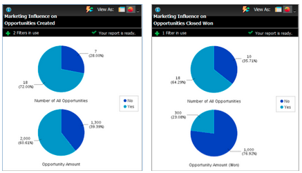

# Release Notes: December 2012 {#release-notes-december}

The December release includes the much anticipated **Forward to Friend** feature, as well as several other goodies! Note that features marked with an asterisk (&#42;) are available only in the Select Edition and in RCA (Revenue Cycle Analytics).

## Forward to Friend {#forward-to-friend}

Enable the sharing of content with others by including a **Forward to Friend** link in your emails. The addition of new filters and triggers will help you identify your influencers, by identifying users who forwarded an email, as well as those who received the forwarded emails.

To include a **Forward to Friend** invitation in your email, open it in the editor and insert the `{{system.forwardToFriendLink}}` token.

Use the corresponding triggers and filters to identify users who used the **Forward to Friend** link, and those who received the email.

## Granular Admin Permissions {#granular-admin-permissions}

Our newest release gives you greater access and control over [!UICONTROL Admin] roles, by controlling access to different functions in the Marketo [!UICONTROL Admin] area for each role. When you create a new role, you can assign specific [!UICONTROL Admin] functions that role may access.

>[!NOTE]
>
>By default, existing roles with ‘[!UICONTROL Access Admin]’ permission have access to all [!UICONTROL Admin] functions until and unless modified.

## [!UICONTROL BrightTALK] Adapter {#brighttalk-adapter}

The Marketo [!UICONTROL BrightTALK] adapter enables you to capture attendance information from a live or on-demand webcast, directly into a Marketo event!

## Marketo [!DNL Sales Insight] for [!DNL Microsoft Dynamics] {#marketo-sales-insight-for-microsoft-dynamics}

[!DNL Sales Insight] is now available to [!DNL Microsoft Dynamics] customers!

## [!DNL Dynamics] Opportunity Sync {#dynamics-opportunity-sync}

Sync opportunity data between Marketo and [!DNL Microsoft Dynamics].

## Marketing Influenced Opportunities Report&#42; {#marketing-influenced-opportunities-report}

View what percentage of your company’s pipeline and revenue was influenced by your marketing programs. In **[!UICONTROL Revenue Explorer]**, you can now create custom reports with the new ‘Marketing Influenced Opportunity‘ yellow dot in Opportunity Analysis. You can also use the following two reports in the Standard folder:

* Marketing Influence on Opportunities Created
* Marketing Influence on Opportunities Closed Won

## Custom Opportunity Fields in Program Opportunity Analysis&#42; {#custom-opportunity-fields-in-program-opportunity-analysis}

Add custom opportunity fields to enrich your Program Opportunity Analysis reports in [!UICONTROL Revenue Explorer].

## Campaign Inspector {#campaign-inspector}

Have you ever wondered which campaigns are using a specific flow action, such as [!UICONTROL Change Score] or [!UICONTROL Request Campaign]? Or where a certain filter is being used? The new [!UICONTROL Campaign Inspector] (available from the Treasure Chest) enables you to identify these campaigns, as well as active campaigns and campaigns with errors.

Go to **[!UICONTROL Admin]** > **[!UICONTROL Treasure Chest]** to enable the **[!UICONTROL Campaign Inspector]**.

