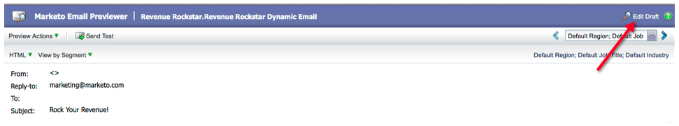
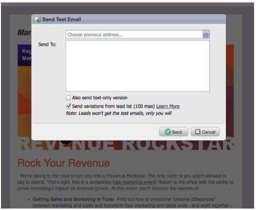

# Release Notes: March 2012 {#release-notes-march}

## Resolve My Tokens {#resolve-my-tokens}

My Tokens (Program Tokens) will resolve when previewing an email, when sending a test email, and when sending a local email via a single flow action. No longer will you have to create a smart campaign inside the program to test your My Tokens!

## Toggle between Previewer and Editor in Emails and Landing Pages {#toggle-between-previewer-and-editor-in-emails-and-landing-pages}

With one click, easily go back and forth between the Editor and the Previewer.

Editor to Previewer:

Previewer to Editor:

## Snippet Previewer {#snippet-previewer}

Selecting “Preview Snippet” from the menu allows you to view a Snippet, without making it a draft.Furthermore, if you have read only access to a shared snippet (via workspaces), you can view the snippet with this action

## Send multiple test emails {#send-multiple-test-emails}

With the addition of dynamic content, it becomes increasingly more important to preview and test all the variations of the emails that might be sent to your leads. When you are previewing using View by Lead Detail, you have the option to send a test for the variations from the lead list (up to 100 test emails).

## Dynamic Landing Pages based on URL parameter {#dynamic-landing-pages-based-on-url-parameter}

Anonymous leads make up a significant amount of your landing pages visits. With the addition of dynamic content and the ability to put segmentation into your URL as a parameter, you can dynamically display your landing page content when an anonymous or known lead clicks on the link.
