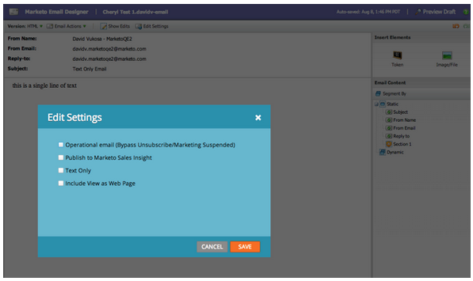

# Release Notes: August 2013 {#release-notes-august}

The following features are included in the August, 2013 release.

**Text Only Emails**

Now you may send [just the text version](/help/marketo/product-docs/email-marketing/general/creating-an-email/create-a-text-only-email.md) of an email. Keep in mind, links won't be decorated when using this option.

## Customer Engagement Engine Enhancements {#customer-engagement-engine-enhancements}

### Ignore Exhausted Content {#ignore-exhausted-content}

Configure the engagement program to [ignore exhaustion](/help/marketo/product-docs/email-marketing/drip-nurturing/using-engagement-programs/disable-and-enable-exhausted-content-notifications.md), including suppression of any notifications.

## Engagement Stream Testing {#engagement-stream-testing}

Use the [new testing feature](/help/marketo/product-docs/email-marketing/drip-nurturing/engagement-program-streams/test-an-engagement-stream.md) to simulate a cast, and test newly added content to a live stream.

## Personalized Send Test {#personalized-send-test}

When you send an email test, you can select the name of a lead to personalize the test email.

## “View Email as Web Page” and “Unsubscribe” System Tokens {#view-email-as-web-page-and-unsubscribe-system-tokens}

Utilize these [new tokens](/help/marketo/product-docs/email-marketing/general/using-tokens/system-tokens-glossary.md) to provide greater control of their placement in emails.

## Automatic Trigger Campaign Cleanup {#automatic-trigger-campaign-cleanup}

Marketo will now periodically notify you and [automatically deactivate trigger campaigns](/help/marketo/product-docs/core-marketo-concepts/smart-campaigns/using-smart-campaigns/automatic-trigger-campaign-cleanup.md) that have not run in the past six months.

## Marketo Financial Management Enhancement {#marketo-financial-management-enhancement}

### Program Cost Update  {#program-cost-update}

Program cost sync enables tracking of program cost across multiple platforms.

### Cobalt User Interface {#cobalt-user-interface}

We are continuing the rollout of our new Cobalt interface. This project will make everything in Marketo super snappy! The upgrade will continue through the rest of the year.
