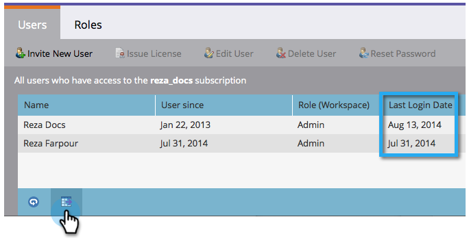
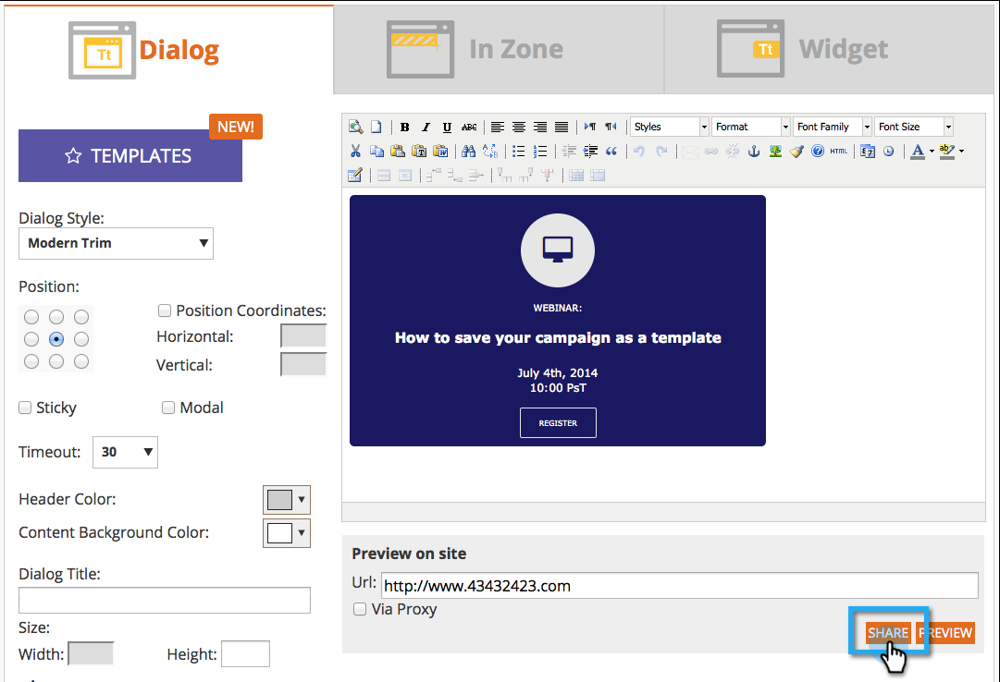

# Release Notes: August 2014 {#release-notes-august}

The following features are included in the August 2014 Release. Check your Marketo edition for feature availability. Come back after the release for links to detailed feature documentation.

## Marketing Calendar Licenses {#marketing-calendar-licenses}

After September 5th, 2014 only 5 users can have free access to the marketing calendar. Be sure to [Issue/Revoke a Marketing Calendar License](/help/marketo/product-docs/core-marketo-concepts/marketing-calendar/understanding-the-calendar/issue-revoke-a-marketing-calendar-license.md) to the users of your choice before then for un-interrupted access.

## New User Permissions {#new-user-permissions}

The following new user permissions were added:

| Permission |Description |
|---|---|
| Access Revenue Explorer |If you purchased RCA, you will now have control over who can access it. |
| Import List |Restrict users from importing lists into the lead database. |
| List Import |Restrict users from importing lists via a program under marketing activities. |
| Activate Trigger Campaign |Control who can and cannot activate trigger campaigns. |
| Schedule Batch Campaign |Control who can and cannot schedule batch campaign runs. |

## Export Users and Roles from [!UICONTROL Admin] {#export-users-and-roles-from-admin}

You can now [Export a List of Users and Roles](/help/marketo/product-docs/administration/users-and-roles/export-a-list-of-users-and-roles.md) from Marketo. You can also include a "Last Login" time stamp to be included with the export.

## Delete Channels and Tags {#delete-channels-and-tags}

You can now delete any unused channels and statuses. As always, you can only hide one that is currently in use.

## Automated [!DNL DKIM] {#automated-dkim}

For improved deliverability, all outgoing emails will be [!DNL DKIM] (DomainKeys Identified Mail) signed. By default, emails will use Marketo's shared [!DNL DKIM] signature. You will have the option to customize this signature.

>[!NOTE]
>
>[!DNL DKIM] will be rolled out slowly, you may not see it for a few weeks.

## Real-Time Personalization Updates {#real-time-personalization-updates}

We have added labels to the campaign page so that you can tag to your hearts content.

## Mobile Targeting {#mobile-targeting}

You asked on the community and we delivered! You can now include, exclude or set a specific call to action for mobile and tablet users.

## Enhanced 1:1 Segmentation and Targeting {#enhanced-segmentation-and-targeting}

You can now use advanced filter operators for targeting known visitors.

## Campaign Sharing {#campaign-sharing}

You now have the ability to quickly and easily share an RTP campaign preview link.

## Content Recommendation Engine Report {#content-recommendation-engine-report}

We have added a new content recommendation engine report for you to see a nice summary.

## Enhanced User Administration {#enhanced-user-administration}

Admin users can now lock users due to multiple failed login attempts. You can also unlock those users if desired.

## Tracking Control {#tracking-control}

You can now exclude specific IPs from all tracking and reporting in Real-Time Personalization.

