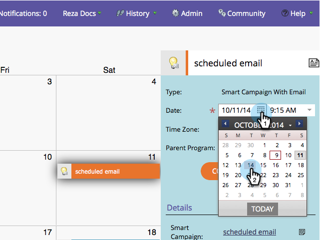

# Release Notes: October 2014 {#release-notes-october}

Check your Marketo edition for feature availability. Documentation will come at time of release.

## Program Focus in Marketing Calendar {#program-focus-in-marketing-calendar}

[Create and edit entries](/help/marketo/product-docs/core-marketo-concepts/marketing-calendar/understanding-the-calendar/understand-enable-program-focus.md) directly from the marketing calendar.

## New REST API Calls {#new-rest-api-calls}

Use the API to pull new activities or changes to leads:

* Get Lead Changes
* Get Lead Activities
* Get Activity Types
* Get Paging Token

Full details will be available after the release at [https://experienceleague.adobe.com/en/docs/marketo-developer/marketo/rest/rest-api](https://experienceleague.adobe.com/en/docs/marketo-developer/marketo/rest/rest-api).

## MSI - Send Marketo Email for [!DNL Microsoft Dynamics] {#msi-send-marketo-email-for-microsoft-dynamics}

[Send and track sales emails](/help/marketo/product-docs/marketo-sales-insight/msi-for-microsoft-dynamics/setting-up-and-using/send-a-marketo-sales-email-from-microsoft-dynamics.md) to leads and contacts from [!DNL Microsoft Dynamics].

## MSI - Add to Marketo Campaigns for [!DNL Microsoft Dynamics] {#msi-add-to-marketo-campaigns-for-microsoft-dynamics}

[Add leads and contacts to Marketo smart campaigns](/help/marketo/product-docs/marketo-sales-insight/msi-for-microsoft-dynamics/setting-up-and-using/add-a-lead-contact-to-a-marketo-campaign-from-microsoft-dynamics.md) directly from within [!DNL Microsoft Dynamics]. Marketing can choose which Marketo campaigns are available to sales.

## Custom Entity Support for [!DNL Microsoft Dynamics] Sync {#custom-entity-support-for-microsoft-dynamics-sync}

[Use custom object data](/help/marketo/product-docs/crm-sync/microsoft-dynamics-sync/microsoft-dynamics-sync-details/enable-sync-for-a-custom-entity.md) from [!DNL Microsoft Dynamics] for filtering and triggering in smart lists, smart campaigns, programs...

## Shareholder Support for [!DNL Microsoft Dynamics] Sync {#shareholder-support-for-microsoft-dynamics-sync}

Sync down opportunity shareholder data from [!DNL Dynamics]. Also supported are opportunities connected to an account using the "Primary Account" field as well as opportunities connected to contact using the "Primary Contact" sync.

## RTP - Dashboard Enhancements {#rtp-dashboard-enhancements}

The dashboard is now enhanced to include more at-a-glance data:

* Total organization visits
* Top 5 performing industries
* Total engaged visitors

## RTP - New Mobile Templates for Campaigns {#rtp-new-mobile-templates-for-campaigns}

Quickly and easily [create mobile campaigns](/help/marketo/product-docs/web-personalization/using-templates/using-templates-to-create-web-campaigns.md) with these new templates.

## RTP - User Context API {#rtp-user-context-api}

Use a new call that tracks visitor's past visit history. Personalize campaigns based on the visitor's:

* Past pages viewed
* Products interested in
* What RTP campaigns they have seen

Visit [https://experienceleague.adobe.com/en/docs/marketo-developer/marketo/javascriptapi/rich-media-recommendation](https://experienceleague.adobe.com/en/docs/marketo-developer/marketo/javascriptapi/rich-media-recommendation) for full details.
