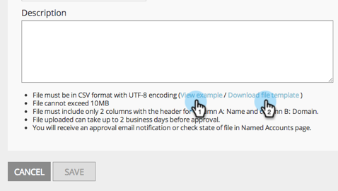

# Release Notes: January 2015 {#release-notes-january}

The following features are included in the January 2015 release. Please check your Marketo Edition for feature availability. After the release, be sure to come back to find links to detailed articles for each feature!

## Marketing Automation Updates {#marketing-automation-updates}

**Mobile Friendly Landing Pages**

You can now [build mobile views for landing pages](/help/marketo/product-docs/demand-generation/landing-pages/free-form-landing-pages/add-a-mobile-view-for-your-free-form-landing-page.md) from within the landing page editor. Deliver your message effectively regardless of device and increase engagement by tailoring your content for easy consumption on-the-go. This feature will rollout gradually throughout the week following the release.

[-Landing Page Walkthrough Video-](https://youtu.be/aPQHlG2X6c0)

**New Rest API Calls**

Three new calls for the Lead & Activity ReST API:

* Delete Lead
* Get Leads by Program ID
* Get Deleted Leads

Also, there is a new option for Sync Lead, to write the lead change asynchronously for a faster API call. Full details will be available after the release at [developers.marketo.com](https://developers.marketo.com)

**Email Scripting Custom Object Support**

Now access custom objects associated with the Account object from within email scripts!

## Real-Time Personalization {#real-time-personalization}

**Personalized Remarketing for Google and Facebook**

Remarketing shows ads to people who have visited your website. You can now personalize your remarketing campaigns on [Google](/help/marketo/product-docs/web-personalization/website-retargeting/personalized-remarketing-in-google.md) and [Facebook](/help/marketo/product-docs/web-personalization/website-retargeting/personalized-remarketing-in-facebook.md) using data from Real-Time Personalization. Remarket to audiences from different industries, named account lists, company sizes or any data from known leads.

[Named Account List Module](/help/marketo/product-docs/web-personalization/account-based-web-marketing/create-a-new-account-list.md)

Enhancements to the Named Accounts module will improve the match rates and validations for users. Additions include:

* Matching organizations from your Named Account list using Lead’s email address (also for RTP-only customers)
* Support for up to 100K records per account
* CSV file template to view and download

**Updated RTP Tag Options**

RTP Tag options under Account Settings have been updated to include:

1. CDN and Asynchronous (Recommended tag)
1. CDN and Synchronous (High Speed)
1. Asynchronous tag without CDN
1. Synchronous tag without CDN

For best performance, it is recommended to place the tag at the top of the header in your web page after `<head>`. All tags allow for use of the [RTP API](https://developers.marketo.com/documentation/websites/rtp-js-api/). For information on how to deploy the RTP Tag see [here](/help/marketo/product-docs/web-personalization/rtp-tag-implementation/deploy-the-rtp-javascript.md).

