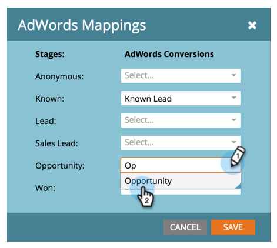

# Release Notes: March 2015 {#release-notes-march}

The following features are included in the March 2015 release. Please check your Marketo Edition for feature availability. After the release, be sure to come back to find links to detailed articles for each feature.

## Calendar HD {#calendar-hd}

Display your team’s marketing actives with the calendar’s new presentation mode. These are great for TVs or giant monitors around the office! Set and displays goals based on a smart list or custom metrics.

>[!NOTE]
>
>This feature is not available for Spark and [!DNL Standard] editions.

## [!DNL Google Adwords] Integration {#google-adwords-integration}

Link your [[!DNL Google AdWords] account to Marketo](/help/marketo/product-docs/administration/additional-integrations/add-google-adwords-as-a-launchpoint-service.md) to automatically upload offline conversion data from Marketo to [!DNL Google AdWords]. Then, from the [!DNL AdWords] UI, you will be able to easily see which clicks resulted in qualified leads, opportunities, and new customers (or whatever revenue stages you want to track).

## [!UICONTROL Revenue Explorer] Redesign {#revenue-explorer-redesign}

[!UICONTROL Revenue Explorer] has a brand new look and feel, as well as the new Sunburst chart type! We'll be rolling this out over the first two weeks of April.

## New Asset [!DNL REST] APIs {#new-asset-rest-apis}

[New Asset [!DNL REST] APIs](https://developers.marketo.com/)

We now have support for creating and editing emails, templates, my tokens, files, and snippets [via the API](https://developers.marketo.com/documentation/asset-api)!

## [!DNL Microsoft Dynamics] 2015 On Premise {#microsoft-dynamics-on-premise}

Supported with the latest installer now [accessible through the app](/help/marketo/product-docs/crm-sync/microsoft-dynamics-sync/sync-setup/update-the-marketo-solution-for-microsoft-dynamics.md).

## [!DNL RTP] - Personalized Web Engagement with Lead Data {#rtp-personalized-web-engagement-with-lead-data}

Leverage the [lead data fields](/help/marketo/product-docs/web-personalization/using-web-segments/manage-person-data.md) you have you in your Marketo lead database to create real-time segmentation and personalized content campaigns. Manage your lead data fields in RTP and add/delete relevant lead fields.

## [!DNL RTP] - Personalize Web Content by Email or Program Campaign Name {#rtp-personalize-web-content-by-email-or-program-campaign-name}

Continue the conversation with your lead across channels from email to web. [Personalize inbound content based on email campaign or program](/help/marketo/product-docs/web-personalization/using-web-segments/web-segments.md) name used in Marketo’s Marketing Activities.
