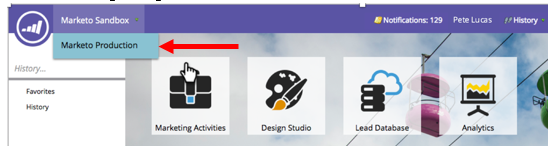

# Release Notes: Fall '16 {#release-notes-fall}

The following features are included in the Fall '16 release. Check your Marketo edition for feature availability. Please click the title links to view detailed articles for each feature.

## [!UICONTROL Predictive Content] in Email {#predictive-content-in-email}

There's a new user experience for our [!UICONTROL Predictive Content] application to track, manage, and recommend your content through our machine learning and predictive algorithms across the web and email channels.

>[!NOTE]
>
>All customers with the Predictive module will be enabled by January 10th.

You can now add predictive content to your email. When the email is opened, the recipient automatically receives relevant, recommended content that helps increase content engagement and conversions.

## [Facebook Offline Conversions](/help/marketo/product-docs/demand-generation/facebook/understanding-facebook-offline-conversions.md) {#facebook-offline-conversions}

With [!DNL Facebook] Offline Conversions integration, conversion data in Marketo (for Lead Ad leads) is automatically sent back to [!DNL Facebook] so that your advertising team can better optimize its ad spend. In this [!DNL Facebook] Ad Manager Report, the offline conversions are highlighted.

## [Universal ID](/help/marketo/product-docs/administration/settings/using-a-universal-id-for-subscription-login.md) {#universal-id}

A Universal ID lets you access multiple Marketo subscriptions with a single login and switch between subscriptions quickly. You can use a single community profile for all of your subscriptions.

>[!NOTE]
>
>Please contact Marketo Support to enable this feature.

## Marketo Account Based Marketing Enhancements {#marketo-account-based-marketing-enhancements}

Now, you can assign account teams to named accounts in Account Based Marketing (ABM), for example, account owner, sales development representative, business development representative, and customer success manager. You also can build account-owner-specific account lists and send personalized weekly ABM reports to the account team.

**REST API**

This release also enables you to manage named account attributes and accounts scores in ABM using the Marketo REST API. For more details on the API operations, please visit the [Marketo Developers website](https://developers.marketo.com/rest-api/lead-database/named-accounts).

## [Audit Trail Enhancements](/help/marketo/product-docs/administration/audit-trail/change-details-in-audit-trail.md) {#audit-trail-enhancements}

Audit trail provides a comprehensive history of the changes made within your Marketo subscription. We have added additional tracking capabilities for programs as well as surfacing important change details for smart campaigns, smart lists, and changes made to users and roles.

## [New Permissions](/help/marketo/product-docs/administration/users-and-roles/managing-user-roles-and-permissions/descriptions-of-role-permissions.md) {#new-permissions}

**Make Email Operational**

Gone are the days when you had to worry about users sending transactional emails to people in your database who have unsubscribed. You can now specify which users can make an email operational or edit operational emails.

**Edit Campaign Restrictions**

Why set [campaign restrictions](/help/marketo/product-docs/administration/email-setup/enable-person-restrictions-for-smart-campaigns.md) if you can't enforce them? When you set Campaign Limit Settings to restrict the number of people in your database who can be targeted with a single campaign, you now have the ability to restrict which users can override these settings when scheduling a campaign.

## [Sound for Mobile Push Notifications](/help/marketo/product-docs/mobile-marketing/push-notifications/configure-mobile-push-notification.md) {#sound-for-mobile-push-notifications}

Give your iOS Push Notification added richness by enabling sound. This new feature allows you to trigger a sound when you Push Notification is displayed on the mobile device.

>[!NOTE]
>
>* Device owners can choose to prevent sounds from being played in the device settings, and app developers can give device owners options within the app to prevent sounds from being played.
>* Sounds are automatically played when a Push Notification is displayed on an Android device.

## [[!DNL Sales Insight] Compatible with [!DNL Salesforce] Encryption](/help/marketo/product-docs/marketo-sales-insight/msi-for-salesforce/installation/install-marketo-sales-insight-package-in-salesforce-appexchange.md) {#sales-insight-compatible-with-salesforce-encryption}

Market [!DNL Sales Insight] is now compatible with [!DNL Salesforce] Shield Encryption. All [!DNL Sales Insight] customers should upgrade to this latest managed package (version 1.4359.2), which is [available on the [!DNL Appexchange]](https://appexchange.salesforce.com/listingDetail?listingId=a0N30000001SVZmEAO).

## [Named Accounts APIs](https://developers.marketo.com/rest-api/lead-database/named-accounts/) {#named-accounts-apis}

With this release, Marketo ABM users can manage named accounts via the Named Accounts API. Users can create, update, and delete named accounts, as well as read and update ABM named account scores.

## [Email Editor v2.0 API Support](https://developers.marketo.com/rest-api/assets/emails/) {#email-editor-v-api-support}

Manage variables and modules for emails in v2.0 format using the Marketo REST API.

## [Changes to Marketo [!DNL Salesforce] Sync](https://nation.marketo.com/docs/DOC-3840) {#changes-to-marketo-salesforce-sync}

Marketo’s [!DNL Salesforce] integration is evolving to improve the way that Marketo fields are synced with [!DNL Salesforce]. Now, instead of having to sync a large group of fields that you may or may not need, you can pick and choose which fields you’d like to have included. Check out our documentation here for more information: [https://nation.marketo.com/docs/DOC-3840](https://nation.marketo.com/docs/DOC-3840).
