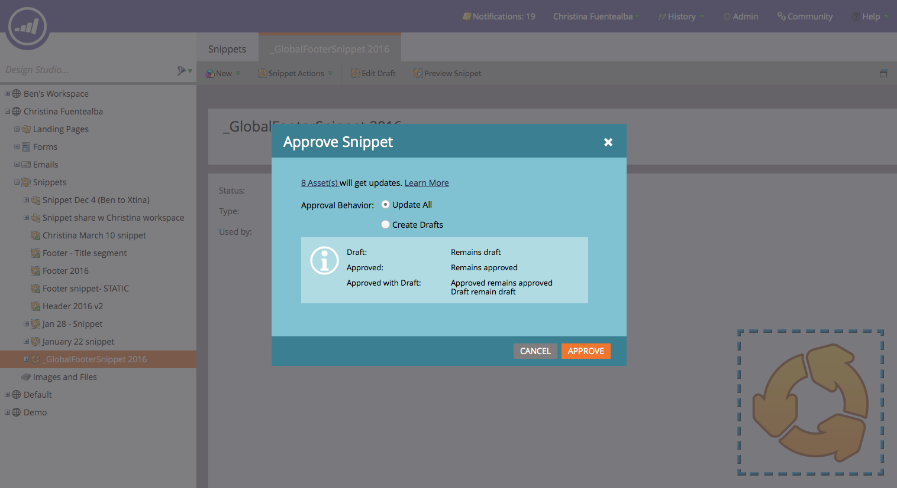
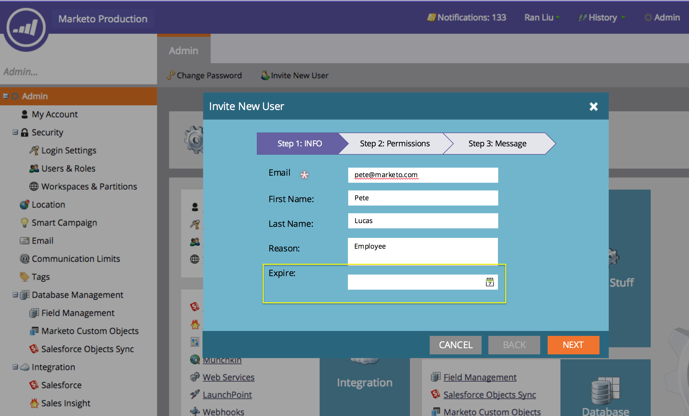

# Release Notes: Spring '16 {#release-notes-spring}

The following features are included in the Spring '16 release. Please click the title links to view detailed articles for each feature.

## [Email Insights](/help/marketo/product-docs/reporting/email-insights/email-insights-overview.md) {#email-insights}

Email Insights is a brand new historical aggregate data email analytics experience - redesigned end-to-end for lightning fast performance. It features a completely new user interface design optimized to fit the needs and workflow of Email Marketers.

>[!NOTE]
>
>We are launching Email Insights to customers in batches, beginning June 3rd. Our goal is to complete this over the next several months. We'll notify you by email when you're enabled.

## [Email Template Picker](/help/marketo/product-docs/email-marketing/general/email-editor-2/email-template-picker-overview.md) {#email-template-picker}

Create beautiful emails using our new Starter Templates! Also, quickly locate your templates from their live thumbnails.

>[!NOTE]
>
>Email Editor 2.0 (with the Template Picker) will gradually be rolled out beginning June 3rd. We will complete the rollout by June 30th. Unlike Email Insights, you will not be notified when you have access. To see if you do, please follow the steps in [this article](/help/marketo/product-docs/email-marketing/general/email-editor-2/transitioning-to-email-editor-2-0.md).

## [Email Editing---Re-imagined](/help/marketo/product-docs/email-marketing/general/email-editor-2/email-editor-v2-0-overview.md) {#email-editing-re-imagined}

That's right, a brand new email editor! Use lightweight drag-and-drop functionality to add and re-order content. New elements, including images, videos, variables, and modules, are sure to enhance your editing experience. Also check out the updated code editor, previewer, and preheader support.

## [Mobile In-App Messages](/help/marketo/product-docs/mobile-marketing/in-app-messages/understanding-in-app-messages.md) {#mobile-in-app-messages}

Create stunning in-app messages for your app right within Marketo. Define exactly who should see it and when with the in-app message program. Easily monitor its performance with the program dashboard.

## [No Draft Snippets](/help/marketo/product-docs/administration/users-and-roles/enable-no-draft-for-snippets.md) {#no-draft-snippets}

Gone are the days where you have to re-approve everything each time a snippet is updated! With No-Draft, all emails and landing pages using a snippet will get the snippet updates and maintain their prior statuses. Each time you approve a snippet, you'll have a choice to run No-Draft and update everything, or create drafts. It's up to you! No-Draft will be available to all customers and controlled by a new permission in Admin.

## [Landing Page, Landing Page Template, and Form APIs](https://developers.marketo.com/blog/spring-2016-updates/) {#landing-page-landing-page-template-and-form-apis}

The Marketo REST APIs now support control over Marketo landing pages, landing page templates, and forms. Users can now create, update content, approve, and delete these assets directly via the Marketo REST API.

## [IP Allowlisting for API Access](/help/marketo/product-docs/administration/additional-integrations/create-an-allowlist-for-ip-based-api-access.md) {#ip-allowlisting-for-api-access}

Similar to the IP allowlisting feature for Marketo user logins, Marketo admins can now set up a allowlist of IP addresses that can access the Marketo SOAP and REST APIs, thereby blocking access from non-authorized IP addresses. This provides an added layer of security to your Marketo instance, and ensures that API access can only occur from within your organization's network. Details on how to set this up are available on the [Marketo documentation site](/help/marketo/product-docs/administration/additional-integrations/create-an-allowlist-for-ip-based-api-access.md).

## [New High-Speed Microsoft Dynamics Sync Connector](/help/marketo/product-docs/crm-sync/microsoft-dynamics-sync/microsoft-dynamics-sync-details/sync-status.md) {#new-high-speed-microsoft-dynamics-sync-connector}

The new, high-speed Dynamics connector provides speeds up to 20 times faster for initial sync and up to 5 times faster for incremental sync. All new customers will onboard to this connector on the release date, and we will gradually roll it out to existing customers over the summer release time frame.

**Refresh data for new fields**: Now you can enable new sync fields at any point in time and all data values for that field will be refreshed from Dynamics CRM into Marketo. No more worries about having to select all fields during initial setup. If you disable an existing sync field and re-enable it later, all data values for that field will be refreshed from Dynamics CRM into Marketo.

**Sync Lead as Contact**: The Sync Lead to Microsoft flow action has a new option to sync as a lead or a contact.

**Sync Errors Admin Tab**:  Browse, search, or export leads (and other objects) that failed to synchronize with details such as operation, direction, error code and error message.

**Microsoft Dynamics 2016**: Connector is fully certified for Dynamics 2016 Online and On-premise versions.

**Plug-In Updates are now documented:** See the [plug-in updates docs article](/help/marketo/product-docs/crm-sync/microsoft-dynamics-sync/marketo-plugin-releases-for-microsoft-dynamics.md).

## [Friendly Instance Name](/help/marketo/product-docs/administration/settings/edit-subscription-settings.md) {#friendly-instance-name}

Today, it's hard to differentiate between Marketo instances, for example, sandbox and production instances. This feature lets you know which instances you're currently working on.

## [Limited Time Access for Subscriptions](/help/marketo/product-docs/administration/users-and-roles/managing-marketo-users.md) {#limited-time-access-for-subscriptions}

Today, users are invited to Marketo subscription for an indefinite period of time. This feature enables admins to invite users to subscriptions for a limited period of time, for example, 2 weeks or 1 month.

## [Custom Objects Grid](/help/marketo/product-docs/administration/marketo-custom-objects/understanding-marketo-custom-objects.md) {#custom-objects-grid}

Now, you can view the number of records and fields for all published custom objects.

## Custom Activities {#custom-activities}

Marketo admins can now define and manage their custom activity types via the Marketo Custom Activity Definition modeler. Similar to (and in conjunction with) the Marketo Custom Object Modeler, admins can now extend the data model to suit their exact business needs. Details on how to use this functionality is available on the [Marketo documentation site](/help/marketo/product-docs/administration/marketo-custom-activities/understanding-custom-activities.md).
