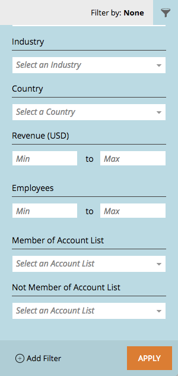

# Release Notes: April '17 ABM Enhancements {#release-notes-april-abm-enhancements}

The following features are included in the April '17 ABM enhancement release. Check your Marketo edition for feature availability.

## Synching of CRM-Mapped Standard Fields {#synching-of-crm-mapped-standard-fields}

Marketo ABM is changing behavior related to CRMs. Going forward, Marketo ABM establishes and maintains a 1-to-1 relationship between ABM accounts and accounts in the CRM. This allows Marketo to keep mapped account fields in sync with the CRM.

## Custom Fields for CRM Discovery {#custom-fields-for-crm-discovery}

You now can add custom fields to accounts, map them to your CRM, and use them for CRM Account Discovery in Marketo.

## Account-based Filters in the Named Account Grid {#account-based-filters-in-the-named-account-grid}

You now can easily filter your named accounts based on an Account List.

