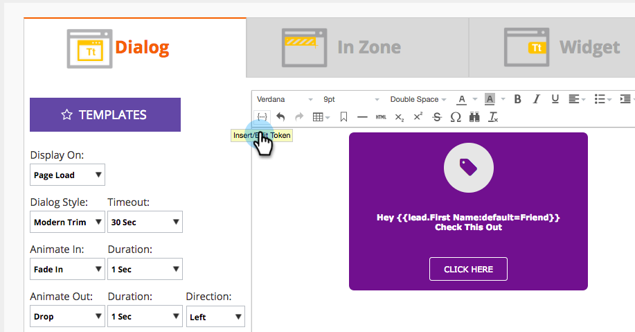

# Release Notes: Fall '17 {#release-notes-fall}

The following features are included in the Fall '17 release. Check your Marketo edition for feature availability.

Please click the title links to view detailed articles for each feature. Note: Some of the features included in this release do not have associated articles. If a topic has multiple subheadings, the links are placed there.

## System Reliability {#system-reliability}

We've made further improvements to the core Marketo infrastructure, including better sequencing, fewer mismatches, and improved Munchkin stability.

## SFDC Sync Performance {#sfdc-sync-performance}

Take advantage of richer and faster synchronization across Marketo and Salesforce. Data changes that require bulk updates on accounts or leads can be split into parallel queues to avoid backlogs. Events and tasks now also synchronize up to 50% faster.

## Analytics Performance Improvements {#analytics-performance-improvements}

Recent infrastructure improvements offer increased uptime and stability within the Marketo reporting and analytics tools, allowing you to build ad hoc reports more quickly.

## [Recipient Time Zone](/help/marketo/product-docs/email-marketing/email-programs/email-program-actions/scheduling-with-recipient-time-zone/understanding-recipient-time-zone.md) {#recipient-time-zone}

With this new feature, you can now hold and deliver email according to local time zones. Email and engagement programs can be configured to be delivered in the recipients' time zones, eliminating the need to create multiple programs—send once and Marketo will automatically hold the email until the correct local time. Lift email metrics, observe local practices, and save time by using a single program globally.

>[!NOTE]
>
>If you can't enable Recipient Time Zone on your email and engagement programs yet, don’t panic! We’re gradually enabling this feature to all customers.

## [Review Sample Emails by Segment](/help/marketo/product-docs/email-marketing/general/creating-an-email/send-a-sample-email.md) {#review-sample-emails-by-segment}

Marketo has a new option to pick a segment when sending sample emails for review. You no longer need to manually determine which segment a lead belongs to, making it easier to send emails containing dynamic content to different segments.

## [LinkedIn Lead Gen Custom Questions](/help/marketo/product-docs/demand-generation/social/social-functions/set-up-linkedin-lead-gen-forms.md) {#linkedin-lead-gen-custom-questions}

Customize your LinkedIn Lead Gen forms to collect custom lead attributes. You can now ask up to three custom questions per form, choose from single line text input or multiple-choice questions, and map back to Marketo lead fields.

## Slack Integration {#slack-integration}

We released two features as part of our new Slack integration:

* System notifications: Get Slack notifications regarding important events in your Marketo instance, like alerts about current campaign statuses and any issues that require immediate attention. 
* Interesting moments: When a Marketo Insight has been triggered by a known individual from a sales account, lead owners can be notified via Slack. Notifications include lead information as well as details about the sales account.

## ABM Enhancements {#abm-enhancements}

**[Show Accounts with No Contacts](https://docs.marketo.com/x/fKCt)**

Marketo ABM now syncs and displays CRM accounts without contacts. Include new accounts with no prior sales or marketing history and track progress by matching subsequent leads to the accounts.

## ContentAI Analytics {#contentai-analytics}

**[New ABM Account List Filter](https://docs.marketo.com/x/1BPG)**

View and compare content performance across ABM Account Lists to optimize existing content. ContentAI shows you:

* top content viewed
* top converted content
* AI-powered suggested content for marketing activities

## Web Personalization Enhancements {#web-personalization-enhancements}

**[Tokens for Web Campaigns](/help/marketo/product-docs/web-personalization/working-with-web-campaigns/using-the-web-personalization-rich-text-editor.md)**

Tokens are now available for use within web campaigns. Leverage tokens to deliver personalized messages and content to increase engagement in your web campaigns.

**[Design Studio Images in Web Campaign Editor](/help/marketo/product-docs/web-personalization/working-with-web-campaigns/using-the-web-personalization-rich-text-editor.md)**

Save time by re-using creative assets and images across multiple channels within Marketo.

## Integration  {#integration}

**[Email Preview API](https://developers.marketo.com/rest-api/assets/emails/)**

You can now remotely preview email outside of Marketo, simplifying the process of email content localization and reducing errors.

**[Replace HTML API](https://developers.marketo.com/rest-api/assets/emails/)**

Developers can update HTML content of email assets remotely, allowing them to work within a single system to maintain assets.
