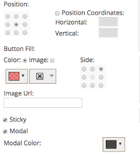

# Release Notes: Spring '17 {#release-notes-spring}

The following features are included in the Spring '17 release. Check your Marketo edition for feature availability.

Please click the title links to view detailed articles for each feature. **Note**: If a topic has multiple subheadings, the links are placed there.

## [LinkedIn Lead Gen Forms](/help/marketo/product-docs/demand-generation/social/social-functions/set-up-linkedin-lead-gen-forms.md) {#linkedin-lead-gen-forms}

[LinkedIn Lead Gen Forms](https://business.linkedin.com/marketing-solutions/native-advertising/lead-gen-ads) are a more direct way for a business to run lead generation campaigns on LinkedIn. People can fill out forms to express interest in a product or service, enabling the business to capture the person’s details and sync them to Marketo, where automated follow-up processes and lead routing activities can occur.

The Marketo integration with LinkedIn Lead Gen Forms automatically captures the information a lead provides within the Lead Gen form. Follow-up actions and notifications can then be automated using the new **Fills Out LinkedIn Lead Gen Form** trigger and filter.

## [Expire MSI Template](/help/marketo/product-docs/marketo-sales-insight/msi-for-salesforce/features/actions-in-the-msi-panel/send-marketo-email/publish-an-email-to-sales-insight.md) {#expire-msi-template}

Gone are the days of cleaning up outdated templates in Sales Insight. Set an expiration date when you publish your email and we'll take care of un-publishing it for you when the expiration date rolls around.

>[!NOTE]
>
>Setting the expiration date for 5/31/17 means that the template will be removed from Sales Insight at the end of the day on 5/31/17.

## [Bulk Extract APIs for People and Activities](https://developers.marketo.com/rest-api/bulk-extract/) {#bulk-extract-apis-for-people-and-activities}

Easily transfer large amounts of person and activity data from Marketo to your external systems.

## ABM Enhancements {#abm-enhancements}

**[Custom Fields on ABM Named Accounts](https://docs.marketo.com/x/1wnG)**

Marketo ABM now allows you to create up to 10 custom fields on your Named Accounts. You can map these Custom Fields to fields in your CRM Account object and Marketo ABM will sync the data, allowing you to extend your ABM Named Accounts and help drive your marketing.

**[Percentile Scoring on ABM Named Accounts](https://docs.marketo.com/display/docs/assets/abmpercentiles.png)**

Named Account scores can vary greatly. Marketo ABM now automatically calculates a percentile for each of your scores, so you can see at a glance where each Named Account ranks among your other Named Accounts.

**[ABM Account List APIs](https://developers.marketo.com/rest-api/lead-database/named-account-lists/)**

Take advantage of rich and robust ABM partner integrations with enhanced API support for Named Account Lists.

## Web Personalization Enhancements {#web-personalization-enhancements}

**[Web Campaign Upon Scroll](/help/marketo/product-docs/web-personalization/working-with-web-campaigns/set-how-your-web-campaign-displays.md)**

New Web Campaign effects provide your web visitors with a more personalized experience. Set your personalized Web Campaigns to display only when a web visitor scrolls down on your web page. You can set your Dialog Web Campaigns to show upon scroll based on:

* percentage of the page scrolled
* pixel reached
* scrolling below the fold of the page

**[Web Campaign Upon Exit Intent](/help/marketo/product-docs/web-personalization/working-with-web-campaigns/set-how-your-web-campaign-displays.md)**

Capture your visitor’s attention before they close your page. Set your personalized Web Campaigns to display only when a mouse gesture indicates the visitor is leaving the page.

**[Animation Effects for Web Campaigns](/help/marketo/product-docs/web-personalization/working-with-web-campaigns/create-a-new-dialog-web-campaign.md)**

Set the animation effects for your Dialog Web Campaign to customize how a campaign appears upon entering or exiting your web page. You can select from 6 different effects and control the timing and direction of the dialog.

**[Dialog Close Button Customization](/help/marketo/product-docs/web-personalization/working-with-web-campaigns/create-a-new-dialog-web-campaign.md)**

Customize the Close Button for dialog boxes. Select from a range of options used in Transparent Dialog Style Web Campaigns. Select the icon, color, and positioning for the Close Button. You can also add your own button image.

**[Archive Web Campaigns](/help/marketo/product-docs/web-personalization/working-with-web-campaigns/archive-a-web-campaign.md)**

Archive is a new Web Campaign status that allows you to archive Web Campaigns and hide them from the default Web Campaign view. This lets you focus on your most relevant, active campaigns and retrieve older archived campaigns on demand.

**[Localization](/help/marketo/product-docs/administration/settings/select-your-language-locale-and-time-zone.md)**

Web Personalization is now offered in all Marketo-supported languages (English, Japanese, German, Spanish, French, and Portuguese).

## Predictive Enhancements {#predictive-enhancements}

**[Localization](/help/marketo/product-docs/administration/settings/select-your-language-locale-and-time-zone.md)**

Predictive Content is now offered in all Marketo-supported languages (English, Japanese, German, Spanish, French, and Portuguese).

## [Legacy Rich Text Editor and Form Editor 1.0 Deprecation](https://nation.marketo.com/docs/DOC-4315) {#legacy-rich-text-editor-and-form-editor-deprecation}

Starting August 1, 2017, customers still using the legacy Rich Text Editor and Form Editor 1.0 will be automatically transitioned to the new experience.
