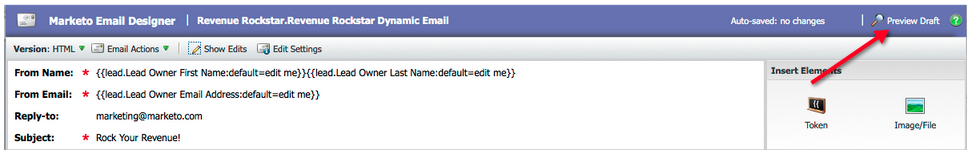
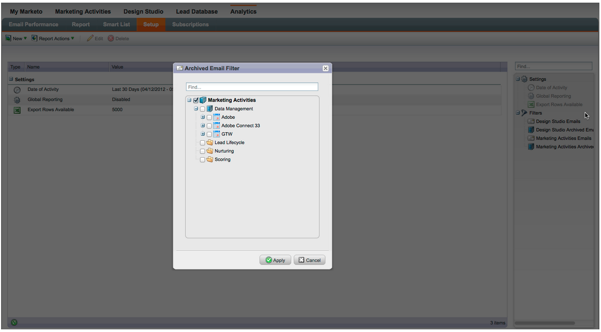
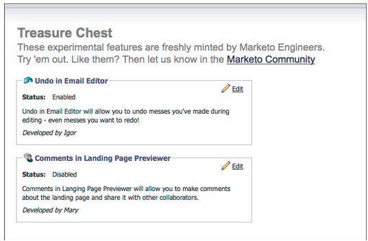
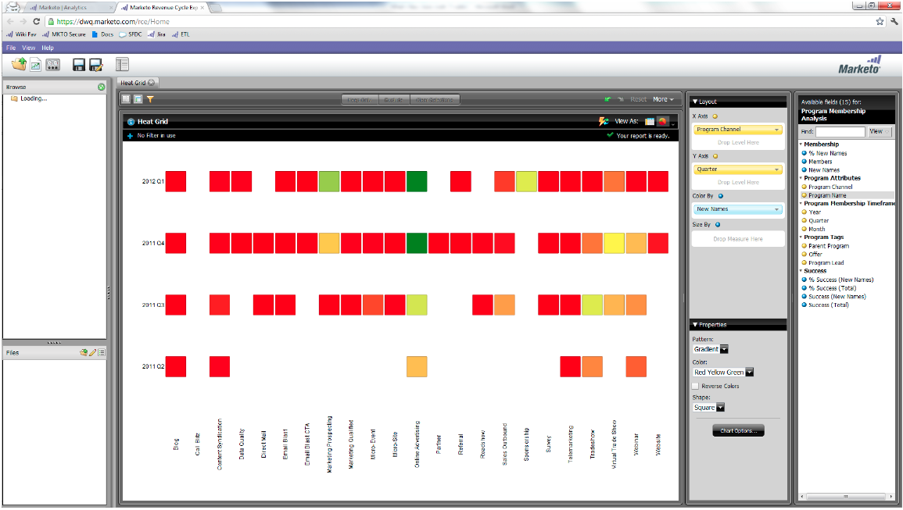
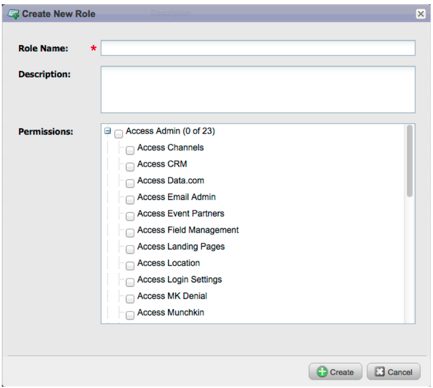

# 2012

## January/February 2012 {#january-february}

The following features are included in the Jan/Feb Release. Check your Marketo edition for feature availability. Come back after the release for links to detailed feature documentation.

## Advanced Dynamic Content {#advanced-dynamic-content}

_Available for Pro and Enterprise Versions_

With advanced dynamic content you can create engaging email communications and landing pages relevant to your audience without having to create multiple assets for the same message. Upgraded Previewers allow you to view each unique version in a single screen.

## Segmentation  {#segmentation}

_Available for Pro and Enterprise Versions_

Segmentation is a group of segments, which are a targeted group of individuals to whom you market. Segments are defined by rules that are driven by filter criteria similar to smart lists. Your segments can be based on demographic data, such as job title or industry, or based on behaviors such as web pages visited or clicked links.

## Snippets {#snippets}

_Available for Pro and Enterprise Versions_

Store rich content that can be used over and over again to create static or dynamic emails and landing pages.

## PURLs {#purls}

_Available for Pro and Enterprise Versions_

Using Personalized URLs (PURLs) marketers can now create contact-specific URLs, to drive personalization, measurability and lift responses in multi-touch marketing programs for both direct mail and email campaigns.

## EU Privacy Directive Support {#eu-privacy-directive-support}

New features to respect browser "Do Not Track" settings include the ability to disable tracking for anonymous leads; this makes complying with the EU's stricter privacy tracking regulations easier.

## Single Sign-on {#single-sign-on}

Organizations now have the ability to support a seamless login to the Marketo application using SAML 2.0 for single sign-on from a corporate portal.

## Updated Email and Landing Page Editors {#updated-email-and-landing-page-editors}

The Email and Landing Page Editors were redesigned with a more inviting interface, intuitive navigation and a dramatically improved user experience, this includes:

A side-by-side HTML and text view

The From Name, From Email, Reply-To (NEW) and Subject are displayed in the editor. All other settings are accessible through the Edit Settings button.

## Browser Support {#browser-support}

* [!DNL Mozilla Firefox] 9.0
* [!DNL Google Chrome] 16
* [!DNL Microsoft Internet Explorer] 8 & 9
* **Note**: we no longer support [!DNL Internet Explorer] 7

## Program Management {#program-management}

Simplified program management improves usability with Token delete and the easier deletion of Programs.

## Unsubscribe from Subscription Report {#unsubscribe-from-subscription-report}

Now you can unsubscribe from the subscription directly from the report!

## Munchkin Updates {#munchkin-updates}

New Munchkin calls reduce webpage load times and provide more consistent performance for click link events.

## Program Opportunity Analysis (RCA only) {#program-opportunity-analysis-rca-only}

Understand marketing contribution to individual opportunity revenue

## Program Revenue Stage Analysis {#program-revenue-stage-analysis}

Gain insight into program lead velocity by understanding which programs acquired the fast movers

## March 2012 {#march}

## Resolve My Tokens {#resolve-my-tokens}

My Tokens (Program Tokens) will resolve when previewing an email, when sending a test email, and when sending a local email via a single flow action. No longer will you have to create a smart campaign inside the program to test your My Tokens!

## Toggle between Previewer and Editor in Emails and Landing Pages {#toggle-between-previewer-and-editor-in-emails-and-landing-pages}

With one click, easily go back and forth between the Editor and the Previewer.

Editor to Previewer:

Previewer to Editor:

## Snippet Previewer {#snippet-previewer}

Selecting "Preview Snippet" from the menu allows you to view a Snippet, without making it a draft. Furthermore, if you have read only access to a shared snippet (via workspaces), you can view the snippet with this action.

## Send multiple test emails {#send-multiple-test-emails}

With the addition of dynamic content, it becomes increasingly more important to preview and test all the variations of the emails that might be sent to your leads. When you are previewing using View by Lead Detail, you have the option to send a test for the variations from the lead list (up to 100 test emails).

## Dynamic Landing Pages based on URL parameter {#dynamic-landing-pages-based-on-url-parameter}

Anonymous leads make up a significant amount of your landing pages visits. With the addition of dynamic content and the ability to put segmentation into your URL as a parameter, you can dynamically display your landing page content when an anonymous or known lead clicks on the link.

## April 2012 {#april}

## Segmentation Filters and Triggers {#segmentation-filters-and-triggers}

Do you target the same group of leads consistently? If so, use segmentation in your smart lists for targeting leads. With segmentation, your entire lead database is always segmented and it can be re-used across your programs for consistency. Segmentation results are pulled quickly because they do not require the smart list to run at the time of the request.

## Insert External Values into Email Content, and other Flow Steps, through Expanded API Capabilities {#insert-external-values-into-email-content-and-other-flow-steps-through-expanded-api-capabilities}

* The Request Campaign API now allows you to send in values for My Tokens for that particular run of the campaign - this is particularly useful for populating email content via the API
* New Upload To List and Schedule Campaign APIs support the above for lists of leads and batch campaigns.

## Easier Confirmation Emails for [!DNL GoToWebinar] and [!DNL WebEx] (Adobe Connect and [!DNL ON24] Coming Soon!) {#easier-confirmation-emails-for-gotowebinar-and-webex-adobe-connect-and-on-coming-soon}

We've simplified the confirmation URL by creating a member token that displays the unique registration confirmation URL for each lead. You will no longer have to create this URL using different tokens. This is currently available for [!DNL GoToWebinar] and [!DNL WebEx] customers, and will be available for Adobe Connect and [!DNL ON24] in our next release.

## Upload Multiple Images and Files with a Single Click! {#upload-multiple-images-and-files-with-a-single-click}

Save time and be more efficient when importing images and files into Marketo! If you use [!DNL Firefox] or [!DNL Google Chrome], you can multi-select files and upload them all at once. Although there is no limit to the number of files you can upload, the individual size limit per file is 50MB.

Note: At this time, this feature is not supported on [!DNL Internet Explorer], due to limitations of the browser.

## Move Text in an Email {#move-text-in-an-email}

You can re-order text blocks in an email. Within the text editor select a text block; when you click the edit icon,you will see the option to move the block up or down.

## [!DNL Salesforce] References Removed for Non-[!DNL Salesforce] Users {#salesforce-references-removed-for-non-salesforce-users}

If you are not syncing your subscription with [!DNL Salesforce], you will notice that all folders and flow actions that reference [!DNL Salesforce] are removed.

## Marketo Revenue Cycle Analytics {#marketo-revenue-cycle-analytics}

**Enhanced Gate Stages in the Revenue Cycle Modeler**

Allows users to define an order for their transition rules.

## May 2012 {#may}

## Email Performance Report Redesign {#email-performance-report-redesign}

Note: this will be a staged roll-out, beginning with the May release

We made the Email Performance and Campaign Email Performance reports run faster. We've also improved the definitions of certain metrics and consolidated the "Messages Sent" and "Leads Sent" metrics to a single metric, "Sent". We've merged "Messages Delivered" and "Leads Delivered" to "Delivered".

## Wait Step Enhancements {#wait-step-enhancements}

Using the new Advanced Wait properties, you can configure the wait step in a Smart Campaign Flow action to "wait until" a specific day of the week, the next business day, a specific date or time. These enhancements ensure your nurture emails arrive in the Inbox during business hours!

Figure 1. Specify the Wait Step to end on a Business Day

## Archived Assets Hidden {#archived-assets-hidden}

Archived assets are automatically filtered from autosuggest, drop downs, and reports making it easier to find what you are looking for!

Figure 2. Example of the Archived Email Filter

## New Event Check-in App for iPad {#new-event-check-in-app-for-ipad}

Simplify your event check-in process using our new iPad app! The Event Check-in app syncs with your Marketo Program and allows you to easily check registrants into an event, as well as add new leads on the fly.

Requires iOS 5.1 or later; iPad only.

Figure 3. Event Check-In Home Page

Figure 4. Event Check In: Select your Event!

Figure 5. Check them in

## Enhanced Webinar Confirmation URL {#enhanced-webinar-confirmation-url}

Now available for [!DNL ON24] and Adobe Connect! Include a unique link in the confirmation email for each registered attendee using the new `{{member.webinar URL}}` token. Adobe Connect enhancements also include the ability to turn on/off the Adobe account information email that includes the login ID and password for the user.

Figure 6. Get people to your webinar

## Template Preview {#template-preview}

Looking for a specific template while building your email or landing page, but not sure what it looks like? With the new template preview capability, you can verify the selected template prior to saving a new asset!

Figure 7. Preview your chosen template

## Configurable Form Prefill {#configurable-form-prefill}

Control pre-population of form data at the subscription level and overwrite at the landing page level. Without pre-population, you can ensure the lead provides the most up-to-date information.

Figure 8. Form Prefill Configuration in Admin

Figure 9. Edit Form Prefill Setting on a Landing Page

## Marketo Treasure Chest {#marketo-treasure-chest}

Gain access to experimental features developed by Marketo Engineers to enhance your user experience. This release includes Email Undo, plus the ability to enter comments and collaborate with other users on your landing pages.

\

Figure 10. Manager Treasure Chest Features in Admin

## [!DNL Microsoft Dynamics]® CRM Integration {#microsoft-dynamics-crm-integration}

Sync Accounts, Contacts, and Leads between Marketo and [!DNL Microsoft Dynamics] CRM Online using our new pre-built integration!

Figure 11. [!DNL Microsoft Dynamics] configuration

## Marketo [!DNL Sales Insight] Enhancements {#marketo-sales-insight-enhancements}

**Unsubscribe Footer Options**

Configure when and if the unsubscribe footer displays for emails sent through [!DNL Sales Insight].

Figure 12. [!DNL Sales Insight] Settings in Admin

## Folders for Sales Email Templates {#folders-for-sales-email-templates}

You can now organize the email templates shared with Marketo [!DNL Sales Insight] into specified folders, making it easier for your sales reps to find the right email.

Figure 13. Choose a folder for your emails

## Access Opportunity Analyzer from [!DNL Sales Insight] {#access-opportunity-analyzer-from-sales-insight}

Provide your Sales Reps with insight into which marketing activities are driving engagement, using direct access to the Opportunity Analyzer from Marketo [!DNL Sales Insight]. Note. Requires Revenue Cycle Analytics license.

## Custom field for Contact Status {#custom-field-for-contact-status}

You can now map a custom field in [!DNL Salesforce] to populate the Status field for Contacts in the My Best Bets, My Team's Best Bets and custom views.

Figure 14. Map a custom field to Contacts

See Pages Visited by Anonymous Leads

Drill down to the pages viewed by an anonymous lead from the [!UICONTROL Anonymous Web Activity] view.

Figure 15. See Anonymous web activity

## Enhanced Lead and Contact Subscribe {#enhanced-lead-and-contact-subscribe}

Follow a lead or contact any time using the new Subscribe button on the record detail page.

## June 2012 {#june}

## Marketo Lead Management Enhancements {#marketo-lead-management-enhancements}

### Rename {#rename}

You can rename your Smart Lists, static lists, and campaigns. If you are using these assets in filters, triggers, or flows, the name will automatically update there as well. You have always been able to rename your emails, forms, and folders.

And, as a bonus, we improved the entering and viewing of description text for assets.

## Import Field Mapping {#import-field-mapping}

We made importing a list into Marketo much easier! During the import process, you can map the name of the Marketo field to the column header name in the import file. Furthermore, in [!UICONTROL Admin] you can set up alias names that are mapped to the field name in Marketo, ensuring your users select the correct field every time.

As you continue to import and map fields, Marketo will remember and display the mappings during import, for ease of use. And to make life even easier, you can click the Sample Value header to see the different values that would populate in the field. This helps ensure you map the correct field every time!

## [!UICONTROL Summary] Page for Smart Lists and Static Lists {#summary-page-for-smart-lists-and-static-lists}

Have you ever wondered where your lists are being used? Or who created the list, or last modified it? The new summary page available on Smart Lists and static lists, will provide you with these important details.

On the existing Program and Campaign summary pages, we added the Created Date/User and the Last Modified date/User information as well!

## [!UICONTROL Used By] for Assets {#used-by-for-assets}

We added a new tab to our asset [!UICONTROL Summary] Pages, called [!UICONTROL Used By]!

Example: [!UICONTROL Used By] for Static Lists

## Landing Page Gridlines {#landing-page-gridlines}

The addition of landing page gridlines makes aligning text, graphics, and forms on your landing page a whole lot easier. Turn it on and off for any given landing page, and also adjust the width between the lines!

## Leads Blocked from Mailings {#leads-blocked-from-mailings}

When scheduling a campaign, you can click on the link to see the list of leads that are blocked from your mailing.

## [!UICONTROL Wait] Step - Lead Token and My Token {#wait-step-lead-token-and-my-token}

In our May release, we added advanced options to the [!UICONTROL Wait] flow step. With these changes, you can specify a business day, date, and time. In this release, we added the ability to use a token in the wait step. For example, you may want to use `{{lead.Birthday}}` to send an email on their Birthday, or use `{{my.Event Date}}` to send a final webinar reminder.

## [!UICONTROL View] as [!UICONTROL Thumbnails] in Design Studio {#view-as-thumbnails-in-design-studio}

Switch your view from a list of images to a thumbnail view!

Note: As of this release, previous sorting on smart list grids will not apply to the next smart list you view. For example, if you sort a smart list by Company Name, we will not automatically sort the next smart list viewed by this same field.

Reminder: Email Performance Report upgrade is in progress!

## Marketo Revenue Cycle Analytics Enhancements {#marketo-revenue-cycle-analytics-enhancements}

### New Metrics in Program Opportunity Analysis  {#new-metrics-in-program-opportunity-analysis}

You can now get insights into the average number of marketing touches before opportunities are created or closed, as well as the average value of a marketing touch.

## Displaying Multi-Charts {#displaying-multi-charts}

The multi-chart feature allows you to display multiple charts in a single Revenue Cycle Explorer report. For example, you can use this feature when you want to display the same data over different months. This feature also prevents you from having to create separate filters and reports.

## Heat Grid Chart Type  {#heat-grid-chart-type}

Heat Grids allow you the ability to visualize data so you can identify patterns of Marketing performance. This visualization type will color-code your results so you view complex business analysis in an easy-to-understand visualization.

## Scatter Chart Type  {#scatter-chart-type}

Scatter charts help you visualize data on multiple dimensions in one graph. This visualization type will plot a bubble on a graph based on the attributes used. You can then use a measure to color-code the bubble and/or use a measure to specify the size of the bubble.

## September 2012 {#september}

This release includes highly anticipated, integrated social features and lead management goodies! Note: social features are available as an add-on or as part of selected bundles.

## Publish a YouTube Video with Social Sharing {#publish-a-youtube-video-with-social-sharing}

Amplify the audience for your videos by encouraging your visitors to share them socially, using the new Video Share on your landing pages.

## Add a Share Button {#add-a-share-button}

Fully customize share messages and appearance of a new set of social sharing buttons. Additionally, capture social profile data as your leads share your content.

## Social Sign-On {#social-sign-on}

Gain insight and reduce friction by allowing leads to prefill forms with information from their social networks.

## Publish Landing Pages to [!DNL Facebook] {#publish-landing-pages-to-facebook}

Extend the reach of your landing pages by publishing them directly into [!DNL Facebook], complete with social apps, forms, and the full functionality of Marketo's landing pages.

## [!DNL ReadyTalk] Event Adapter {#readytalk-event-adapter}

Seamlessly connect a Marketo event to a [!DNL ReadyTalk] meeting. Use a Marketo form to capture registrants and automatically register them in [!DNL ReadyTalk]. A bi-directional sync allows attendance information to populate into Marketo.

## Microsoft [!DNL Dynamics] On Premise {#microsoft-dynamics-on-premise}

We now support Microsoft [!DNL Dynamics] 2011 on-premise with an Internet-Facing deployment.

## Webhooks (Treasure Chest) {#webhooks-treasure-chest}

A Webhook is a user-defined HTTP callback. It's a great way to push data from Marketo to any other service. This feature is currently available in the Treasure Chest and is only supported in trigger campaigns at this time.

Examples of how you might use Webhooks include: posting username and password information to another system to create a trial account; sending an SMS text message when you get a new lead.

## Update to getMultipleLeads API {#update-to-getmultipleleads-api}

We've added new filtering criteria to the getMultipleLeads API call. In addition to filtering by date, we now support additional criteria:

* Date Ranges
* Static List Names
* Arrays of Lead Keys

## October 2012 {#october}

The October release includes more exciting new features! Social features are available as an add-on or as part of selected bundles.

## Import Programs and Program Exchange {#import-programs-and-program-exchange}

A program can be imported from one Marketo subscription to another. For instance, you can create a program in a sandbox and then import it into your live subscription. Also, you can import a pre-built program from the Marketo Program Library.

>[!NOTE]
>
>Only Marketo users who have been granted permission by a Marketo admin user can import programs.
>
>Contact Marketo Support to connect a sandbox account your live subscription.

## Notifications {#notifications}

Notifications keep you up-to-date on system events happening in your Marketo subscription. For example, the system will automatically notify you when a campaign fails or your CRM sync needs attention. Notifications are available on the My Marketo tab. Furthermore, you can subscribe to a notification so that you can receive them in real time, in your email.

## Polls {#polls}

Create polls to engage your leads in your content! They can vote for their favorite network or movie, and then share the poll with friends through their social networks. You can gather rich analytics about what your leads voted for.

## Track Social Activities {#track-social-activities}

Find out who's been sharing your content and voting in your polls by creating smart lists based on specific social activities. For example, create a smart campaign to bump up the score for the leads who are sharing your content the most!

## Social Profiles {#social-profiles}

You can now gather information about your leads when they share content or fill out forms using their social profiles. This includes [!DNL Facebook], [!DNL LinkedIn] and [!DNL Twitter] handles, the number of friends they have, and more.

## [!UICONTROL Revenue Explorer] Report Subscriptions {#revenue-explorer-report-subscriptions}

Create report subscriptions and send [!UICONTROL Revenue Explorer] reports on a periodic basis to your key stakeholders, including non-Marketo users. The email contains a preview of your report data table or charts, and an [!DNL Excel] spreadsheet with all of the report data.

>[!NOTE]
>
>Only available for users who have [!UICONTROL Revenue Explorer] by purchasing Revenue Cycle Analytics with the Enterprise or the Select Edition.

## December 2012 {#december}

The December release includes the much anticipated **Forward to Friend** feature, as well as several other goodies! Note that features marked with an asterisk (&#42;) are available only in the Select Edition and in RCA (Revenue Cycle Analytics).

## Forward to Friend {#forward-to-friend}

Enable the sharing of content with others by including a **Forward to Friend** link in your emails. The addition of new filters and triggers will help you identify your influencers, by identifying users who forwarded an email, as well as those who received the forwarded emails.

To include a **Forward to Friend** invitation in your email, open it in the editor and insert the `{{system.forwardToFriendLink}}` token.

Use the corresponding triggers and filters to identify users who used the **Forward to Friend** link, and those who received the email.

## Granular Admin Permissions {#granular-admin-permissions}

Our newest release gives you greater access and control over [!UICONTROL Admin] roles, by controlling access to different functions in the Marketo [!UICONTROL Admin] area for each role. When you create a new role, you can assign specific [!UICONTROL Admin] functions that role may access.

>[!NOTE]
>
>By default, existing roles with '[!UICONTROL Access Admin]' permission have access to all [!UICONTROL Admin] functions until and unless modified.

## [!UICONTROL BrightTALK] Adapter {#brighttalk-adapter}

The Marketo [!UICONTROL BrightTALK] adapter enables you to capture attendance information from a live or on-demand webcast, directly into a Marketo event!

## Marketo [!DNL Sales Insight] for [!DNL Microsoft Dynamics] {#marketo-sales-insight-for-microsoft-dynamics}

[!DNL Sales Insight] is now available to [!DNL Microsoft Dynamics] customers!

## [!DNL Dynamics] Opportunity Sync {#dynamics-opportunity-sync}

Sync opportunity data between Marketo and [!DNL Microsoft Dynamics].

## Marketing Influenced Opportunities Report&#42; {#marketing-influenced-opportunities-report}

View what percentage of your company's pipeline and revenue was influenced by your marketing programs. In **[!UICONTROL Revenue Explorer]**, you can now create custom reports with the new 'Marketing Influenced Opportunity' yellow dot in Opportunity Analysis. You can also use the following two reports in the Standard folder:

* Marketing Influence on Opportunities Created
* Marketing Influence on Opportunities Closed Won

## Custom Opportunity Fields in Program Opportunity Analysis&#42; {#custom-opportunity-fields-in-program-opportunity-analysis}

Add custom opportunity fields to enrich your Program Opportunity Analysis reports in [!UICONTROL Revenue Explorer].

## Campaign Inspector {#campaign-inspector}

Have you ever wondered which campaigns are using a specific flow action, such as [!UICONTROL Change Score] or [!UICONTROL Request Campaign]? Or where a certain filter is being used? The new [!UICONTROL Campaign Inspector] (available from the Treasure Chest) enables you to identify these campaigns, as well as active campaigns and campaigns with errors.

Go to **[!UICONTROL Admin]** > **[!UICONTROL Treasure Chest]** to enable the **[!UICONTROL Campaign Inspector]**.

