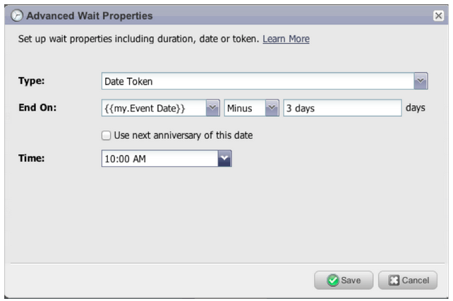
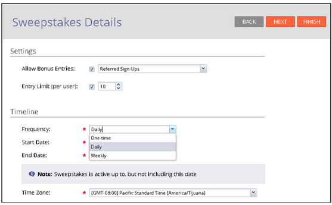
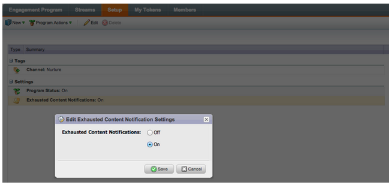

# 2013

## January 2013 {#january}

The January release expands our social offering with **Referral Offers**. In addition, [!DNL Marketo Lead Management] users can set their time zone, language, and locale preference. Please note that features marked with an &#42; are available only in the Select Edition.

## Referral Offers {#referral-offers}

A **Referral Offer** gives your leads an incentive to refer their friends. Create goals and rewards for successful referrals. You can use it on landing pages, your website, and even Facebook.

## Time Zone Preference {#time-zone-preference}

You can change the default time zone for your personal Marketo account. For example, even if the default for the subscription is Pacific Time, you can change it to Eastern Time for your own account.

## Select your [!DNL Marketo Lead Management] Language {#select-your-marketo-lead-management-language}

You can change the default language for your Marketo user account. Even if the default for the subscription is in English, you can change it to German or French for your own use.

## Multi-Lingual Form Error Messages {#multi-lingual-form-error-messages}

When a lead fills out a Marketo form, some validation messages are automatically built in. You may want to select a different display language for these error messages. We now support English, German, and French.

An example of a French form:

## Select your [!DNL Sales Insight] Language ([!DNL Salesforce] Only) {#select-your-sales-insight-language-salesforce-only}

If your [!DNL Salesforce] language preference is set to either French or German, Marketo [!DNL Sales Insight] will honor this preference. Download the latest MSI package to get this functionality (available the week of January 14).

## Field Display Name {#field-display-name}

Field Display Names can display text in different languages (e.g. multi-byte characters are supported).

## Change Program Data {#change-program-data}

The [!UICONTROL Change Program Data] flow step allows you to change the [!UICONTROL Success] status and [!UICONTROL Success Date] of a program member manually through a campaign. You can use this flow step to correct a mistake, or to manually change a member who may not have participated in the program as intended.

## February 2013 {#february}

The February release includes a highly requested feature, support for  [!DNL Apple Safari] and other small enhancements.

## Official Support for  [!DNL Apple Safari] {#official-support-for-apple-safari}

The latest versions of  [!DNL Apple Safari] for Mac and  [!DNL Windows] are fully supported for use with Marketo Lead Management. Note:  [!DNL Safari] on iOS is not fully compatible.

## Webhooks Enhancements {#webhooks-enhancements}

Webhooks is enhanced to escape tokens in the URL/payload and can also update Marketo lead fields by parsing XML/JSON responses from 3rd party systems (not available in the  [!DNL Spark SMB Edition]).

## Updated  SOAP API Endpoint {#updated-soap-api-endpoint}

The preferred  SOAP API endpoint has been updated, which is shown in [!UICONTROL Admin] ->  SOAP API. Please update your calls to use this new endpoint. API calls to the old endpoint are deprecated, but will continue to function. (SOAP API not available in the [!DNL Spark SMB Edition])

## Mobile Support for [!DNL Facebook] Tabs {#mobile-support-for-facebook-tabs}

[!DNL Facebook] tabs published from Marketo will detect mobile devices and route them to a landing page. This will ensure that the user gets the right content on mobile devices on which [!DNL Facebook] tabs are not supported (available in [!DNL Spark], [!DNL Standard], [!DNL Select SMB Editions] and [!DNL Marketo Social Marketing]).

## Coming Soon: Support for Multiple Models {#coming-soon-support-for-multiple-models}

We're laying the groundwork to support multiple revenue cycle models, voted #1 idea for RCA in the Community, in a future release. In this release, you will notice some changes including Smart List filters and Add Choices in Flow Steps to support the selection of a model and stage. We're also moving the Lead Revenue Stage and Lead Revenue Cycle Model fields out of the Smart List Lead grid tab.

## March 2013 {#march}

The following features are included in the March release.

## Marketo Calendar Files {#marketo-calendar-files}

Create a calendar file as a **My Token** to be used in your event confirmation and reminder emails. This integrated calendar file (e.g., .ics file) will render all tokens, including My Tokens and the `{{member.webinar URL}}` token.

## Wait Until +/- {#wait-until}

Create Wait Steps that can execute a specified number of days before or after a date token. For example, you can create a wait step that will wait 3 days before the event date and then send a reminder!

You can create a wait step that will wait 14 days before the lead's birthday. By selecting "use next anniversary of this date" the system will automatically ignore the year associated with the date, and use the current or next calendar year instead.

## Social Sweepstakes {#social-sweepstakes}

A sweepstakes gives your leads a chance to win a prize and tell their friends about you. You select random winners from the participants and send them email.

## Additional Form [!UICONTROL Error Message] Languages {#additional-form-error-message-languages}

More than a dozen languages have been added to the form error messages!

## Support News and Alerts {#support-news-and-alerts}

Stay connected to Marketo Customer Support by subscribing to Support News and Alerts for P1 Alerts, Known Issues, Hints and Tips from our Support Experts, and updates from Marketo Customer Support.

## April 2013 {#april}

The following features are included in the April release.

## [!DNL Box] Integration {#box-integration}

Connect Marketo with your [!DNL Box] account to easily copy files into the design studio.

## [!DNL Gmail] Plugin {#gmail-plugin}

If you use Marketo [!DNL Sales Insight], as well as [!DNL Gmail], you can install our new [!DNL Gmail] plugin through the [!DNL Chrome] store. The plugin allows you to log messages with Marketo, load Marketo email templates, and send messages with Marketo tracking features.

## Email Analysis {#email-analysis}

Create advanced email reports in [!UICONTROL Revenue Explorer] such as the Click Activity Heat Grid report. This report will give insight into the day and time people are clicking links in your emails.

The Email Analysis feature as a whole will be turned on in phases during April and May as we migrate your 2012 and 2013 email data. In other words, some customers will have access to this feature sooner than others.

## Program APIs {#program-apis}

Support for programs in the SOAP API call, including read-only access to program data such as: program membership counts, acquired by, success, settings, channels, tags, tokens and costs. Please see the SOAP API documentation for more details.

## [!DNL ON24] Enhancement {#on-enhancement}

Job Title and Company Name will sync to [!DNL ON24] from your Marketo registration form.

## May 2013 {#may}

The following features are included in the May release.

## Calendar Files for Landing Pages {#calendar-files-for-landing-pages}

Create a calendar file as a My Token that can be added to your landing page. This integrated calendar file (e.g. .ics file) will render all tokens, including My Tokens on local asset landing pages.

## Model Membership Tab {#model-membership-tab}

View all your model member's data in one place in order to easily monitor and troubleshoot. The new [!UICONTROL Members] Tab is a read-only view available when you select an approved Revenue Cycle Model.

## Reorganized Flow Action Tree {#reorganized-flow-action-tree}

Find flow actions faster with the newly reorganized flow action tree.

## Renamed Flow Actions {#renamed-flow-actions}

Change Progression Status is now [!UICONTROL Change Program Status]. Change Program Data is now [!UICONTROL Change Program Success].

## June 2013 {#june}

The following features are included in the June release.

## Additional User Languages {#additional-user-languages}

View the Marketo Lead Management interface in your preferred language -- now supporting Spanish and Portuguese.

## Cobalt User Interface {#cobalt-user-interface}

Over the next few months you will notice a new theme rolled out in different parts of the application; impacting modal windows for example.

## Subfolder Cloning {#subfolder-cloning}

Clone assets into subfolders.

## Multiple Models {#multiple-models}

A top idea for Revenue Cycle Analytics (RCA) in the Community, this feature allows you to create multiple models to have a more detailed understanding of your revenue funnel by product line, business unit, or region. The Leads by Revenue Stage, Success Path Analyzer, Program Analyzer and Revenue Explorer reports now supports the ability to select a specific model for reporting.

By default, two models are available for Select SMB Edition and fifteen models for Enterprise Edition. You may purchase additional models also.

## July 2013 {#july}

The following features are included in the July release which is scheduled for a Friday, July 26 rollout.

## Exhausted Content Widget on the Dashboard {#exhausted-content-widget-on-the-dashboard}

Provides information on when leads will exhaust the content within the Stream. The system will provide you with information on how many leads are about to reach exhausted content, or how long leads have been exhausted.

## Communication Limits {#communication-limits}

Want to stop over-emailing leads? Now it is easy to automatically limit frequency to each individual. Simply set a daily and weekly communication limit, and the system will do the rest. Available in Select, Enterprise, and with the Add-On package for Standard customers.

## Cobalt User Interface {#cobalt-user-interface-july}

Over the next few months, you will notice more of our new theme rolling out in different parts of the application. No functionality will be moved or removed.

## Program Member Date Column {#program-member-date-column}

View and sort the member grid by the date that the lead was added.

## Changes to Spell Check in WYSIWYG Editor {#changes-to-spell-check-in-wysiwyg-editor}

The service utilized by the WYSIWYG editor for spell check was discontinued. We removed the Spell Check button from the editor until we find a replacement.

## August 2013 {#august}

The following features are included in the August, 2013 release.

**Text Only Emails**

Now you may send [just the text version](/help/marketo/product-docs/email-marketing/general/creating-an-email/create-a-text-only-email.md) of an email. Keep in mind, links won't be decorated when using this option.

## Customer Engagement Engine Enhancements {#customer-engagement-engine-enhancements}

### Ignore Exhausted Content {#ignore-exhausted-content}

Configure the engagement program to [ignore exhaustion](/help/marketo/product-docs/email-marketing/drip-nurturing/using-engagement-programs/disable-and-enable-exhausted-content-notifications.md), including suppression of any notifications.

## Engagement Stream Testing {#engagement-stream-testing}

Use the [new testing feature](/help/marketo/product-docs/email-marketing/drip-nurturing/engagement-program-streams/test-an-engagement-stream.md) to simulate a cast, and test newly added content to a live stream.

## Personalized Send Test {#personalized-send-test}

When you send an email test, you can select the name of a lead to personalize the test email.

## "View Email as Web Page" and "Unsubscribe" System Tokens {#view-email-as-web-page-and-unsubscribe-system-tokens}

Utilize these [new tokens](/help/marketo/product-docs/email-marketing/general/using-tokens/system-tokens-glossary.md) to provide greater control of their placement in emails.

## Automatic Trigger Campaign Cleanup {#automatic-trigger-campaign-cleanup}

Marketo will now periodically notify you and [automatically deactivate trigger campaigns](/help/marketo/product-docs/core-marketo-concepts/smart-campaigns/using-smart-campaigns/automatic-trigger-campaign-cleanup.md) that have not run in the past six months.

## Marketo Financial Management Enhancement {#marketo-financial-management-enhancement}

### Program Cost Update  {#program-cost-update}

Program cost sync enables tracking of program cost across multiple platforms.

### Cobalt User Interface {#cobalt-user-interface-august}

We are continuing the rollout of our new Cobalt interface. This project will make everything in Marketo super snappy! The upgrade will continue through the rest of the year.

## September 2013 {#september}

The following features are included in the September release.

## Shorter URLs {#shorter-urls}

Email URLs have been given a trim to be click friendly to the recipient, while preserving all tracking functionality

>[!CAUTION]
>
>As we switch over to Short URLs, links in emails sent out prior to the September release, will expire 90 days after this release.

Use data from Marketo custom objects or add conditional logic to your email content using the Velocity template language.

## Change Send Test to Send Sample {#change-send-test-to-send-sample}

We have renamed the action Send Test to be Send Sample

## Personalized [!UICONTROL Send Sample Email] {#personalized-send-sample-email}

When you send an email sample, you can select the name of a lead to personalize the sample email.

## Additional Field Sync for [!DNL GoToWebinar] {#additional-field-sync-for-gotowebinar}

You can sync Company Name and Job Title from your Marketo form to [!DNL GoToWebinar]. To enable these additional fields, go to Event Partners and check "Enable Additional Fields."

## Restrict User Login to SSO only {#restrict-user-login-to-sso-only}

Configure subscriptions to only allow Marketo Users to log in through SSO and not through the normal login screen

## Virus Scan of Uploaded Files {#virus-scan-of-uploaded-files}

Files uploaded to the Design Studio are now automatically scanned and blocked if the files contain viruses

## Export Opportunity Influence Analyzer {#export-opportunity-influence-analyzer}

You can now export the data in the Opportunity Influence Analyzer to [!DNL Excel]. Each exported [!DNL Excel] file contains all the marketing interactions for all leads (including those without a role in the opportunity) as well all the opportunities under the selected account in the analyzer. The opportunity rows are highlighted in green. You can use [!DNL Excel]'s native data filtering capabilities if you need to focus on specific leads or marketing activities.

## Program Attribution Settings {#program-attribution-settings}

You can change the way Marketo ties contacts and opportunities for first and multi touch attribution metrics, including the ability to do account-based attribution. These settings will impact attribution metrics in [!UICONTROL Revenue Explorer] reports under the Program Opportunity Analysis area and the Opportunity Analysis area. This will also affect the attribution metrics in Program Analyzer.

You can change the program attribution settings to one of three choices. Changing this setting does not modify any Marketo or CRM data; it simply changes the way your reports run and it can be reverted at any time.

The Explicit setting will only examine contacts with roles (current behavior). Implicit will examine all contacts associated to the account regardless of role. We strongly recommend using the Explicit mode if possible. Using Implicit may create false positives, people with credit for an opportunity despite having no real influence in the opportunity.

## [!UICONTROL Sales Insight] available in French and German ([!DNL Salesforce] only) {#sales-insight-available-in-french-and-german-salesforce-only}

Download the latest version of Marketo Lead Management and Marketo [!UICONTROL Sales Insight] from [!DNL AppExchange] so your French and German salespeople can see [!UICONTROL Sales Insight] content in their preferred language.

## Cobalt User Interface {#cobalt-user-interface-september}

Over the next few months, a new theme is being rolled out in different parts of the application. This month, you may notice more new blue modal windows.

## October 2013 {#october}

The following features are included in the October 2013 release.

## templates.marketo.com {#templates-marketo-com}

[Templates.marketo.com](/help/marketo/product-docs/demand-generation/landing-pages/landing-page-templates/guided-landing-page-template-list.md) showcases email and landing page templates (including responsive mobile email templates) which you can download from the [!DNL Marketo Program Library]. We will add templates monthly, check back often!

## developers.marketo.com {#developers-marketo-com}

[Developer.adobe.com](https://experienceleague.adobe.com/en/docs/marketo-developer/marketo/home) is for developers who want to build integrations into Marketo. You can reference different integration options, including Munchkin JavaScript APIs, SOAP API code examples, Webhooks and email scripting. A Java SDK is also available on [GitHub](https://github.com/Marketo/SOAP-API-Java-Client).

## Updated [!DNL BrightTALK] Event Adapter {#updated-brighttalk-event-adapter}

Sync additional fields from [!DNL BrightTALK] to Marketo, including Company Name, Job Title, Industry and Company Size.

## Android Tablet Event Check-In App {#android-tablet-event-check-in-app}

Check registrants into your event using our new Android-based check in app available on Google Play.

## December 2013 {#december}

The following features are included in the December release.

After the release, be sure to check out the New Release tab in the Community for detailed Knowledge Base articles for each feature!

## Email Program {#email-program}

Sending an email has never been easier. Use the new [email program](/help/marketo/product-docs/email-marketing/email-programs/creating-an-email-program/understanding-email-programs.md) to send a batch email, instead of the Default Program. Define the smart list, email, schedule it, and you are off!

Also check out the new [Email Metrics Dashboard](/help/marketo/product-docs/email-marketing/email-programs/email-program-data/view-the-email-program-dashboard.md) to see how your email performed.

## Email A/B Testing {#email-a-b-testing}

In the new Email Program, run an [A/B test](/help/marketo/product-docs/email-marketing/email-programs/email-program-actions/email-test-a-b-test/add-an-a-b-test.md) on a percentage of the overall email send population. Choose from 4 different types of tests: Subject line, From Address, Date/Time, and Whole Email. You can even choose to manually promote the winner, or let the system promote it based on a pre-defined winning criteria. The new Email program, including A/B test, can be nested in Events and the default Program to make that email send so simple!

## Email Champion/Challenger Testing {#email-champion-challenger-testing}

[Champion/Challenger testing](/help/marketo/product-docs/email-marketing/general/functions-in-the-editor/email-tests-champion-challenger/add-an-email-champion-challenger.md) is similar to A/B test, but the difference is that it is used for triggered emails and you don't automatically send a winner. This test allows you to challenge an established way of doing something, called the Champion, and you test if it is still the best by introducing a Challenger. In addition, Champion/Challenger Email Tests can be used inside Engagement program streams.

## Lead Details in [!UICONTROL Email Analysis] {#lead-details-in-email-analysis}

We introduced additional lead and company attributes in [!UICONTROL Email Analysis]. You can now view your email stats grouped by new attributes such as [!UICONTROL Industry] and [!UICONTROL Lead Source].

## Enhanced [!DNL BrightTALK] Event Adapter {#enhanced-brighttalk-event-adapter}

Now you can pull registrants into Marketo from your [!DNL BrightTALK] channel and event. You can use this information to inform other marketing campaigns!

