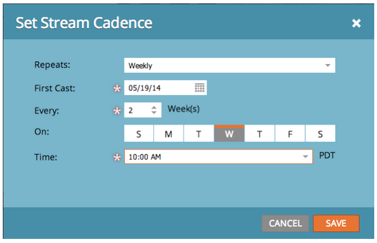
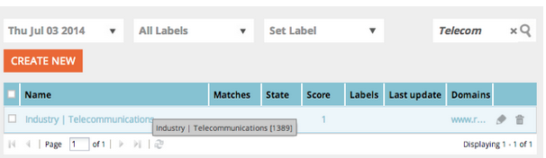
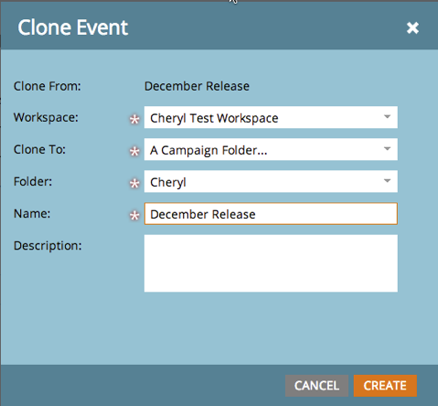
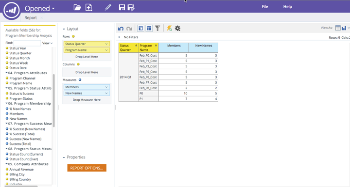

# 2014

## January 2014 {#january}

The following features are included in the January 2014 release. Please check your [Marketo Edition](https://www.marketo.com/pricing/) for feature availability.

## Forms 2.0 {#forms}

Heads up: Documentation for Forms 2.0 is coming soon!

Take control of the form creation process and give your web developers a break. Forms 2.0 are designed to empower Marketers to create both visually and functionally robust forms without needing programming knowledge.

**Give Your Forms the Visual Makeover They Deserve:**

Theme designs, button customization, and flexible layouts enable you to design modern looking forms that'll fit right in with your site's look and feel.

**Conditional Visibility and Follow-up page Logic:**

Want "State" to only show up if a user selects USA as their "Country"? How about presenting different whitepapers to customers based on how they answer questions on your form? Build conditional logic into your forms right from the editor. No [!DNL javascript] required!

**Easily Embed Forms on your own landing pages:**

Gone are the days of lifting html code from forms placed on Marketo landing pages and dropping them in an [!DNL iFrame]. Simply grab the embed code and place it on your landing page where you want the form to render. Two modes -normal and lightbox- give you even more flexibility with Marketo forms on your site.

## Communication Limits for Email Program {#communication-limits-for-email-program}

[Set Communication Limits on an email program](/help/marketo/product-docs/email-marketing/email-programs/email-program-actions/enable-disable-communication-limits-in-an-email-program.md) to ensure you do not over-communicate to your database. If a person is over the limit defined, she will not receive the email.

## Additional Fields in Program Membership Analysis {#additional-fields-in-program-membership-analysis}

Now you can add and group your Program Membership Analysis metrics by lead and company attributes. For example, you can add the Industry field to see the split of your program members and successes.

## February 2014 {#february}

The following features are included in the February 2014 release. Please check your Marketo Edition for feature availability. After the release, be sure to come back to find links to detailed Knowledge Base articles for each feature!

## [!UICONTROL Engagement Score] as Winning Criteria {#engagement-score-as-winning-criteria}

[Use the engagement score](/help/marketo/product-docs/email-marketing/email-programs/email-program-actions/email-test-a-b-test/define-the-a-b-test-winner-criteria.md) to determine the winning variant in your A/B split test or Champion/Challenger test. The test must run for a minimum of 24 hours, to give an adequate engagement score.

## Email Program [!UICONTROL Results] Tab {#email-program-results-tab}

[View the results](/help/marketo/product-docs/email-marketing/email-programs/email-program-data/view-email-program-results.md) and activities logged for the email program.

## People/[!UICONTROL Leads] Blocked from Mailing {#people-leads-blocked-from-mailing}

[Click the people/leads blocked from mailing](/help/marketo/product-docs/email-marketing/email-programs/managing-people-in-email-programs/define-an-audience-with-a-smart-list.md) number to see who will not receive the email due to being unsubscribed, black listed, having an invalid or blank email address, or being marketing suspended.

## Export Email Program Data {#export-email-program-data}

[Export email metrics to [!DNL Excel]](/help/marketo/product-docs/email-marketing/email-programs/email-program-data/export-email-program-dashboard-to-excel.md), including AB Test variant data.

## [!UICONTROL Engagement Score] in [!UICONTROL Engagement Stream Performance] Report {#engagement-score-in-engagement-stream-performance-report}

We added the Engagement Score to the [[!UICONTROL Engagement Stream Performance] Report](/help/marketo/product-docs/email-marketing/drip-nurturing/reports-and-notifications/engagement-stream-performance-report.md) to help you see how effective the content in your engagement program is.

## Program Details in Email Analysis {#program-details-in-email-analysis}

Now you can group your email metrics by Program Name, Channel and Tags. The program name is added to the Email Name field when the email is a local asset to the Program. The new Program Name field shows the program name of the smart campaign that sent the email. This could be different from the program in the Email Name field if the email is a local asset of a different program.

## Update to Clicks Link Filters and Trigger {#update-to-clicks-link-filters-and-trigger}

The following filter and trigger names have been updated:

* Clicks Link to [!UICONTROL Clicks Link on Web Page]
* Clicked Link to [!UICONTROL Clicked Link on Web Page]
* Not Clicked Link to [!UICONTROL Not Clicked Link on Web Page]

## Forms 2.0 Enhancements {#forms-enhancements}

We've given Forms 2.0 several "quality of life" updates with this release. In addition to enabling progressive profiling on embedded forms, we've made workflow and UX changes that will make it easier to use the more advanced functionality in the editor, [including the visibility rules](/help/marketo/product-docs/demand-generation/forms/form-fields/dynamically-toggle-visibility-of-a-form-field.md), advanced thank you pages, and hidden fields.

## March 2014 {#march}

The following features are included in the March 2014 release. Please check your Marketo Edition for feature availability. After the release, be sure to come back for links to knowledge base articles for each feature.

## Email Program Dashboard Refresh Button {#email-program-dashboard-refresh-button}

Use the [refresh button](/help/marketo/product-docs/email-marketing/email-programs/email-program-data/use-the-email-program-dashboard.md) to get up-to-the minute email metrics about your email send or your AB test!

## Undo/Redo in the Email Editor and Snippet Editor {#undo-redo-in-the-email-editor-and-snippet-editor}

[Undo or redo](/help/marketo/product-docs/email-marketing/general/email-editor-2/edit-elements-in-an-email.md) up to 50 actions for the current session.

## Program Status Columns in Program Performance Report {#program-status-columns-in-program-performance-report}

When using the [program performance report](/help/marketo/product-docs/core-marketo-concepts/programs/program-performance-report/add-program-status-columns-to-a-program-report.md), you can now see how many people are in which program statuses.

## Inclusive and Operational Programs for Analytics {#inclusive-and-operational-programs-for-analytics}

You can now include programs without period costs in [!UICONTROL Revenue Explorer] and Analyzers by setting the Analytics Behavior option to "Inclusive" when you edit Program Channels. You can also exclude operational programs from reporting all together by choosing "Operational".

## Hybrid and Implicit Options for Lead Conversion {#hybrid-and-implicit-options-for-lead-conversion}

You can change the way Marketo ties contacts and opportunities for the lead conversion metrics in Lead Analysis. You can [change the attribution setting](/help/marketo/product-docs/administration/settings/change-attribution-settings-for-analytics.md) to one of three choices. Changing this setting does not modify any Marketo or CRM data; it simply changes the way your reports run and it can be reverted at any time.

The Explicit setting will only treat contacts with roles in an opportunity as converted leads (default behavior). Implicit will treat all contacts associated to the account in the opportunity, regardless of role, as converted. Hybrid will treat contacts with roles as converted if available; if none, we treat all contacts in the account as converted.

As a reminder, this setting also changes program attribution metrics.

## Additional User Language {#additional-user-language}

Select Your [Marketo Application Language](/help/marketo/product-docs/administration/settings/change-time-zone.md). View the Marketo Lead Management interface in your preferred language -- now supporting Japanese.

## Marketo Developer Blog {#marketo-developer-blog}

The [Marketo Developer blog](https://developers.marketo.com/blog/) is dedicated to those web developers and software engineers who support the rapidly evolving needs of the modern marketer. You can subscribe to announcements on new integration options, API version updates, and a new series of how-to articles that include code samples and best practices on integration with the Marketo platform.

The [first article](https://developers.marketo.com/blog/retrieving-customer-and-prospect-information-from-marketo-using-the-api/) in this series will walk you through how to efficiently retrieve information on the people (customers/contacts/leads) that are stored within Marketo using the API.

## May 2014 {#may}

The following features are included in the May 2014 release. Please check your Marketo Edition for feature availability. After the release, be sure to come back to find links to detailed Knowledge Base articles for each feature!

## Delete Workspace {#delete-workspace}

Now you can [delete an unused workspace](/help/marketo/product-docs/administration/workspaces-and-person-partitions/delete-a-workspace.md). Be sure to move all assets into another workspace before attempting to delete the workspace.

## Schedule First Cast {#schedule-first-cast}

In engagement programs, you can schedule the date for the [first cast to run](/help/marketo/product-docs/email-marketing/drip-nurturing/engagement-program-streams/set-stream-cadence.md). For example, specify the cadence to be every 2 weeks and select the date of the first cast.

## Enhanced Engagement Programs {#enhanced-engagement-programs}

Now everyone gets multiple programs, streams and communication limits.

## Link Tracking in Text Emails {#link-tracking-in-text-emails}

[Add double square brackets](/help/marketo/product-docs/email-marketing/general/functions-in-the-editor/add-tracked-links-to-a-text-email.md) around URLs in the text version of your emails to indicate when links should be converted into re-directed Marketo tracking links

>[!NOTE]
>
>**Example**
>
>`[[https://www.marketo.com]]`

By default, no links will be tracked in the text version of emails. Add this new syntax to indicate when a link should be converted into a tracking link. The behavior of HTML links is unchanged.  To add tracked links to your emails:

* **HTML version:** Just insert your link. It will be tracked by default.
* **Text version:** Enter the URL surrounded by double square brackets.

To add untracked links to your emails:

* **HTML version:** Insert your link and add the "mktNoTrack" class to the link.
* **Text version:** Just enter the URL. It will be untracked by default.

## Link Markup in Sample Emails {#link-markup-in-sample-emails}

See how your links will behave in emails ahead of time. Sample emails now display links exactly how they would appear to your leads. Preview which links have been converted to tracking links, giving you a better sense of how the message will actually appear to recipients.

## [!UICONTROL Abort Campaign] {#abort-campaign}

Don't panic! If you find a mistake, use the new [abort campaign](/help/marketo/product-docs/core-marketo-concepts/smart-campaigns/using-smart-campaigns/abort-a-smart-campaign.md) button to immediately stop campaigns in their tracks. You'll receive a notification outlining how many leads were pending in each flow step when the campaign was stopped.

## [!UICONTROL Sales Insight] in Japanese, Portuguese and Spanish {#sales-insight-in-japanese-portuguese-and-spanish}

Download the latest version of [!UICONTROL Sales Insight] from AppExchange so your Japanese, Portuguese and Spanish speaking sales agents view [!UICONTROL Sales Insight] content in their preferred language.

## Program Status and Success Timeframe in Program Membership Analysis {#program-status-and-success-timeframe-in-program-membership-analysis}

View how many members are in each Program Status and when they changed to each status, including the date when they achieved Program Success.

## A/B Test Emails in [!UICONTROL Email Analysis] {#a-b-test-emails-in-email-analysis}

Report on each of your A/B test email variants in [!UICONTROL Email Analysis].

## Analytics Packaging Changes {#analytics-packaging-changes}

Revenue Cycle Modeler and Success Path Analyzer are now included in MA Standard Edition.

## Mobile Platform Info {#mobile-platform-info}

[Segment and trigger](/help/marketo/product-docs/reporting/basic-reporting/report-activity/build-a-people-performance-report-with-mobile-platform-columns.md) off of leads opening and clicking emails from their mobile devices.

## June 2014 {#june}

The following features are included in the June 2014 release. Please check your Marketo Edition for feature availability.

## Updated UI - Coming Soon! {#updated-ui-coming-soon}

A new look and feel, including navigation for [!DNL Marketo Lead Management] is coming soon in a later release!

## [!DNL Sales Insight] plugin for [!DNL Outlook] 2013 {#sales-insight-plugin-for-outlook}

This will require a download of the new plug-in. You can download it from [here](/help/marketo/product-docs/marketo-sales-insight/msi-outlook-plugin/install-the-marketo-email-add-in-for-outlook-with-a-registration-code.md).

## Token Resolution {#token-resolution}

When you send a test email from [!DNL Sales Insight], currently tokens in the email do not resolve and the default value is sent. This enhancement will ensure that tokens resolve in test emails.

## Customize Percentages for Stars and Flames {#customize-percentages-for-stars-and-flames}

[Set the percentage](/help/marketo/product-docs/marketo-sales-insight/msi-for-salesforce/features/stars-and-flames/customize-stars-and-flames.md) of leads that get 1, 2, or 3 stars and flames.

## Lead REST API {#lead-rest-api}

Create, read, and update leads programmatically through our new ReST API. To get started with ReST you need to [create a custom service](/help/marketo/product-docs/administration/additional-integrations/create-a-custom-service-for-use-with-rest-api.md) in Marketo. Then head over to the [developers site](https://experienceleague.adobe.com/en/docs/marketo-developer/marketo/rest/rest-api) for details on using this API.

## Marketo Real-Time Personalization (RTP) Campaigns Page Update {#marketo-real-time-personalization-rtp-campaigns-page-update}

RTP Campaigns now include a new design with thumbnail views and campaign performance. Additionally, you can [organize your campaigns](/help/marketo/product-docs/web-personalization/working-with-web-campaigns/sort-web-campaigns-by-latest-or-top-performing.md) according to date or top performance.

## Web Analytics Integrations {#web-analytics-integrations}

Append all your RTP data within your web analytics platform.

The integration with [Google Analytics](/help/marketo/product-docs/web-personalization/reporting-for-web-personalization/web-analytics-integrations/integrate-rtp-with-google-analytics.md) (GA) is now enabled by default, so under Account Settings turn on the switch for which data you want to send through to GA custom variables and events.

We also completed the integration with [Adobe SiteCatalyst](/help/marketo/product-docs/web-personalization/reporting-for-web-personalization/web-analytics-integrations/integrate-with-adobe-analytics.md).

## July 2014 {#july}

The following features are included in the July 2014 release. Please check your Marketo Edition for feature availability. Come back after the release for links to detailed feature documentation.

## Marketing Calendar {#marketing-calendar}

See all of your events, emails and more across programs. [This new product](/help/marketo/product-docs/core-marketo-concepts/marketing-calendar/understanding-the-calendar/navigating-the-marketing-calendar.md) will be available at no charge to customers with 10 or fewer [!DNL Marketo Lead Management] or Dialog users.

Documentation on the Marketing Calendar will be available at release time.

## New Look and Feel {#new-look-and-feel}

[!DNL Marketo Lead Management] will be updated with a new look and feel that is modern and sleek, and includes an updated navigation.

## Date Operators {#date-operators}

[Advanced filters](/help/marketo/product-docs/core-marketo-concepts/smart-lists-and-static-lists/creating-a-smart-list/smart-list-filter-operators-glossary.md) for "[!UICONTROL in past before]", "[!UICONTROL in future]", and "[!UICONTROL in future after]". For example, find leads that have a birth date in the next 3 months, or a contract that is expiring after 6 months.

## Program Schedule View {#program-schedule-view}

In addition to the marketing calendar you manage your events and default programs with, a new schedule view right on the program.

* Reschedule all dates at once
* New Tentative Dates - pencil it in!
* Custom Entry types - ToDo, Press Release, anything you want

## List Operations in the REST API {#list-operations-in-the-rest-api}

We've added the calls below related to list operations in ReST. See [https://experienceleague.adobe.com/en/docs/marketo-developer/marketo/rest/rest-api](https://experienceleague.adobe.com/en/docs/marketo-developer/marketo/rest/rest-api) for the full documentation.

* Get List By ID
* Get Multiple Lists
* Import to List
* Get Import to List Status

## Fast List Import {#fast-list-import}

Over **50x faster**, your files will zoom into Marketo! The old "Normal" and "Optimized for New Leads" import options have been replaced with "Default (Fast Import)".

The "Skip New Leads and Updates" option remains unchanged.

## New Improved Munchkin! {#new-improved-munchkin}

Rollout will be staged starting in mid-July and continuing for the next several months.

* Removes the dependency [!DNL jQuery] for full and future compatibility
* More compatible with other JavaScript on your site
* Fully tested on many sites over the past year!

## RTP: Real-Time Personalization Campaign Templates {#rtp-real-time-personalization-campaign-templates}

The RTP Set Campaign page now [includes ready-made templates](/help/marketo/product-docs/web-personalization/using-templates/using-templates-to-create-web-campaigns.md). Choose from a variety of styles including webinars, case studies, ebooks.

## RTP: JavaScript API Enhancements {#rtp-javascript-api-enhancements}

New RTP API call to get real-time visitor data such as organization, industry, location and segment code match. In addition, hovering over a segment name in the Segments page will reveal a tooltip showing the segment code. See our [developers site](https://experienceleague.adobe.com/en/docs/marketo-developer/marketo/javascriptapi/rich-media-recommendation) for full documentation.

## RTP: HTML5 support in Campaign Content Editor {#rtp-html-support-in-campaign-content-editor}

The content WYSIWYG editor in the Set Campaigns page now has full HTML5 compatibility. Click on the "HTML" icon within the editor to insert any HTML5 code.

## August 2014 {#august}

The following features are included in the August 2014 Release. Check your Marketo edition for feature availability. Come back after the release for links to detailed feature documentation.

## Marketing Calendar Licenses {#marketing-calendar-licenses}

After September 5th, 2014 only 5 users can have free access to the marketing calendar. Be sure to [Issue/Revoke a Marketing Calendar License](/help/marketo/product-docs/core-marketo-concepts/marketing-calendar/understanding-the-calendar/issue-revoke-a-marketing-calendar-license.md) to the users of your choice before then for un-interrupted access.

## New User Permissions {#new-user-permissions}

The following new user permissions were added:

| Permission |Description |
|---|---|
| Access Revenue Explorer |If you purchased RCA, you will now have control over who can access it. |
| Import List |Restrict users from importing lists into the lead database. |
| List Import |Restrict users from importing lists via a program under marketing activities. |
| Activate Trigger Campaign |Control who can and cannot activate trigger campaigns. |
| Schedule Batch Campaign |Control who can and cannot schedule batch campaign runs. |

## Export Users and Roles from [!UICONTROL Admin] {#export-users-and-roles-from-admin}

You can now [Export a List of Users and Roles](/help/marketo/product-docs/administration/users-and-roles/export-a-list-of-users-and-roles.md) from Marketo. You can also include a "Last Login" time stamp to be included with the export.

## Delete Channels and Tags {#delete-channels-and-tags}

You can now delete any unused channels and statuses. As always, you can only hide one that is currently in use.

## Automated [!DNL DKIM] {#automated-dkim}

For improved deliverability, all outgoing emails will be [!DNL DKIM] (DomainKeys Identified Mail) signed. By default, emails will use Marketo's shared [!DNL DKIM] signature. You will have the option to customize this signature.

>[!NOTE]
>
>[!DNL DKIM] will be rolled out slowly, you may not see it for a few weeks.

## Real-Time Personalization Updates {#real-time-personalization-updates}

We have added labels to the campaign page so that you can tag to your hearts content.

## Mobile Targeting {#mobile-targeting}

You asked on the community and we delivered! You can now include, exclude or set a specific call to action for mobile and tablet users.

## Enhanced 1:1 Segmentation and Targeting {#enhanced-segmentation-and-targeting}

You can now use advanced filter operators for targeting known visitors.

## Campaign Sharing {#campaign-sharing}

You now have the ability to quickly and easily share an RTP campaign preview link.

## Content Recommendation Engine Report {#content-recommendation-engine-report}

We have added a new content recommendation engine report for you to see a nice summary.

## Enhanced User Administration {#enhanced-user-administration}

Admin users can now lock users due to multiple failed login attempts. You can also unlock those users if desired.

## Tracking Control {#tracking-control}

You can now exclude specific IPs from all tracking and reporting in Real-Time Personalization.

## October 2014 {#october}

Check your Marketo edition for feature availability. Documentation will come at time of release.

## Program Focus in Marketing Calendar {#program-focus-in-marketing-calendar}

[Create and edit entries](/help/marketo/product-docs/core-marketo-concepts/marketing-calendar/understanding-the-calendar/understand-enable-program-focus.md) directly from the marketing calendar.

## New REST API Calls {#new-rest-api-calls}

Use the API to pull new activities or changes to leads:

* Get Lead Changes
* Get Lead Activities
* Get Activity Types
* Get Paging Token

Full details will be available after the release at [https://experienceleague.adobe.com/en/docs/marketo-developer/marketo/rest/rest-api](https://experienceleague.adobe.com/en/docs/marketo-developer/marketo/rest/rest-api).

## MSI - Send Marketo Email for [!DNL Microsoft Dynamics] {#msi-send-marketo-email-for-microsoft-dynamics}

[Send and track sales emails](/help/marketo/product-docs/marketo-sales-insight/msi-for-microsoft-dynamics/setting-up-and-using/send-a-marketo-sales-email-from-microsoft-dynamics.md) to leads and contacts from [!DNL Microsoft Dynamics].

## MSI - Add to Marketo Campaigns for [!DNL Microsoft Dynamics] {#msi-add-to-marketo-campaigns-for-microsoft-dynamics}

[Add leads and contacts to Marketo smart campaigns](/help/marketo/product-docs/marketo-sales-insight/msi-for-microsoft-dynamics/setting-up-and-using/add-a-lead-contact-to-a-marketo-campaign-from-microsoft-dynamics.md) directly from within [!DNL Microsoft Dynamics]. Marketing can choose which Marketo campaigns are available to sales.

## Custom Entity Support for [!DNL Microsoft Dynamics] Sync {#custom-entity-support-for-microsoft-dynamics-sync}

[Use custom object data](/help/marketo/product-docs/crm-sync/microsoft-dynamics-sync/microsoft-dynamics-sync-details/enable-sync-for-a-custom-entity.md) from [!DNL Microsoft Dynamics] for filtering and triggering in smart lists, smart campaigns, programs...

## Shareholder Support for [!DNL Microsoft Dynamics] Sync {#shareholder-support-for-microsoft-dynamics-sync}

Sync down opportunity shareholder data from [!DNL Dynamics]. Also supported are opportunities connected to an account using the "Primary Account" field as well as opportunities connected to contact using the "Primary Contact" sync.

## RTP - Dashboard Enhancements {#rtp-dashboard-enhancements}

The dashboard is now enhanced to include more at-a-glance data:

* Total organization visits
* Top 5 performing industries
* Total engaged visitors

## RTP - New Mobile Templates for Campaigns {#rtp-new-mobile-templates-for-campaigns}

Quickly and easily [create mobile campaigns](/help/marketo/product-docs/web-personalization/using-templates/using-templates-to-create-web-campaigns.md) with these new templates.

## RTP - User Context API {#rtp-user-context-api}

Use a new call that tracks visitor's past visit history. Personalize campaigns based on the visitor's:

* Past pages viewed
* Products interested in
* What RTP campaigns they have seen

Visit [https://experienceleague.adobe.com/en/docs/marketo-developer/marketo/javascriptapi/rich-media-recommendation](https://experienceleague.adobe.com/en/docs/marketo-developer/marketo/javascriptapi/rich-media-recommendation) for full details.

## December 2014 {#december}

The following features are included in the December 2014 release. Please check your Marketo Edition for feature availability. After the release, be sure to come back to find links to detailed articles for each feature!

## [!DNL Sales Insight] Reports {#sales-insight-reports}

The [[!DNL Sales Insight] Email Performance Report](/help/marketo/product-docs/marketo-sales-insight/msi-for-salesforce/features/performance-reports/sales-insight-email-performance-report.md) allows you to see email metrics by email and Sales Representative. It supports emails sent out through [!DNL Salesforce], [!DNL Microsoft Dynamics], the [!DNL Outlook] plug-in and the [!DNL Gmail] plug-in.

## [!DNL Facebook] Custom Audiences {#facebook-custom-audiences}

Once your Marketo admin has added [[!DNL Facebook] via [!UICONTROL Admin] > [!UICONTROL LaunchPoint]](/help/marketo/product-docs/demand-generation/ad-network-integrations/add-facebook-custom-audiences-as-a-launchpoint-service.md), you can easily create, update or [replace a [!DNL Facebook] Custom Audience with leads from a Marketo static or smart list](/help/marketo/product-docs/demand-generation/facebook/create-a-custom-audience-in-facebook.md). Look for the new [!DNL Facebook] icon along the bottom of the lead grid of any static or smart list.

## Improved Cloning Across Workspaces  {#improved-cloning-across-workspaces}

[Cloning a program](/help/marketo/product-docs/core-marketo-concepts/programs/working-with-programs/clone-a-program.md) to another workspace has never been easier! When you click clone, you select the destination workspace. No more cloning into a folder and then moving the folder!

>[!NOTE]
>
>This new clone feature is only available for programs at this time.

## Reference Smart List {#reference-smart-list}

[Smart lists that are shared with another workspace can be referenced](/help/marketo/product-docs/core-marketo-concepts/smart-lists-and-static-lists/using-smart-lists/reference-a-list-or-smart-list-across-workspaces.md) when building a smart list or flow.

## List Import Improvements {#list-import-improvements}

[Import files](/help/marketo/getting-started/quick-wins/import-a-list-of-people.md) encoded in UTF-16, Shift-JIS, or EUC-JP. We continue to support UTF-8 encoded files.

## Link Tracking in Email Scripting {#link-tracking-in-email-scripting}

Links within email scripts will now be tracked and available within the Email Link Performance report.

## Token Encoding Setting {#token-encoding-setting}

We've rolled out a new security feature to automatically HTML encode tokens, which will be enabled by default in March 2015. Until then, toggle this functionality in Field Management to test the behavior ahead of time. All lead and company tokens will be encoded when inserted into emails or landing pages. Options will also be available for individual fields.

## New REST API Calls {#new-rest-api-calls-december}

Three new calls for the Lead & Activity REST API:

· Get Lead Partitions

· Associate Lead

· Merge Lead

Full details will be available after the release at [https://experienceleague.adobe.com/en/docs/marketo-developer/marketo/home](https://experienceleague.adobe.com/en/docs/marketo-developer/marketo/home)

## [!DNL Munchkin Javascript] Compatibility Enhancements {#munchkin-javascript-compatibility-enhancements}

We've made several minor enhancements to [!DNL Munchkin] to ensure it continues to load quickly and function as desired in cases with other JavaScript on the page.

Rollout will be staged starting in mid-December and continuing for the next several months.

## [!UICONTROL Revenue Explorer] Upgraded Look and Feel {#revenue-explorer-upgraded-look-and-feel}

## RTP: Named Account List Module {#rtp-named-account-list-module}

Manage and monitor your key high-yield accounts in the new [!UICONTROL Named Accounts] page. Upload new lists of named accounts to identify and target these organizations. We've automated the process providing you more control and flexibility to implement your account-based marketing plans and target your key accounts across different channels (web and advertising).

## RTP: Sliding Effect for In Zone Campaigns {#rtp-sliding-effect-for-in-zone-campaigns}

We've added a new Sliding effect for In Zone campaigns to allow for your personalized content to slide into place upon page load.

