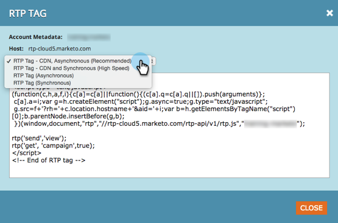
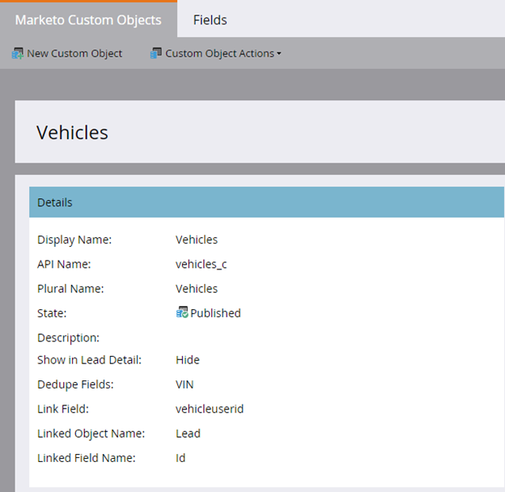

# 2015

## January 2015 {#january}

The following features are included in the January 2015 release. Please check your Marketo Edition for feature availability. After the release, be sure to come back to find links to detailed articles for each feature!

## Marketing Automation Updates {#marketing-automation-updates}

**Mobile Friendly Landing Pages**

You can now [build mobile views for landing pages](/help/marketo/product-docs/demand-generation/landing-pages/free-form-landing-pages/add-a-mobile-view-for-your-free-form-landing-page.md) from within the landing page editor. Deliver your message effectively regardless of device and increase engagement by tailoring your content for easy consumption on-the-go. This feature will rollout gradually throughout the week following the release.

[-Landing Page Walkthrough Video-](https://youtu.be/aPQHlG2X6c0)

**New REST API Calls**

Three new calls for the Lead & Activity REST API:

* Delete Lead
* Get Leads by Program ID
* Get Deleted Leads

Also, there is a new option for Sync Lead, to write the lead change asynchronously for a faster API call. Full details will be available after the release at [https://experienceleague.adobe.com/en/docs/marketo-developer/marketo/home](https://experienceleague.adobe.com/en/docs/marketo-developer/marketo/home)

**Email Scripting Custom Object Support**

Now access custom objects associated with the Account object from within email scripts!

## Real-Time Personalization {#real-time-personalization}

**Personalized Remarketing for Google and [!DNL Facebook]**

Remarketing shows ads to people who have visited your website. You can now personalize your remarketing campaigns on [Google](/help/marketo/product-docs/web-personalization/website-retargeting/personalized-remarketing-in-google.md) and [[!DNL Facebook]](/help/marketo/product-docs/web-personalization/website-retargeting/personalized-remarketing-in-facebook.md) using data from Real-Time Personalization. Remarket to audiences from different industries, named account lists, company sizes or any data from known leads.

[Named Account List Module](/help/marketo/product-docs/web-personalization/account-based-web-marketing/create-a-new-account-list.md)

Enhancements to the Named Accounts module will improve the match rates and validations for users. Additions include:

* Matching organizations from your Named Account list using Lead's email address (also for RTP-only customers)
* Support for up to 100K records per account
* CSV file template to view and download


**Updated RTP Tag Options**

RTP Tag options under Account Settings have been updated to include:

1. CDN and Asynchronous (Recommended tag)
1. CDN and Synchronous (High Speed)
1. Asynchronous tag without CDN
1. Synchronous tag without CDN

For best performance, it is recommended to place the tag at the top of the header in your web page after `<head>`. All tags allow for use of the [RTP API](https://experienceleague.adobe.com/en/docs/marketo-developer/marketo/javascriptapi/rich-media-recommendation). For information on how to deploy the RTP Tag see [here](/help/marketo/product-docs/web-personalization/rtp-tag-implementation/deploy-the-rtp-javascript.md).



## February 2015 {#february}

The following features are included in the February 2015 release. Please check your Marketo Edition for feature availability. After the release, be sure to come back to find links to detailed articles for each feature. Drum roll...

## Marketing Automation Enhancements {#marketing-automation-enhancements}

**[Move Smart Campaign](/help/marketo/product-docs/core-marketo-concepts/smart-campaigns/using-smart-campaigns/move-a-smart-campaign.md)**

Rejoice! Now you can move smart campaigns in and out of programs using drag and drop or the Move feature in the tree.

**[[!DNL Dynamics] 2015 (Online)](https://docs.marketo.com/display/docs/microsoft+dynamics+2013+on-premises)** - supported!

**HTTPS Certificate Changes**

To protect confidentiality and integrity of customer data and SaaS services, Marketo follows SaaS industry best practices

and will replace currently used security protocols (SHA-1 and SSL) with more secure versions (SHA-2 (a.k.a. SHA-256) and TLS) for the following domains:

* marketo.net (encrypted [!DNL Munchkin] traffic)

* [marketo.com](https://marketo.com) (main SaaS applications)

This will happen shortly after this release. SHA-1 protocol will be temporally supported on [mktoapi.com](https://mktoapi.com) domain until December, 2015 to allow owners of legacy systems and applications to update their systems with SHA-2 compatibility.

**Secure [!DNL Munchkin]**

We are removing our support for SSL3. We have maintained SSL3 up until now to maintain support for old web browsers, but in 2015 we are no longer seeing significant web traffic from those browsers. This would only affect [!DNL Munchkin] when used on secure pages, and will roll out slowly after the February release.

## Real-Time Personalization Enhancements {#real-time-personalization-enhancements}

**[Target URL for Campaigns](/help/marketo/product-docs/web-personalization/working-with-web-campaigns/adding-a-target-url-to-a-web-campaign.md)**

Select the pages you would like your real-time campaign to display on using 'Add a Target URL'. This feature works with all campaign types (Dialog, In Zone, Widgets), but is especially valuable for In Zone campaigns where a campaign will render in the Zone ID for only the target URL selected. It supports adding multiple URLs to target different web pages.


**Country and State Added to Account-Based Targeting**

Country and State can now be added to your Named Account Lists. Target key account prospects from specific locations.

## March 2015 {#march}

The following features are included in the March 2015 release. Please check your Marketo Edition for feature availability. After the release, be sure to come back to find links to detailed articles for each feature.

## Calendar HD {#calendar-hd}

Display your team's marketing actives with the calendar's new presentation mode. These are great for TVs or giant monitors around the office! Set and displays goals based on a smart list or custom metrics.

>[!NOTE]
>
>This feature is not available for Spark and [!DNL Standard] editions.


## [!DNL Google Adwords] Integration {#google-adwords-integration}

Link your [[!DNL Google AdWords] account to Marketo](/help/marketo/product-docs/administration/additional-integrations/add-google-adwords-as-a-launchpoint-service.md) to automatically upload offline conversion data from Marketo to [!DNL Google AdWords]. Then, from the [!DNL AdWords] UI, you will be able to easily see which clicks resulted in qualified leads, opportunities, and new customers (or whatever revenue stages you want to track).


## [!UICONTROL Revenue Explorer] Redesign {#revenue-explorer-redesign}

[!UICONTROL Revenue Explorer] has a brand new look and feel, as well as the new Sunburst chart type! We'll be rolling this out over the first two weeks of April.

## New Asset REST APIs {#new-asset-rest-apis}

[New Asset REST APIs](https://experienceleague.adobe.com/en/docs/marketo-developer/marketo/rest/assets/assets)

We now have support for creating and editing emails, templates, my tokens, files, and snippets [via the API](https://developer.adobe.com/marketo-apis/api/asset/)!

## [!DNL Microsoft Dynamics] 2015 On Premise {#microsoft-dynamics-on-premise}

Supported with the latest installer now [accessible through the app](/help/marketo/product-docs/crm-sync/microsoft-dynamics-sync/sync-setup/update-the-marketo-solution-for-microsoft-dynamics.md).


## RTP - Personalized Web Engagement with Lead Data {#rtp-personalized-web-engagement-with-lead-data}

Leverage the [lead data fields](/help/marketo/product-docs/web-personalization/using-web-segments/manage-person-data.md) you have you in your Marketo lead database to create real-time segmentation and personalized content campaigns. Manage your lead data fields in RTP and add/delete relevant lead fields.

## RTP - Personalize Web Content by Email or Program Campaign Name {#rtp-personalize-web-content-by-email-or-program-campaign-name}

Continue the conversation with your lead across channels from email to web. [Personalize inbound content based on email campaign or program](/help/marketo/product-docs/web-personalization/using-web-segments/web-segments.md) name used in Marketo's Marketing Activities.

## April 2015 {#april}

The following features are included in the April 2015 release. Please check your Marketo Edition for feature availability. After the release, be sure to come back to find links to detailed articles for each feature!

## Analytics Home Redesign

[Analytics Home Redesign](/help/marketo/product-docs/reporting/basic-reporting/creating-reports/navigating-the-analytics-home-page.md)

>[!NOTE]
>
>This feature will be released Tuesday, April 28th.

The new [[!UICONTROL Analytics] Home page](/help/marketo/product-docs/reporting/basic-reporting/creating-reports/navigating-the-analytics-home-page.md) enables quick access for running ad-hoc reports across available report types.


In addition, private versus shared report organization is now available. Create or drag reports into your [!UICONTROL My Reports] folder to lock them from viewing, editing or deleting by other users. [!UICONTROL Group Reports] is shared across all users.

## Marketo Mobile Engagement {#marketo-mobile-engagement}

**Marketo Mobile Engagement**

With Marketo Mobile Engagement, delivering compelling mobile experiences is easy. Create highly personalized campaigns that deliver compelling content without ever needing to rely on an app development team. New filters and triggers allow you to listen and respond on the mobile channel through push notifications.


## [!DNL LinkedIn] Lead Accelerator Integration

[[!DNL LinkedIn] Lead Accelerator Integration](/help/marketo/product-docs/demand-generation/social/social-functions/use-a-marketo-list-or-smart-list-as-a-linkedin-audience-segment.md)

Extend your lead nurture strategy to paid display and social ads. The [ad network integration](/help/marketo/product-docs/demand-generation/ad-network-integrations/add-linkedin-matched-audiences-as-a-launchpoint-service.md) with [!DNL LinkedIn] Lead Accelerator allows you to securely create an audience segment within [!DNL LinkedIn] based on the members of any smart or static list. Members within a [!DNL LinkedIn] audience segment can then be nurtured with a sequence of relevant ads.


## Marketo [!DNL Sales Insight] for [!DNL Salesforce1] {#marketo-sales-insight-for-salesforce}

Your favorite [!DNL Sales Insight] features - lead feed, best bets, interesting moments, and add to Marketo Campaign - all available on the [!DNL Salesforce1] app.

 

## RTP - Account-Based Marketing Analytics {#rtp-account-based-marketing-analytics}

**RTP - Account-Based Marketing Analytics**

Get instant visibility of the performance of your key Named Account lists based on each stage in the buying cycle, with the new performance graph for your Named Account lists. The graph shows the stage of the visit from the key organization starting from awareness all the way to action, based on number of visits and status of visitor.

## May 2015 {#may}

The following features are included in the May 2015 release. Please check your Marketo Edition for feature availability. After the release, be sure to come back to find links to detailed articles for each feature!

## Fully Responsive Landing Pages

[Fully Responsive Landing Pages](/help/marketo/product-docs/demand-generation/landing-pages/guided-landing-pages/create-a-guided-landing-page.md)

We're releasing a new landing page editing mode and template syntax. Unlike our "Free-form" landing page editor, the new "Guided" landing page editor will provide a structured editing experience for fully responsive landing pages.


## Abort Email Program

[Abort Email Program](/help/marketo/product-docs/email-marketing/email-programs/email-program-actions/abort-email-program.md)

Did you hit send before an email program was ready to go out? Pull the brakes with the new abort email program button. This will stop in-flight email programs right in their tracks.

## Email Deliverability  {#email-deliverability}

Marketo will now run weekly automated [!DNL SPF] and [!DNL DKIM] checks on your added domains. Stay on top of this by checking your notifications.

## Email Template Behavior Change {#email-template-behavior-change}

As of this release, valid HTML comments are now allowed and not stripped out when creating new emails.

## RTP: Drag and Drop Segment Editor {#rtp-drag-and-drop-segment-editor}

RTP: [Drag and Drop Segment Editor](/help/marketo/product-docs/web-personalization/using-web-segments/web-segments.md)

Drag and drop your criteria into the segment builder, define the value, and you're well on your way to creating a real-time segment.

## RTP: Predictive Content Recommendations {#rtp-predictive-content-recommendations}

[Predictive Content Recommendations](/help/marketo/product-docs/predictive-content/enabling-predictive-content/enable-predictive-content-for-web-rich-media.md)

Use RTP's machine learning and predictive analytics algorithms to recommend the right content to the right prospect. Enhance your content assets visually with images and text descriptions and recommend more than one content asset.

## June 2015 {#june}

The following features are included in the June 2015 release. Please check your Marketo Edition for feature availability. After the release, be sure to come back to find links to detailed articles for each feature!

## [Attribution Email Report](/help/marketo/product-docs/web-personalization/reporting-for-web-personalization/email-reports.md) {#attribution-email-report}

See the value personalization and recommended content provides to your marketing activities. [The Attribution Email Report](/help/marketo/product-docs/web-personalization/reporting-for-web-personalization/email-reports.md) displays the direct and assisted leads attributed from RTP's personalization and recommended content campaigns. In RTP's, User Settings and Email Report, add the Attribution Email Report to receive monthly or quarterly emails.

## July 2015 {#july}

## [!DNL Marketo Moments] {#marketo-moments}

Out at lunch but need to reschedule an email? The [!DNL Marketo Moments] app, available from The App Store or [!DNL Google Play], gives you the power to see how your email and event campaigns are performing in real time, as well as what's coming in the future, from your iPhone, iPad or Android phone.


## Rich Text Editor Update {#rich-text-editor-update}

Updated text editor with modern look and feel, including streamlined text formatting, image editing, link insertion, and HTML editing. The HTML editor now features minimal validation, allowing for less restrictive code editing.
`<iframe width="420" height="315" src="https://www.youtube.com/embed/LmmBN6IQrII" frameborder="0" allowfullscreen></iframe>` This update will automatically roll out within a few days of the July release. Afterwards, you'll be able to toggle between the New and Legacy versions of the editor from **[!UICONTROL Admin] > [!UICONTROL Email] > [!UICONTROL Edit Editor Settings]**.


Updated link and image dialogs.


Toggle the text editor version.


## Email Deliverability Single Sign On {#email-deliverability-single-sign-on}

When you click the email deliverability tile, you no longer need to provide your login credentials.

## Campaign Prioritization {#campaign-prioritization}

Have you set up several personalized RTP campaigns and noticed that some of them may overlap with others? Go ahead and set a priority for which campaigns' RTP should show over others.


## Company API {#company-api}

**Company object access via the REST API**: The REST API now provides access to the Marketo Company (a.k.a. Account) object. That means you can read, update and delete company objects you created in Marketo and associate leads with such companies using the updated [!DNL Lead] API.

Learn [more]<https://developer.adobe.com/marketo-apis/api/mapi/#tag/Companies>) in our reference guide for the Company API.

## Access Email Deliverability {#access-email-deliverability}

**Access Email Deliverability Tool**: This new permission allows admins to grant users access to the Email Deliverability tool.

## Fall 2015 {#fall}

The following features are included in the Fall '15 release. Please check your Marketo Edition for feature availability.

## Subscribe to a Smart List {#subscribe-to-a-smart-list}

[Subscribe to a Smart List](/help/marketo/product-docs/reporting/basic-reporting/report-subscriptions/subscribe-to-a-smart-list.md)

Subscribe to Smart List allows marketers to export a smart list and email it to the stakeholders that are not using Marketo, for example, Sales or Telemarketing teams.

Export can be scheduled daily, weekly or monthly, can have end delivery date and can be customized to share limited number of columns.


Multiple subscriptions can be created on a smart list. There is limitation of 100 subscriptions with 100K leads per subscription, across workspaces, per Marketo instance.


## Marketo Custom Objects {#marketo-custom-objects}

[Marketo Custom Objects](/help/marketo/product-docs/administration/marketo-custom-objects/understanding-marketo-custom-objects.md)

Easily create custom objects from the admin UI. We currently support the ability to create a 1:N custom object in Marketo and connect it to a lead or company.

>[!NOTE]
>
>Marketo Custom Objects are not available for Spark.



## Marketo Insights for [!DNL Google Chrome] {#marketo-insights-for-google-chrome}

[Marketo Insights for [!DNL Google Chrome]](/help/marketo/product-docs/marketo-sales-insight/msi-chrome-plugin/using-marketo-insights-for-google-chrome.md)

We're excited to announce the release of an update to our [!DNL Google Mail] [!DNL Sales Insight] extension! View it in the  [[!DNL Chrome Store]](https://chrome.google.com/webstore/detail/marketo-insights-for-goog/jjkfbhajlmoeegbjgjipliamplidmbjb).

This update includes many new features and functionality:

* Prior to engaging, salespeople can see relevant information about their prospects directly within [!DNL Google Mail], including job titles, twitter profiles, company information, photos, and more.
* Salespeople can see in real-time what content prospects are engaging with across channels, such as emails opened or clicked, online or in-person events attended, web pages visited, eBooks downloaded and much more.
* Emails sent through [!DNL Google Mail] are logged in Marketo and tracked in real-time. This lets salespeople see when prospects are looking at their emails so they can follow-up at just the right time. Marketo [!DNL Sales Insight] for [!DNL Google Mail] also makes it easy for salespeople to leverage templates created by marketing in order to send beautiful invites, offers, and other types of content.


## Marketo Mobile Engagement - Tokens, Send Sample, and Preview {#marketo-mobile-engagement-tokens-send-sample-preview}

* [Tokens](/help/marketo/product-docs/mobile-marketing/push-notifications/configure-mobile-push-notification.md)
* [Send Sample](/help/marketo/product-docs/mobile-marketing/push-notifications/send-a-push-notification-sample.md)
* [Preview](/help/marketo/product-docs/mobile-marketing/push-notifications/preview-a-push-notification.md)

Easily personalize push notifications with [tokens](/help/marketo/product-docs/mobile-marketing/push-notifications/configure-mobile-push-notification.md).


You can also [preview](/help/marketo/product-docs/mobile-marketing/push-notifications/preview-a-push-notification.md) or send out a [sample](/help/marketo/product-docs/mobile-marketing/push-notifications/send-a-push-notification-sample.md) push notification before you deploy it to customers.


## Smart Campaigns in Moments {#smart-campaigns-in-moments}

[Smart Campaigns in Moments](/help/marketo/product-docs/core-marketo-concepts/mobile-apps/marketo-moments/understanding-moments/understanding-smart-campaign-cards.md)

Stats on Emails sent through Smart Campaigns are now available in Moments. Other features in this upgrade include:

* Swipe-to-Done. Have too many cards in your stream? You can now swipe them away!
* Send a sample straight from the preview screen
* Smart List details added to Email Program cards
* Added support for the Aborted status for Email Programs


## RTP - Content Analytics and Recommendations {#rtp-content-analytics-and-recommendations}

[Content Analytics](/help/marketo/product-docs/web-personalization/understanding-web-personalization/understanding-content-analytics.md) and Recommendations

RTP Content Analytics shows you the performance of your web content assets from regular web visits and also visits generated from RTP's content recommendation engine.

* See which content is performing best and brings in the most leads
* Boost your content consumption by enabling content in RTP's predictive content engine to automatically recommend the best content to the right visitors
* Drill down on each content asset to see more in-depth metrics, graphs, and performance

RTP's Assets page is now split into Content Analytics and Content Recommendations.

* **Content Analytics:** Shows the views and direct leads of all discovered and defined web content, helping you analyze your best performing content
* **Content Recommendations:** Shows impressions and clicks from RTP's recommended content and associated lead attribution. You can also edit and enable content recommendations from this page for the [bar](/help/marketo/product-docs/predictive-content/enabling-predictive-content/enable-the-content-recommendation-bar.md) and [rich media](/help/marketo/product-docs/predictive-content/enabling-predictive-content/enable-predictive-content-for-web-rich-media.md) recommendations.

* All direct lead data in these two pages has been retrospectively updated since the start of the year (Jan 1, 2015).

## RTP - Clone an RTP Campaign {#rtp-clone-an-rtp-campaign}

[RTP - Clone an RTP Campaign](/help/marketo/product-docs/web-personalization/working-with-web-campaigns/clone-a-web-campaign.md)

Cloning an RTP campaign makes it quicker and more efficient to create more personalized web campaigns. Use the clone feature in RTP's campaign page to copy the campaign settings and change the content for split testing optimization, or clone a campaign with the same content and target it towards a different segment. Create campaigns in seconds!


## Rich Text Editor Improvements {#rich-text-editor-improvements}

We are making several improvements to the rich text editor. After we released the updated editor in July, we received great feedback and were able to work these changes into this upgrade. There's much more to come over the next several months. Here's a list of what's new in Q4:

* VML is now supported within your HTML code:

```
<v:background xmlns:v="urn:schemas-microsoft-com:vml" fill="t">
<v:fill type="tile" src="<a href="https://i.imgur.com/YJOX1PC.png" rel="nofollow">https://i.imgur.com/YJOX1PC.png</a>" color="#7bceeb"/>
</v:background>
```

* Anything can now be inserted in a valid HTML comment (certain syntaxes like seen below were previously stripped):

`<!--[if gte mso 9]> <![endif]-->`

* Do not pad empty table cells with `&nbsp;`

* Maximize/minimize button added to the HTML source editor
* Pre-existing table properties are now identified and displayed in the Table Properties dialog
* Both rows of buttons are now shown by default.
* The editor will now accept any element (even deprecated or non-standard elements):

`<myCustomElement>Hello World!</myCustomElement>`

* The editor will now accept any attribute (even deprecated or non-standard attributes):

```
<myCustomElement myCustomAttribute="foo">Hello World!</myCustomElement>
<td background="someImage.png">
```

## [!DNL Microsoft Dynamics] - Validate Sync {#microsoft-dynamics-validate-sync}

[[!DNL Microsoft Dynamics] - Validate Sync](/help/marketo/product-docs/crm-sync/microsoft-dynamics-sync/sync-setup/validate-microsoft-dynamics-sync.md)

This new admin tool runs a series of checks to see if your sync configurations have been set up correctly.


## Add Fields to CRM Custom Object Sync {#add-fields-to-crm-custom-object-sync}

Easily add new fields to custom objects synced from [!DNL Salesforce] and [!DNL Dynamics]. You now can add new fields to your custom object sync without disabling and enabling your entire custom object.

## Changes to Security Features {#changes-to-security-features}

* Password attempts are limited to 5. After the fifth attempt the user will be locked.
* The inactive session timeout is now configurable for the subscription.


## IE 11 Support (and deprecating support for IE 9) {#ie-support-and-deprecating-support-for-ie}

We now officially support the [!DNL Microsoft Internet Explorer] 11 browser and are removing support for the [!DNL Microsoft Internet Explorer] 9 browser.

## Lightning UI support for MSI {#lightning-ui-support-for-msi}

The latest MSI package on app exchange works with both Lightning and Legacy versions of the [!DNL Salesforce] UI.

## New [!DNL Dynamics] Plug-in {#new-dynamics-plug-in}

This new plug-in runs various actions in an asynchronous mode to help increase performance.

## Search by URL of Landing Page in Design Studio {#search-by-url-of-landing-page-in-design-studio}

In the Design Studio Landing page grid, you can now search by page URL to find your landing pages. This is also exportable.

