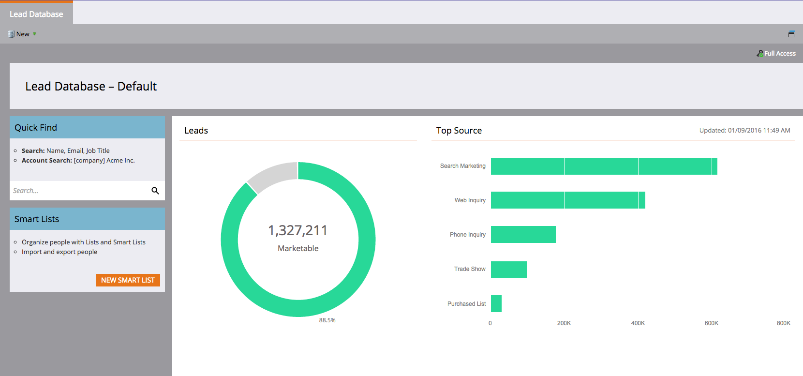
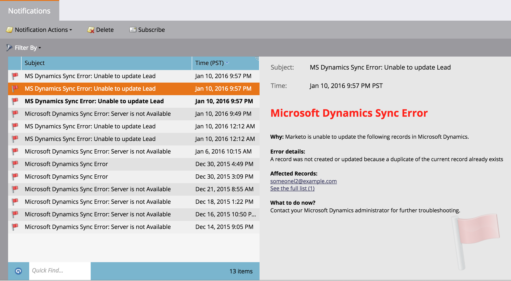
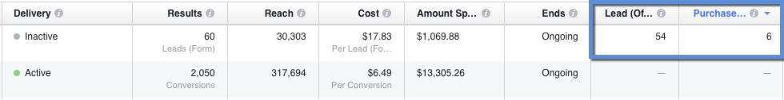

# 2016

## Winter 2016 {#winter}

The following features are included in the Winter '16 release. Please click the title links to view detailed articles for each feature.

## [Is Anonymous Filter](/help/marketo/product-docs/administration/additional-integrations/add-munchkin-tracking-code-to-your-website/next-generation-munchkin-tracking-faq.md) {#is-anonymous-filter}

The Is Anonymous filter has been removed for Smart Lists. See the [Next Generation Munchkin Tracking FAQ](/help/marketo/product-docs/administration/additional-integrations/add-munchkin-tracking-code-to-your-website/next-generation-munchkin-tracking-faq.md) document for details. This change does not affect Web Personalization (RTP), which continues to identify anonymous and known web visitors and personalize content in real time to these visitors.

## [Database Dashboard](/help/marketo/product-docs/core-marketo-concepts/smart-lists-and-static-lists/managing-people-in-smart-lists/database-dashboard.md)  {#database-dashboard}

The [!UICONTROL Lead Database] has an updated Summary Dashboard that includes total people database size, number of marketable leads, and a breakdown of leads by top five sources.

## [Microsoft Edge Browser](/help/marketo/product-docs/administration/setup-administration/supported-browsers.md) {#microsoft-edge-browser}

We've added [!DNL Microsoft Edge] to the [list of browsers](https://docs.marketo.com/display/public/DOCS/Supported+Browsers) supported by Marketo.

## [Microsoft Outlook 2016](/help/marketo/product-docs/marketo-sales-insight/msi-outlook-plugin/install-the-marketo-email-add-in-for-outlook-with-a-registration-code.md) {#microsoft-outlook}

[[!DNL Microsoft Outlook] 2016](/help/marketo/product-docs/marketo-sales-insight/msi-outlook-plugin/install-the-marketo-email-add-in-for-outlook-with-a-registration-code.md) is now supported.

## [Email Program Head Start](/help/marketo/product-docs/email-marketing/email-programs/email-program-actions/head-start-for-email-programs.md) {#email-program-head-start}

Use [!UICONTROL Head Start] to indicate that processing for your send should occur ahead of time. Instead of qualifying leads and preparing emails at the scheduled time of the program, [!UICONTROL Head Start] ensures that these tasks are done beforehand. This way, your audience will start receiving emails at the scheduled time.

To use this feature, the email program must be scheduled at least 12 hours in advance and the Smart List will be locked 12 hours prior to the send.

>[!NOTE]
>
>This feature will roll out gradually for a week following the Winter '16 Release. It is unavailable for use with smart campaigns or the API.

## [Mobile Marketing Enhancements](/help/marketo/product-docs/mobile-marketing/admin/add-a-mobile-app.md) {#mobile-marketing-enhancements}

**[!DNL PhoneGap] Support:** We now offer [!DNL PhoneGap] support for your mobile app. [Learn more](https://developers.marketo.com/documentation/mobile/phonegap-plugin/).

**Support for Sandbox Apps**:

## [Program API](https://developers.marketo.com/documentation/programs/) {#program-api}

Create, update, and clone programs via the REST API. This does not include the creation or updating of smart lists and smart campaigns within a program.

## [Microsoft Dynamics Enhancements](/help/marketo/product-docs/crm-sync/microsoft-dynamics-sync/microsoft-dynamics-sync-details/sync-status.md) {#microsoft-dynamics-enhancements}

**[[!UICONTROL Sync Status]](/help/marketo/product-docs/crm-sync/microsoft-dynamics-sync/microsoft-dynamics-sync-details/sync-status.md)**: Keep tabs on the current throughput and backlog of the sync process. Break it down by the count of inserts and updates by object.

**[[!UICONTROL Notifications]](/help/marketo/product-docs/core-marketo-concepts/miscellaneous/understanding-notifications/notification-types.md)**: Get notified for common sync errors, along with a list of leads that have that error.

## [Custom Objects Enhancements](/help/marketo/product-docs/administration/marketo-custom-objects/create-marketo-custom-objects.md) {#custom-objects-enhancements}

You now can create many-to-many relationships between Leads/Accounts and a custom object by using an intermediary object with multiple link fields.

## [Facebook Lead Ads](/help/marketo/product-docs/demand-generation/facebook/set-up-facebook-lead-ads.md) {#facebook-lead-ads}

[[!UICONTROL Facebook Lead ads]](https://www.facebook.com/business/a/lead-ads) are a more direct way for a business to run lead generation campaigns on [!DNL Facebook]. People fill out a form to express interest in a product or service, so the business can follow up with them. The Marketo integration with [!UICONTROL Facebook Lead Ads] automatically captures the information a lead provides within the Lead Ad form. Follow up actions and notifications can then be automated using the new [!UICONTROL Fills Out Facebook Lead Ads] trigger.

## [Web (Real-Time Personalization) Campaign Scheduler](/help/marketo/product-docs/web-personalization/working-with-web-campaigns/schedule-a-web-campaign.md) {#web-real-time-personalization-campaign-scheduler}

Schedule your campaign in advance. Set up a start and end date for personalized web content and repeat campaigns on specific days and times. Personalize the schedule to display the campaign according to the web visitor's time or a selected time zone.

## Spring 2016 {#spring}

The following features are included in the Spring '16 release. Please click the title links to view detailed articles for each feature.

## [Email Insights](/help/marketo/product-docs/reporting/email-insights/email-insights-overview.md) {#email-insights}

Email Insights is a brand new historical aggregate data email analytics experience - redesigned end-to-end for lightning fast performance. It features a completely new user interface design optimized to fit the needs and workflow of Email Marketers.

>[!NOTE]
>
>We are launching Email Insights to customers in batches, beginning June 3rd. Our goal is to complete this over the next several months. We'll notify you by email when you are enabled.

## [Email Template Picker](/help/marketo/product-docs/email-marketing/general/email-editor-2/email-template-picker-overview.md) {#email-template-picker}

Create beautiful emails using our new Starter Templates! Also, quickly locate your templates from their live thumbnails.

>[!NOTE]
>
>Email Editor 2.0 (with the Template Picker) will gradually be rolled out beginning June 3rd. We will complete the rollout by June 30th. Unlike Email Insights, you will not be notified when you have access. To see if you do, please follow the steps in [this article](/help/marketo/product-docs/email-marketing/general/email-editor-2/transitioning-to-email-editor-2-0.md).

## [Email Editing---Re-imagined](/help/marketo/product-docs/email-marketing/general/email-editor-2/email-editor-v2-0-overview.md) {#email-editing-re-imagined}

That's right, a brand new email editor! Use lightweight drag-and-drop functionality to add and re-order content. New elements, including images, videos, variables, and modules, are sure to enhance your editing experience. Also check out the updated code editor, previewer, and preheader support.

## [Mobile In-App Messages](/help/marketo/product-docs/mobile-marketing/in-app-messages/understanding-in-app-messages.md) {#mobile-in-app-messages}

Create stunning in-app messages for your app right within Marketo. Define exactly who should see it and when with the in-app message program. Easily monitor its performance with the program dashboard.

## [No Draft Snippets](/help/marketo/product-docs/administration/users-and-roles/enable-no-draft-for-snippets.md) {#no-draft-snippets}

Gone are the days where you have to re-approve everything each time a snippet is updated! With No-Draft, all emails and landing pages using a snippet will get the snippet updates and maintain their prior statuses. Each time you approve a snippet, you'll have a choice to run No-Draft and update everything, or create drafts. It is up to you! No-Draft will be available to all customers and controlled by a new permission in Admin.

## [Landing Page, Landing Page Template, and Form APIs](https://developers.marketo.com/blog/spring-2016-updates/) {#landing-page-landing-page-template-and-form-apis}

The Marketo REST APIs now support control over Marketo landing pages, landing page templates, and forms. Users can now create, update content, approve, and delete these assets directly via the Marketo REST API.

## [IP Allowlisting for API Access](/help/marketo/product-docs/administration/additional-integrations/create-an-allowlist-for-ip-based-api-access.md) {#ip-allowlisting-for-api-access}

Similar to the IP allowlisting feature for Marketo user logins, Marketo admins can now set up a allowlist of IP addresses that can access the Marketo SOAP and REST APIs, thereby blocking access from non-authorized IP addresses. This provides an added layer of security to your Marketo instance, and ensures that API access can only occur from within your organization's network. Details on how to set this up are available on the [Marketo documentation site](/help/marketo/product-docs/administration/additional-integrations/create-an-allowlist-for-ip-based-api-access.md).

## [New High-Speed Microsoft Dynamics Sync Connector](/help/marketo/product-docs/crm-sync/microsoft-dynamics-sync/microsoft-dynamics-sync-details/sync-status.md) {#new-high-speed-microsoft-dynamics-sync-connector}

The new, high-speed Dynamics connector provides speeds up to 20 times faster for initial sync and up to 5 times faster for incremental sync. All new customers will onboard to this connector on the release date, and we will gradually roll it out to existing customers over the summer release time frame.

**Refresh data for new fields**: Now you can enable new sync fields at any point in time and all data values for that field will be refreshed from [!DNL Dynamics] CRM into Marketo. No more worries about having to select all fields during initial setup. If you disable an existing sync field and re-enable it later, all data values for that field will be refreshed from [!DNL Dynamics] CRM into Marketo.

**Sync Lead as Contact**: The [!UICONTROL Sync Lead to Microsoft] flow action has a new option to sync as a lead or a contact.

**Sync Errors Admin Tab**:  Browse, search, or export leads (and other objects) that failed to synchronize with details such as operation, direction, error code and error message.

**[!DNL Microsoft Dynamics] 2016**: Connector is fully certified for [!DNL Dynamics] 2016 [!DNL Online] and [!DNL On-premise] versions.

**Plug-In Updates are now documented:** See the [plug-in updates docs article](/help/marketo/product-docs/crm-sync/microsoft-dynamics-sync/marketo-plugin-releases-for-microsoft-dynamics.md).

## [Friendly Instance Name](/help/marketo/product-docs/administration/settings/edit-subscription-settings.md) {#friendly-instance-name}

Today, it is hard to differentiate between Marketo instances, for example, sandbox and production instances. This feature lets you know which instances you are currently working on.

## Limited Time Access for Subscriptions {#limited-time-access-for-subscriptions}

Today, users are invited to Marketo subscription for an indefinite period of time. This feature enables admins to invite users to subscriptions for a limited period of time, for example, 2 weeks or 1 month.

## [Custom Objects Grid](/help/marketo/product-docs/administration/marketo-custom-objects/understanding-marketo-custom-objects.md) {#custom-objects-grid}

Now, you can view the number of records and fields for all published custom objects.

## Custom Activities {#custom-activities}

Marketo admins can now define and manage their custom activity types via the Marketo Custom Activity Definition modeler. Similar to (and in conjunction with) the Marketo Custom Object Modeler, admins can now extend the data model to suit their exact business needs. Details on how to use this functionality is available on the [Marketo documentation site](/help/marketo/product-docs/administration/marketo-custom-activities/understanding-custom-activities.md).

## Summer 2016 {#summer}

The following features are included in the Summer '16 release. Check your Marketo edition for feature availability. Please click the title links to view detailed articles for each feature.

## [Account Based Marketing](https://docs.marketo.com/display/docs/account+based+marketing) {#account-based-marketing}

Marketo Account Based Marketing provides all of the essentials in one unified platform:

* **Target** - Account Discovery, Lead-to-Account Matching, and Named Account Lists
* **Engage** - Account-based Personalization, Cross-channel engagement, and Account-specific Workflows
* **Measure** - Account and List-level Insights, Account Engagement Score, and Pipeline & Revenue Impact

>[!NOTE]
>
>ABM is available as an add-on to your Marketo subscription, so please contact your sales rep to have it implemented.

## [Audit Trail](/help/marketo/product-docs/administration/audit-trail/audit-trail-overview.md) {#audit-trail}

Audit trail provides a comprehensive history of the changes made within your Marketo subscription. It will create accountability among users and admins, help identify the cause of unexpected behavior, and provide the security of knowing who's doing what and when. This information will be available at any point in time and can be used to answer questions such as:

* What happened to this asset or setting, and who last updated it?
* What's user X been up to?
* Who's logging into our account?

## Marketo-Vibes SMS LaunchPoint Integration

Easily create SMS messages right within Marketo. Personalize and target your message using your rich Marketo data, and easily monitor its performance using the SMS message dashboard.

>[!NOTE]
>
>This feature requires that you have an existing [!DNL Vibes SMS] account.

## [Email 2.0 Enhancements](/help/marketo/product-docs/email-marketing/general/email-editor-2/email-editor-v2-0-overview.md) {#email-enhancements}

**Module-level Variables**

Previously, all variables specified in Email 2.0 Templates were "global" in scope. When using variables within modules, this is not always desirable if you plan to use multiple instances of the module. With this release, variables can now be specified as "module level," which allows you to indicate that the user should be able to set unique values for each module they're used in.

**Syntax Updates**

* You can now use "mktoAddByDefault" on modules specified in Email 2.0 Templates in order to indicate which modules should be displayed in new emails by default. This is much more convenient if you are building an email template with large numbers of modules.
* On image elements, you can now specify if the underlying `` HTML element's "height" and "width" properties should be locked down or editable to the end-user. mktoLockImgSize="true" will cause height/width to be locked (even if the image is changed). Similarly, mktoLockImgStyle="true" will cause the "style" property to be locked.

**Code Searching**

Use new search functionality to efficiently find and replace content within your email's code. This functionality is also available in the Email Template editor.

**Token Support in Image Elements**

Tokens can now be used in the "External URL" area of the insert image experience! If you've specified images with `{{my.tokens}}`, you can now reference these tokens within Email Editor 2.0. Note that the image will still appear broken in the Email Editor 2.0 canvas. But, you will see them rendered within Preview and Send Sample before sending out your email.

## Multiple Branding Domains {#multiple-branding-domains}

Gone are the days where email tracking links could only be branded with a single branding domain. You can now add multiple branding domains to inspire consumer confidence, create a more streamlined look to focus on brand, improve email deliverability, and choose, on a per email basis, which branding domain to use for each email's tracking links.

## [Program Tokens](/help/marketo/product-docs/demand-generation/landing-pages/personalizing-landing-pages/tokens-overview.md) {#program-tokens}

We've created a new token type for programs. You now can render Program Name, Description, and ID in assets and smart campaign flow steps.

## [Enterprise Key](/help/marketo/product-docs/marketo-sales-insight/msi-outlook-plugin/authorize-the-marketo-outlook-plugin.md) {#enterprise-key}

Requiring each person on your sales team to install our [!DNL Sales Insight] Plugin for [!DNL Outlook] can be tedious. We have introduced a new way to install the plugin for [!DNL Outlook] remotely using an enterprise key. Send your IT team your unique key found in the Marketo [!DNL Sales Insight] section of [!UICONTROL Admin] and let them do the rest.

## [Web Personalization Campaigns](/help/marketo/product-docs/web-personalization/working-with-web-campaigns/create-a-new-dialog-web-campaign.md) {#web-personalization-campaigns}

Specify a time delay for web campaigns to react on your website.

## [Content Analytics and Recommendations Export](/help/marketo/product-docs/web-personalization/understanding-web-personalization/understanding-content-analytics.md) {#content-analytics-and-recommendations-export}

View content analytics and recommendations data offline.

## [API Support for Email Editor 2.0](https://developers.marketo.com/documentation/asset-api/) {#api-support-for-email-editor}

Pre-existing Asset APIs, previously only compatible with v1.0 emails and templates, are now enabled for v2.0 email assets.

## [Marketo Developers Site](https://developers.marketo.com/) {#marketo-developers-site}

New and improved!

## [Privacy Settings](/help/marketo/product-docs/administration/settings/understanding-privacy-settings.md) {#privacy-settings}

Marketers can use privacy settings to decide whether or not to track visitors using [!DNL Munchkin] and Web Personalization features. Tracking level is controlled by using the browser's Do Not Track setting, an opt-out cookie, or a non-specific IP. These methods might affect Marketo's value and functionality in specific areas, but if the marketer doesn't change anything, Marketo functionality remains the same.

This feature will be released to customers gradually over a period of six weeks. If you need it right away, please contact Marketo Support.

## Fall 2016 {#fall}

The following features are included in the Fall '16 release. Check your Marketo edition for feature availability. Please click the title links to view detailed articles for each feature.

## [!UICONTROL Predictive Content] in Email {#predictive-content-in-email}

There's a new user experience for our [!UICONTROL Predictive Content] application to track, manage, and recommend your content through our machine learning and predictive algorithms across the web and email channels.

>[!NOTE]
>
>All customers with the Predictive module will be enabled by January 10th.

You can now add predictive content to your email. When the email is opened, the recipient automatically receives relevant, recommended content that helps increase content engagement and conversions.

## [Facebook Offline Conversions](/help/marketo/product-docs/demand-generation/facebook/understanding-facebook-offline-conversions.md) {#facebook-offline-conversions}

With [!DNL Facebook] Offline Conversions integration, conversion data in Marketo (for Lead Ad leads) is automatically sent back to [!DNL Facebook] so that your advertising team can better optimize its ad spend. In this [!DNL Facebook] Ad Manager Report, the offline conversions are highlighted.

## Universal ID {#universal-id}

A Universal ID lets you access multiple Marketo subscriptions with a single login and switch between subscriptions quickly. You can use a single community profile for all of your subscriptions.

>[!NOTE]
>
>Please contact Marketo Support to enable this feature.

## Marketo Account Based Marketing Enhancements {#marketo-account-based-marketing-enhancements}

Now, you can assign account teams to named accounts in Account Based Marketing (ABM), for example, account owner, sales development representative, business development representative, and customer success manager. You also can build account-owner-specific account lists and send personalized weekly ABM reports to the account team.

**REST API**

This release also enables you to manage named account attributes and accounts scores in ABM using the Marketo REST API. For more details on the API operations, please visit the [Marketo Developers website](https://developers.marketo.com/rest-api/lead-database/named-accounts).

## [Audit Trail Enhancements](/help/marketo/product-docs/administration/audit-trail/change-details-in-audit-trail.md) {#audit-trail-enhancements}

Audit trail provides a comprehensive history of the changes made within your Marketo subscription. We have added additional tracking capabilities for programs as well as surfacing important change details for smart campaigns, smart lists, and changes made to users and roles.

## New Permissions

**Make Email Operational**

Gone are the days when you had to worry about users sending transactional emails to people in your database who have unsubscribed. You can now specify which users can make an email operational or edit operational emails.

**Edit Campaign Restrictions**

Why set [campaign restrictions](/help/marketo/product-docs/administration/email-setup/enable-person-restrictions-for-smart-campaigns.md) if you can't enforce them? When you set Campaign Limit Settings to restrict the number of people in your database who can be targeted with a single campaign, you now have the ability to restrict which users can override these settings when scheduling a campaign.

## [Sound for Mobile Push Notifications](/help/marketo/product-docs/mobile-marketing/push-notifications/configure-mobile-push-notification.md) {#sound-for-mobile-push-notifications}

Give your iOS Push Notification added richness by enabling sound. This new feature allows you to trigger a sound when you Push Notification is displayed on the mobile device.

>[!NOTE]
>
>* Device owners can choose to prevent sounds from being played in the device settings, and app developers can give device owners options within the app to prevent sounds from being played.
>* Sounds are automatically played when a Push Notification is displayed on an Android device.

## [Sales Insight Compatible with Salesforce Encryption](/help/marketo/product-docs/marketo-sales-insight/msi-for-salesforce/installation/install-marketo-sales-insight-package-in-salesforce-appexchange.md) {#sales-insight-compatible-with-salesforce-encryption}

Market [!DNL Sales Insight] is now compatible with [!DNL Salesforce] Shield Encryption. All [!DNL Sales Insight] customers should upgrade to this latest managed package (version 1.4359.2), which is [available on the [!DNL Appexchange]](https://appexchange.salesforce.com/listingDetail?listingId=a0N30000001SVZmEAO).

## [Named Accounts APIs](https://developers.marketo.com/rest-api/lead-database/named-accounts/) {#named-accounts-apis}

With this release, Marketo ABM users can manage named accounts via the Named Accounts API. Users can create, update, and delete named accounts, as well as read and update ABM named account scores.

## [Email Editor v2.0 API Support](https://developers.marketo.com/rest-api/assets/emails/) {#email-editor-v-api-support}

Manage variables and modules for emails in v2.0 format using the Marketo REST API.

## [Changes to Marketo Salesforce Sync](https://nation.marketo.com/docs/DOC-3840) {#changes-to-marketo-salesforce-sync}

Marketo's [!DNL Salesforce] integration is evolving to improve the way that Marketo fields are synced with [!DNL Salesforce]. Now, instead of having to sync a large group of fields that you may or may not need, you can pick and choose which fields you'd like to have included. Check out our documentation here for more information: [https://nation.marketo.com/docs/DOC-3840](https://nation.marketo.com/docs/DOC-3840).
