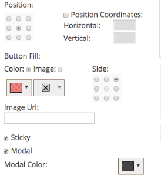
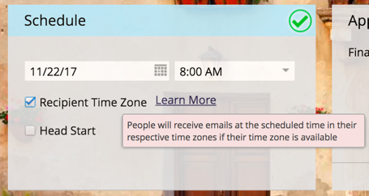

# 2017

## Winter 2017 {#winter}

The following features are included in the Winter '17 release. Check your Marketo edition for feature availability.

Please click the title links to view detailed articles for each feature.

>[!NOTE]
>
>If a topic has multiple subheadings, the links are placed there.

## [Advanced Matching for Facebook Custom Audiences](/help/marketo/product-docs/demand-generation/ad-network-integrations/add-facebook-custom-audiences-as-a-launchpoint-service.md) {#advanced-matching-for-facebook-custom-audiences}

Basic Matching uses email addresses only, but new Advanced Matching uses an additional seven fields, increasing the match rate for more conversion.

## [Custom Object Import API](https://developers.marketo.com/rest-api/lead-database/custom-objects/) {#custom-object-import-api}

This API provides a faster interface to synchronize custom objects into Marketo. You can import CSV, TSV, or SSV spreadsheet files into Marketo as custom objects.

## [Web Personalization Campaigns Export](/help/marketo/product-docs/web-personalization/working-with-web-campaigns/export-web-campaign-data.md) {#web-personalization-campaigns-export}

Export all of your Web Campaign details and analytics in a CSV format. You then can view your data in a convenient layout.

## Localization {#localization}

The Web Personalization, [!UICONTROL Predictive Content], and Email Insights apps are now available in Japanese, German, and Spanish. You [select your language and locale](/help/marketo/product-docs/administration/settings/change-time-zone.md) to view your content in these languages.

## Account Based Marketing Enhancements {#account-based-marketing-enhancements}

**[Import Named Accounts](/help/marketo/product-docs/target-account-management/target/named-accounts/import-named-accounts.md)**

With the [!UICONTROL Named Account] Import option, create or update multiple records at once via CSV upload.

**[Email Insights Support](/help/marketo/product-docs/reporting/email-insights/filtering-in-email-insights.md)**

Use [!UICONTROL Named Account] or [!UICONTROL Account List] as dimensions in Email Insights.

## [!UICONTROL Predictive Content] Enhancements {#predictive-content-enhancements}

**[Filter by [!UICONTROL Enabled Source]](/help/marketo/product-docs/predictive-content/working-with-predictive-content/understanding-predictive-content.md)**

Filter [!UICONTROL Predictive Content] pieces that are enabled for [!UICONTROL Email], [!UICONTROL Rich Media], or the [!UICONTROL Recommendation Bar].

**[Filter [!UICONTROL Analytics by Source]](/help/marketo/product-docs/predictive-content/working-with-predictive-content/understanding-predictive-content.md)**

Filter [!UICONTROL Predictive Content] analytics for specific sources — [!UICONTROL Email], [!UICONTROL Rich Media], or [!UICONTROL Recommendation Bar].

**[!UICONTROL Predictive Content] Editor**

There's an improved editing experience and layout that splits content preparation by source — [!UICONTROL Email], [!UICONTROL Rich Media], or [!UICONTROL Recommendation Bar].

**[Auto-Discovery Content for Predictive](/help/marketo/product-docs/predictive-content/getting-started/enable-content-discovery.md)**

Image URL and metadata are now used in the content auto-discovery process.

## [SDK Enhancements](https://developers.marketo.com/mobile/) {#sdk-enhancements}

Developers now have additional control over the delivery of Push Notifications with the addition of a new SDK API call that allows developers to remove push tokens.

## Vibes SMS LaunchPoint Integration

Improve your targeting with a new filter option, "Member of Vibes List."

## [Legacy Rich Text Editor and Form Editor 1.0 Deprecation](https://nation.marketo.com/docs/DOC-4315) {#legacy-rich-text-editor-and-form-editor-deprecation}

Starting August 1, 2017, customers still using the legacy Rich Text Editor and Form Editor 1.0 will be automatically transitioned to the new experience.

## [Marketo Activity APIs](https://developers.marketo.com/blog/important-change-activity-records-marketo-apis/) {#marketo-activity-apis}

An important change is coming to Marketo's activity APIs. Are you prepared?

## Spring 2017 {#spring}

The following features are included in the Spring '17 release. Check your Marketo edition for feature availability.

Please click the title links to view detailed articles for each feature. **Note**: If a topic has multiple subheadings, the links are placed there.

## [LinkedIn Lead Gen Forms](/help/marketo/product-docs/demand-generation/social/social-functions/set-up-linkedin-lead-gen-forms.md) {#linkedin-lead-gen-forms}

[[!UICONTROL LinkedIn Lead Gen] Forms](https://business.linkedin.com/marketing-solutions/native-advertising/lead-gen-ads) are a more direct way for a business to run lead generation campaigns on [!DNL LinkedIn]. People can fill out forms to express interest in a product or service, enabling the business to capture the person's details and sync them to Marketo, where automated follow-up processes and lead routing activities can occur.

The Marketo integration with [!UICONTROL LinkedIn Lead Gen] Forms automatically captures the information a lead provides within the Lead Gen form. Follow-up actions and notifications can then be automated using the new **Fills Out [!DNL LinkedIn Lead Gen] Form** trigger and filter.

## [Expire MSI Template](/help/marketo/product-docs/marketo-sales-insight/msi-for-salesforce/features/actions-in-the-msi-panel/send-marketo-email/publish-an-email-to-sales-insight.md) {#expire-msi-template}

Gone are the days of cleaning up outdated templates in [!DNL Sales Insight]. Set an expiration date when you publish your email and we'll take care of un-publishing it for you when the expiration date rolls around.

>[!NOTE]
>
>Setting the expiration date for 5/31/17 means that the template will be removed from [!DNL Sales Insight] at the end of the day on 5/31/17.

## [Bulk Extract APIs for People and Activities](https://developers.marketo.com/rest-api/bulk-extract/) {#bulk-extract-apis-for-people-and-activities}

Easily transfer large amounts of person and activity data from Marketo to your external systems.

## ABM Enhancements {#abm-enhancements}

**[Custom Fields on ABM Named Accounts](https://docs.marketo.com/x/1wnG)**

Marketo ABM now allows you to create up to 10 custom fields on your Named Accounts. You can map these Custom Fields to fields in your CRM Account object and Marketo ABM will sync the data, allowing you to extend your ABM Named Accounts and help drive your marketing.

**[Percentile Scoring on ABM Named Accounts](https://docs.marketo.com/display/docs/assets/abmpercentiles.png)**

Named Account scores can vary greatly. Marketo ABM now automatically calculates a percentile for each of your scores, so you can see at a glance where each Named Account ranks among your other Named Accounts.

**[ABM Account List APIs](https://developers.marketo.com/rest-api/lead-database/named-account-lists/)**

Take advantage of rich and robust ABM partner integrations with enhanced API support for Named Account Lists.

## Web Personalization Enhancements {#web-personalization-enhancements}

**[Web Campaign Upon Scroll](/help/marketo/product-docs/web-personalization/working-with-web-campaigns/set-how-your-web-campaign-displays.md)**

New Web Campaign effects provide your web visitors with a more personalized experience. Set your personalized [!UICONTROL Web Campaigns] to display only when a web visitor scrolls down on your web page. You can set your Dialog [!UICONTROL Web Campaigns] to show upon scroll based on:

* percentage of the page scrolled
* pixel reached
* scrolling below the fold of the page

**[Web Campaign Upon Exit Intent](/help/marketo/product-docs/web-personalization/working-with-web-campaigns/set-how-your-web-campaign-displays.md)**

Capture your visitor's attention before they close your page. Set your personalized [!UICONTROL Web Campaigns] to display only when a mouse gesture indicates the visitor is leaving the page.

**[Animation Effects for [!UICONTROL Web Campaigns]](/help/marketo/product-docs/web-personalization/working-with-web-campaigns/create-a-new-dialog-web-campaign.md)**

Set the animation effects for your Dialog Web Campaign to customize how a campaign appears upon entering or exiting your web page. You can select from 6 different effects and control the timing and direction of the dialog.

**[Dialog Close Button Customization](/help/marketo/product-docs/web-personalization/working-with-web-campaigns/create-a-new-dialog-web-campaign.md)**

Customize the Close Button for dialog boxes. Select from a range of options used in Transparent Dialog Style [!UICONTROL Web Campaigns]. Select the icon, color, and positioning for the Close Button. You can also add your own button image.

**[Archive Web Campaigns](/help/marketo/product-docs/web-personalization/working-with-web-campaigns/archive-a-web-campaign.md)**

Archive is a new Web Campaign status that allows you to archive [!UICONTROL Web Campaigns] and hide them from the default Web Campaign view. This lets you focus on your most relevant, active campaigns and retrieve older archived campaigns on demand.

**[Localization](/help/marketo/product-docs/administration/settings/change-time-zone.md)**

Web Personalization is now offered in all Marketo-supported languages (English, Japanese, German, Spanish, French, and Portuguese).

## Predictive Enhancements {#predictive-enhancements}

**[Localization](/help/marketo/product-docs/administration/settings/change-time-zone.md)**

Predictive Content is now offered in all Marketo-supported languages (English, Japanese, German, Spanish, French, and Portuguese).

## [Legacy Rich Text Editor and Form Editor 1.0 Deprecation](https://nation.marketo.com/docs/DOC-4315) {#legacy-rich-text-editor-and-form-editor-deprecation}

Starting August 1, 2017, customers still using the legacy Rich Text Editor and Form Editor 1.0 will be automatically transitioned to the new experience.

## Summer 2017 {#summer}

The following features are included in the Summer '17 release. Check your Marketo edition for feature availability.

Please click the title links to view detailed articles for each feature. Note: Some of the features included in this release do not have associated articles. If a topic has multiple subheadings, the links are placed there.

## [Additional Facebook Offline Conversion Stages](/help/marketo/product-docs/demand-generation/facebook/set-up-facebook-offline-conversions.md) {#additional-facebook-offline-conversion-stages}

Choose up to 7 additional offline conversion stages to map to your Marketo lifecycle stages (beyond the 3 available today). Optimize your [!DNL Facebook] ad spend based on conversions across your customer journey to achieve better ROI.

## [Lock Sales Insight Template](/help/marketo/product-docs/marketo-sales-insight/msi-for-salesforce/features/actions-in-the-msi-panel/send-marketo-email/lock-sales-template.md) {#lock-sales-insight-template}

Ensure consistency of message and content by preventing edits to your sales templates. This helps standardize templates and maintain professional communications.

## ABM Enhancements {#abm-enhancements}

**Data Source for Japanese Company Lookup**

Match people to Japanese company names in the local language.

**[ABM and LeanData Integration](https://docs.marketo.com/x/pKmt)**

[!DNL LeanData] integration now allows for lead-to-account matching in Marketo. Keep marketing and sales aligned by having the same leads associated with accounts within the sales and marketing systems of record. More flexible options give Marketing and Sales Operations more control over lead-to-account matching rules, so they can achieve their desired level of precision.

## Web Personalization Enhancements {#web-personalization-enhancements}

**[Campaign Preview Enhancements](/help/marketo/product-docs/web-personalization/working-with-web-campaigns/preview-and-test-a-web-campaign.md)**

Marketing practitioners can now ensure their web campaigns will look great across any device *before* launching them. With these enhancements, see how your web campaigns will render across desktop, mobile devices, and tablets. The new plug-in for [!DNL Chrome] also offers more consistent and accurate previews.

**[Widget Campaign Enhancements](/help/marketo/product-docs/web-personalization/working-with-web-campaigns/create-a-new-widget-web-campaign.md)**

New options for Widget Campaigns are now available, including:

* Triggering campaigns (delay, scroll)
* Displaying campaigns (any position around the screen)
* Change expand/minimize arrow to any CTA text

## ContentAI {#contentai}

**[ContentAI Analytics and Suggestions](/help/marketo/product-docs/predictive-content/predictive-content-analytics-overview.md)**

Increase return on your content marketing with deeper analytics and AI-powered content suggestions to elevate engagement. Powerful analytics show how recommended content is performing, including popular, trending, and audience-based views. You'll also see suggestions for additional content to include.

## Analytics {#analytics}

**[!UICONTROL Email Insights] Enhancements**

Get even more from your [!UICONTROL Email Insights] experience with new ways to prepare and share data. You can now download your [!UICONTROL Email Insights] results into [!DNL Microsoft Excel] and [!DNL PowerPoint] to work with the data outside of Marketo.

## Federated Identity Configuration Support {#federated-identity-configuration-support}

Keep authentication (Active Directory) behind your firewall on-premises while continuing to use [!DNL Microsoft Dynamics] CRM in the cloud.

## Fall 2017 {#fall}

The following features are included in the Fall '17 release. Check your Marketo edition for feature availability.

Please click the title links to view detailed articles for each feature. Note: Some of the features included in this release do not have associated articles. If a topic has multiple subheadings, the links are placed there.

## System Reliability {#system-reliability}

We've made further improvements to the core Marketo infrastructure, including better sequencing, fewer mismatches, and improved [!DNL Munchkin] stability.

## SFDC Sync Performance {#sfdc-sync-performance}

Take advantage of richer and faster synchronization across Marketo and [!DNL Salesforce]. Data changes that require bulk updates on accounts or leads can be split into parallel queues to avoid backlogs. Events and tasks now also synchronize up to 50% faster.

## Analytics Performance Improvements {#analytics-performance-improvements}

Recent infrastructure improvements offer increased uptime and stability within the Marketo reporting and analytics tools, allowing you to build ad hoc reports more quickly.

## [Recipient Time Zone](/help/marketo/product-docs/email-marketing/email-programs/email-program-actions/scheduling-with-recipient-time-zone/understanding-recipient-time-zone.md) {#recipient-time-zone}

With this new feature, you can now hold and deliver email according to local time zones. Email and engagement programs can be configured to be delivered in the recipients' time zones, eliminating the need to create multiple programs—send once and Marketo will automatically hold the email until the correct local time. Lift email metrics, observe local practices, and save time by using a single program globally.

>[!NOTE]
>
>If you can't enable Recipient Time Zone on your email and engagement programs yet, don't panic! We're gradually enabling this feature to all customers.

## [Review Sample Emails by Segment](/help/marketo/product-docs/email-marketing/general/creating-an-email/send-a-sample-email.md) {#review-sample-emails-by-segment}

Marketo has a new option to pick a segment when sending sample emails for review. You no longer need to manually determine which segment a lead belongs to, making it easier to send emails containing dynamic content to different segments.

## [LinkedIn Lead Gen Custom Questions](/help/marketo/product-docs/demand-generation/social/social-functions/set-up-linkedin-lead-gen-forms.md) {#linkedin-lead-gen-custom-questions}

Customize your [!UICONTROL LinkedIn Lead Gen] forms to collect custom lead attributes. You can now ask up to three custom questions per form, choose from single line text input or multiple-choice questions, and map back to Marketo lead fields.

## Slack Integration {#slack-integration}

We released two features as part of our new Slack integration:

* System notifications: Get Slack notifications regarding important events in your Marketo instance, like alerts about current campaign statuses and any issues that require immediate attention.
* Interesting moments: When a Marketo Insight has been triggered by a known individual from a sales account, lead owners can be notified via Slack. Notifications include lead information as well as details about the sales account.

## ABM Enhancements {#abm-enhancements}

**[Show Accounts with No Contacts](https://docs.marketo.com/x/fKCt)**

Marketo ABM now syncs and displays CRM accounts without contacts. Include new accounts with no prior sales or marketing history and track progress by matching subsequent leads to the accounts.

## ContentAI Analytics {#contentai-analytics}

**[New ABM Account List Filter](https://docs.marketo.com/x/1BPG)**

View and compare content performance across ABM Account Lists to optimize existing content. ContentAI shows you:

* top content viewed
* top converted content
* AI-powered suggested content for marketing activities

## Web Personalization Enhancements {#web-personalization-enhancements}

**[Tokens for Web Campaigns](/help/marketo/product-docs/web-personalization/working-with-web-campaigns/using-the-web-personalization-rich-text-editor.md)**

Tokens are now available for use within web campaigns. Leverage tokens to deliver personalized messages and content to increase engagement in your web campaigns.

**[Design Studio Images in Web Campaign Editor](/help/marketo/product-docs/web-personalization/working-with-web-campaigns/using-the-web-personalization-rich-text-editor.md)**

Save time by re-using creative assets and images across multiple channels within Marketo.

## Integration  {#integration}

**[Email Preview API](https://experienceleague.adobe.com/en/docs/marketo-developer/marketo/email-scripting)**

You can now remotely preview email outside of Marketo, simplifying the process of email content localization and reducing errors.

**[Replace HTML API](https://experienceleague.adobe.com/en/docs/marketo-developer/marketo/email-scripting)**

Developers can update HTML content of email assets remotely, allowing them to work within a single system to maintain assets.

## April ABM Enhancements {#april-abm}

The following features are included in the April '17 ABM enhancement release. Check your Marketo edition for feature availability.

## Synching of CRM-Mapped Standard Fields {#synching-of-crm-mapped-standard-fields}

Marketo ABM is changing behavior related to CRMs. Going forward, Marketo ABM establishes and maintains a 1-to-1 relationship between ABM accounts and accounts in the CRM. This allows Marketo to keep mapped account fields in sync with the CRM.

## Custom Fields for CRM Discovery {#custom-fields-for-crm-discovery}

You now can add custom fields to accounts, map them to your CRM, and use them for CRM Account Discovery in Marketo.

## Account-based Filters in the Named Account Grid {#account-based-filters-in-the-named-account-grid}

You now can easily filter your named accounts based on an Account List.

## August ABM Enhancements {#august-abm}

The following features are included in the August '17 ABM enhancement release. Check your Marketo edition for feature availability.

Please click the title links to view detailed articles for each feature.

## [!DNL Account Insight] {#account-insight}

**[[!DNL Account Insight]](/help/marketo/product-docs/target-account-management/setup-tam/account-insight-plug-in-overview.md)** is a [!DNL Google Chrome] plug-in that surfaces actionable ABM and account insights to your sales teams, enabling them to work closely with marketing to engage accounts effectively. Sales teams will get visibility into the data and insights generated for each of the Named Accounts they own. This will include account score percentiles, a prioritized list of their Named Accounts, engaged people within those accounts, and a live activity stream of recent activities from the account.

 

## [Dynamic Account Lists](/help/marketo/product-docs/target-account-management/target/account-lists.md) {#dynamic-account-lists}

We are adding a new way to create account lists in ABM. In addition to existing account lists, you can now create dynamic account lists that are generated from public CRM Account Views. A CRM Account View is a set of rules that acts as a filter when displaying accounts. For example, you can use it to find accounts where Industry is Healthcare _and_ Revenue is over $100M.

