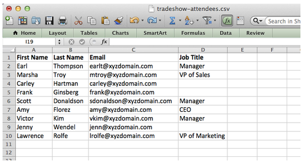
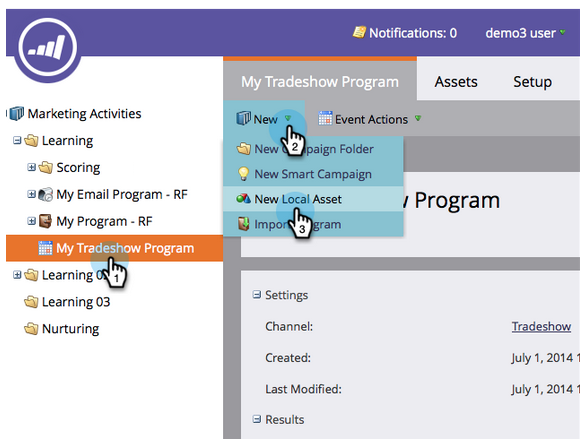
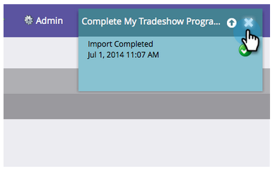

# Import a List of People {#import-a-list-of-people}

Import a List of People - Marketo Docs - Product Documentation

### Mission: Import a spreadsheet list of trade show attendees into your database {#importalistofpeople-mission-importaspreadsheetlistoftradeshowattendeesintoyourdatabase}

>[!NOTE]
>
>**FYI**
>
>Marketo is now standardizing language across all subscriptions, so you may see lead/leads in your subscription and person/people in docs.marketo.com. These terms mean the same thing; it does not affect article instructions. There are some other changes, too. [Learn more](http://docs.marketo.com/display/DOCS/Updates+to+Marketo+Terminology).

>[!NOTE]
>
>**Prerequisites**
>
>* [Get Set Up and Add a Person](get-set-up-and-add-a-person.md) 
>

### What's in this article? {#what-s-in-this-article}

[Step 1: Download and Edit a Spreadsheet](#importalistofpeople-step1-downloadandeditaspreadsheet)  
[Step 2: Create a Program](#importalistofpeople-step2-createaprogram)  
[Step 3: Import Your Spreadsheet into Marketo](#importalistofpeople-step3-importyourspreadsheetintomarketo)  
  
`In this tutorial, you'll learn how to import people from a spreadsheet file into Marketo.`

#### Step 1: Download and Edit a Spreadsheet {#importalistofpeople-step1-downloadandeditaspreadsheet}

1. To start, download our practice spreadsheet file (** [tradeshow-attendees.csv](http://docs.marketo.com/display/docs/assets/tradeshow-attendees.csv)**) to your computer.

   

   >[!NOTE]
   >
   >**Reminder**
   >
   >
   >When importing a date, use this format: **9/21/15** (Month/Day/Year).

   >[!NOTE]
   >
   >Any date/time fields being imported are treated as Central Time. If you have date/time fields in a different time zone, you can use an Excel formula to transform it to Central Time (America/Chicago).

1. Add your own first name, last name, email address, and job title, then save the file on your computer. 

   

>[!NOTE]
>
>Enter your real email address in the CSV file so you can receive the nurturing emails you'll send in the next mission.

#### Step 2: Create a Program {#importalistofpeople-step2-createaprogram}

1. Go to the **Marketing Activities** area.

   

1. Select your **Learning** folder, then under **New** click **New Program**.

   

1. **Name** the program "My Tradeshow Program" and select "Event" for the **Program Type.**

   

1. Select **Tradeshow** for the **Channel** and click **Create**.

   

>[!NOTE]
>
>**Deep Dive**
>
>Event programs occur on specific dates. Learn more about [**Events**](../../../welcome-to-marketo-docs/product-docs/demand-generation/events.md).

#### Step 3: Import Your Spreadsheet into Marketo {#importalistofpeople-step3-importyourspreadsheetintomarketo}

1. In **My Tradeshow Program**, click **New** and select **New Local Asset**.

   

1. Click **List**.

   

1. **Name** the list "Tradeshow Attendees" and click **Create**.

   

1. In your **Tradeshow Attendees** list, click **List Actions** and select **Import List**.

   

   >[!CAUTION]
   >
   >If you are using your own CSV file, make sure that it is encoded UTF-8, UTF-16, Shift-JIS, or EUC-JP.

   >[!NOTE]
   >
   >The size limit for CSV files is 100MB.

1. **Browse** to the **tradeshow-attendees.csv** spreadsheet file on your computer and click **Next**.

   

   >[!NOTE]
   >
   >In List Import Mode, choosing **Skip new people and updates** `means you will not impact existing person records or log any activities. Use this mode if you want a quick, pre-filtered static list of existing people for use in your marketing activities. Selecting this mode will:`
   >
   >    
   >    
   >    * Skip new person creation
   >    * Skip person field updates
   >    * Skip activity logging
   >    
   >

1. Map your List Column fields to their respective Marketo Field and click **Next**.

   

   >[!TIP]
   >
   >Column headers should always match the field exactly (case sensitive) in order to achieve the best auto-mapping results. If you're using custom fields and don't see them in the drop-down, go back and [create them](http://docs.marketo.com/display/DOCS/Create+a+Custom+Field+in+Marketo) so they can become options.

   >[!NOTE]
   >
   >If there are any fields you don't want to import, select **Ignore** in the Marketo Field drop-down menu.

1. Select **My Tradeshow Program** for the **Acquisition Program**, then click **Import**.

   

1. Wait for your people to import, then close the import progress pop-up.

   

1. Back in **My Tradeshow Program**, click the **Members** tab. You'll see all the people you just imported.

   

>[!NOTE]
>
>**Deep Dive**
>
>You can analyze the success of your program by tracking program membership. Learn more about [ **Programs** ](../../../welcome-to-marketo-docs/product-docs/core-marketo-concepts/programs.md).

### Mission Complete {#importalistofpeople-missioncomplete}

Your tradeshow attendees are now members of your Marketo program!

---

[◄ Mission 4: Email Auto Response](email-auto-response.md) [Mission 6: Drip, Drip, Nurture ►](drip-drip-nurture.md) 