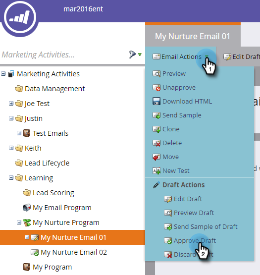

# Personalize an Email {#personalize-an-email}

Personalize an Email - Marketo Docs - Product Documentation

### Mission: Make your emails personal by adding data tokens {#personalizeanemail-mission-makeyouremailspersonalbyaddingdatatokens}

>[!NOTE]
>
>**FYI**
>
>Marketo is now standardizing language across all subscriptions, so you may see lead/leads in your subscription and person/people in docs.marketo.com. These terms mean the same thing; it does not affect article instructions. There are some other changes, too. [Learn more](http://docs.marketo.com/display/DOCS/Updates+to+Marketo+Terminology).

>[!NOTE]
>
>**Prerequisites**
>
>* [Get Set Up and Add a Person](get-set-up-and-add-a-person.md)
>* [Send an Email Blast](send-an-email.md)
>* [Drip, Drip, Nurture](drip-drip-nurture.md)
>

### What's in this article? {#what-s-in-this-article}

[Step 1: Select an Email to Personalize](#personalizeanemail-step1-selectanemailtopersonalize)  
[Step 2: Make the Salesperson the Sender](#personalizeanemail-step2-makethesalespersonthesender)  
[Step 3: Add the Lead's Name to the Email](#personalizeanemail-step3-addthelead'snametotheemail)

#### Step 1: Select an Email to Personalize {#personalizeanemail-step1-selectanemailtopersonalize}

1. Select one of the nurture emails created in the [previous quick win](drip-drip-nurture.md) and click **Edit Draft**.

   

   >[!NOTE]
   >
   >
   >This creates a copy of the email as a draft. You must approve the draft for the changes to go live.

   **Edit Draft**

If you haven't enabled a pop-up blocker, the email editor will open in a new tab/window. Otherwise, click  twice. 

#### Step 2: Make the Salesperson the Sender {#personalizeanemail-step2-makethesalespersonthesender}

1. Select the **From **field, highlight and **delete** the current name.

   

1. Click the **Token** icon to the right of the **From **field.

   

1. Find and select the **{{****lead.Lead Owner First Name}} **token.

   

1. Type your company name and a dash for the **Default Value** to ensure something is displayed in case the sale rep's first name is unavailable. Click **Insert**.

   

1. Hit the space bar in the **From **field, making sure the cursor is flashing one space after the token you just inserted. Then click the **Token** icon again.

   

1. Find and select the **{{****lead.Lead Owner Last Name}} **token.

   

1. Type "Sales" for the **Default Value** and click **Insert**.

   

#### Step 3: Add the Lead's Name to the Email {#personalizeanemail-step3-addthelead'snametotheemail}

1. Select the top editable section, click the gear icon and select **Edit**.

   

1. Add a space after "Hello" and place your cursor in front of the comma, then click the **Insert Token** icon.

   

1. Find and select the **{{lead.First Name}}** token.

   

1. Enter "Friend" (or any label you'd like) in the **Default Value** field and click **Insert**.

   

   >[!TIP]
   >
   >Always include a default value for tokens; this ensures the default value will be displayed in the email if some part of the personal information is missing.

   ##### Click Save. {#personalizeanemail-clicksave.}

   

1. Close the email editor tab/window.

   

1. Under **Email Actions**, select **Approve Draft**.

   

>[!TIP]
>
>Need a quick refresher on how to send yourself the email? See [Send an Email Blast](send-an-email.md).

### Watch a Video {#personalizeanemail-watchavideo}

`<iframe width="630" height="470" src="//play.vidyard.com/iRnqxMyJg6VKyuPeuxmHFb.html?v=3.1.1" frameborder="0" allowfullscreen></iframe>` 

###   
Mission Complete {#personalizeanemail-missioncomplete}

Congratulations, you've personalized your email!

---

[◄ Mission 6: Drip, Drip, Nurture](drip-drip-nurture.md) [Mission 8: Alert the Sales Rep ►](alert-the-sales-rep.md) 