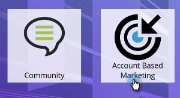
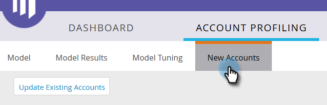
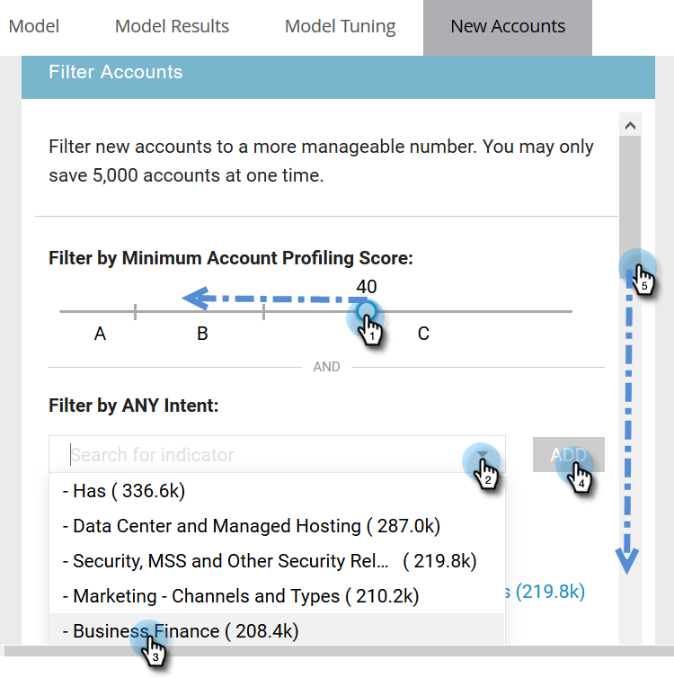
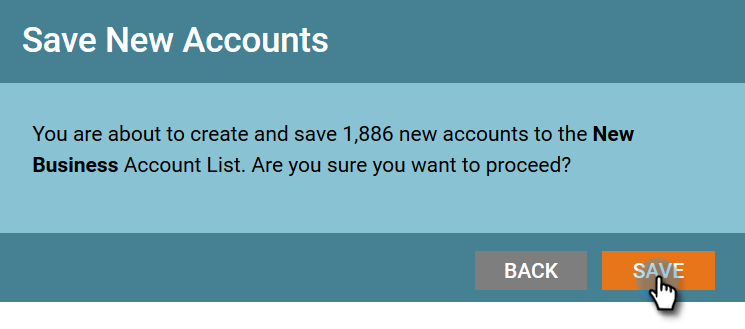

# New Account Discovery {#new-account-discovery}

New Account Discovery - Marketo Docs - Product Documentation

New Account Discovery can help you find new accounts to target by using AI-powered recommendations from your ideal customer profile.

>[!NOTE]
>
>**Prerequisites**
>
>[Set up Account Profiling](http://docs.marketo.com/x/FgAKAQ)

>[!TIP]
>
>It's recommended to press the **Update Existing Accounts** button before performing a new account search to ensure you are looking at the most recent data. This update can take up to 24 hours.

##### 1. In My Marketo, click ABM. {#newaccountdiscovery-inmymarketo-clickabm.}

##### 2. Click the Account Profiling tab. {#newaccountdiscovery-clicktheaccountprofilingtab.}

##### 3. Click the New Accounts tab. {#newaccountdiscovery-clickthenewaccountstab.}

>[!NOTE]
>
>New Accounts shows a list of accounts that are not yours in ABM, yet. They are accounts that have the potential to be new for you based on filters you select.

##### 4. Select all applicable filters (this part is highly customizable, the following is just one example to demonstrate filtering). {#newaccountdiscovery-selectallapplicablefilters(thispartishighlycustomizable-thefollowingisjustoneexampletodemonstratefiltering).}

##### 5. Click Save All & Create List on the bottom-right of the page. {#newaccountdiscovery-clicksaveall&createlistonthebottom-rightofthepage.}

>[!NOTE]
>
>If you only see a few accounts you want, you have the option of clicking on individual accounts and clicking **Save Selected Accounts** when done.

##### 6. You can make your list its own new Account List, or add it to an existing one. In this example, we'll create a new one. {#newaccountdiscovery-youcanmakeyourlistitsownnewaccountlist-oraddittoanexistingone.inthisexample-we'llcreateanewone.}

>[!NOTE]
>
>To save it to an existing Account List, select that option, click the drop-down and select the desired Account List, and click **Next**.

##### 7. Click Save. {#newaccountdiscovery-clicksave.}

>[!NOTE]
>
>You can only save up to 5,000 accounts at a time. If your search yields 10,000 results, you'll have to save the first (top) 5,000, then reset the filters and save the next 5,000. The **total** account limit is one million.

##### 8. Click OK. {#newaccountdiscovery-clickok.}

>[!TIP]
>
>After your accounts are saved, you can use a [matched audience on LinkedIn](http://docs.marketo.com/x/rYGZAQ) to target them.

