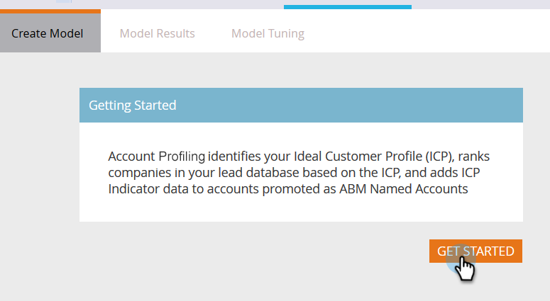
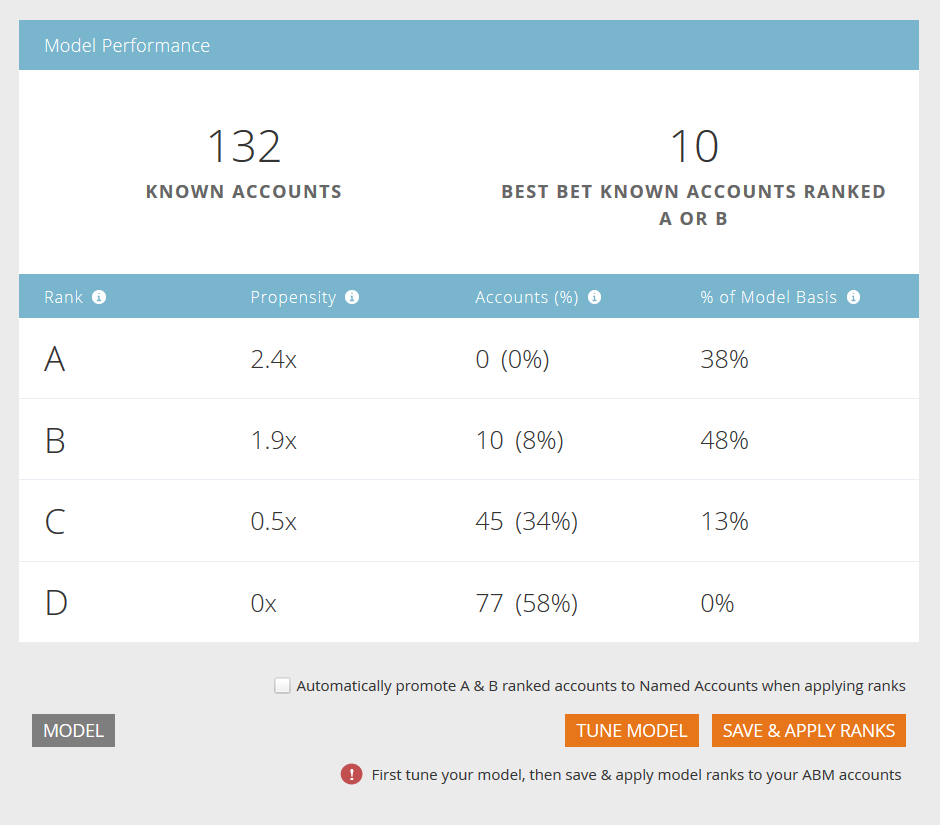

# Setting up Account Profiling {#setting-up-account-profiling}

Setting up Account Profiling - Marketo Docs - Product Documentation

Follow these steps to start using Account Profiling.

##### 1. In My Marketo, open Account Based Marketing. {#settingupaccountprofiling-inmymarketo-openaccountbasedmarketing.}

##### 2. Click the Account Profiling tab. {#settingupaccountprofiling-clicktheaccountprofilingtab.}

##### 3. The Create Model tab is opened by default. Click Get Started. {#settingupaccountprofiling-thecreatemodeltabisopenedbydefault.clickgetstarted.}

##### 4. Give your model a name, choose who will be included in the results, and who will serve as the basis for the Ideal Customer Profile (ICP). Click Create Model when done. {#settingupaccountprofiling-giveyourmodelaname-choosewhowillbeincludedintheresults-andwhowillserveasthebasisfortheidealcustomerprofile(icp).clickcreatemodelwhendone.}

##### 5. Your model will begin its build. It may take a while, but don't worry, you'll be notified when it's done. {#settingupaccountprofiling-yourmodelwillbeginitsbuild.itmaytakeawhile-butdon'tworry-you'llbenotifiedwhenit'sdone.}

##### 6. To see the results of your model, click See Model Result. {#settingupaccountprofiling-toseetheresultsofyourmodel-clickseemodelresult.}

Your model is now created.

>[!TIP]
>
>Now that your model is created, learn how to tune it in the [Account Profiling Overview](http://docs.marketo.com/x/NIDv).

