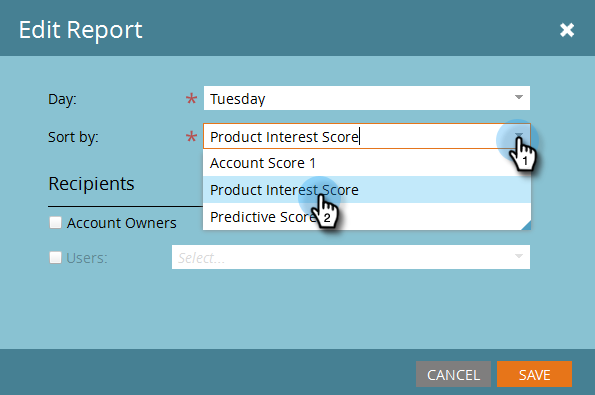

# ABM Report Setup {#abm-report-setup}

ABM Report Setup - Marketo Docs - Product Documentation

The ABM Sales Report is a weekly, personalized email sent to the account team.

### What's in this article? {#what-s-in-this-article}

[Report Setup](#abmreportsetup-reportsetup)  
[How to Unsubscribe](#abmreportsetup-howtounsubscribe)  
[How to Resubscribe](#abmreportsetup-howtoresubscribe)

#### Report Setup {#abmreportsetup-reportsetup}

##### 1. Click Admin. {#abmreportsetup-clickadmin.}

##### 2. Click ABM. {#abmreportsetup-clickabm.}

##### 3. Under Weekly Report, click Edit. {#abmreportsetup-underweeklyreport-clickedit.}

##### 4. Click the Day drop-down and select the day of the week you want the recipients to receive the email. {#abmreportsetup-clickthedaydrop-downandselectthedayoftheweekyouwanttherecipientstoreceivetheemail.}

##### 5. To determine the layout of your email, click the Sort By drop-down and make a selection. {#abmreportsetup-todeterminethelayoutofyouremail-clickthesortbydrop-downandmakeaselection.}

##### 6. Check the Users checkbox, then click the drop-down and select who you want to receive the email. {#abmreportsetup-checktheuserscheckbox-thenclickthedrop-downandselectwhoyouwanttoreceivetheemail.}

>[!NOTE]
>
>Notifications will only be sent to account owners or team members.

##### 7. Click Save. {#abmreportsetup-clicksave.}

And that's it! 

#### How to Unsubscribe {#abmreportsetup-howtounsubscribe}

Each report comes with the option to opt out. To do so simply click **Unsubscribe** at the bottom of the email.

#### How to Resubscribe {#abmreportsetup-howtoresubscribe}

##### 1. Click Admin. {#abmreportsetup-clickadmin..1}

##### 2. Click ABM. {#abmreportsetup-clickabm..1}

##### 3. Under Weekly Report, click the number listed as Unsubscribed. {#abmreportsetup-underweeklyreport-clickthenumberlistedasunsubscribed.}

##### 4. Click the Users drop-down. {#abmreportsetup-clicktheusersdrop-down.}

##### 5. Select the user you want to receive emails again and click Resubscribe. {#abmreportsetup-selecttheuseryouwanttoreceiveemailsagainandclickresubscribe.}

