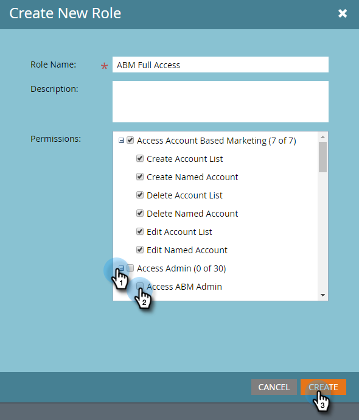

# Permissions {#permissions}

Permissions - Marketo Docs - Product Documentation

You'll need to set-up permissions for your users to be able to use ABM. Here's how.

##### 1. Click Admin. {#permissions-clickadmin.}

##### 2. Click Users & Roles. {#permissions-clickusers&roles.}

>[!NOTE]
>
>You can add ABM permissions for an existing role, or create a brand new one. This example uses a new role.

##### 3. Click Roles, then New Role. {#permissions-clickroles-thennewrole.}

##### 4. Enter a Role Name and click the + icon next to the Access Account Based Marketing checkbox. {#permissions-enterarolenameandclickthe+iconnexttotheaccessaccountbasedmarketingcheckbox.}

##### 5. To select *all* permissions, simply check the Access Account Based Marketing checkbox. {#permissions-toselectallpermissions-simplychecktheaccessaccountbasedmarketingcheckbox.}

>[!NOTE]
>
>You also have the option to select only some of the options. Do that by checking each checkbox individually.

##### 6. Click the + to open the Access Admin menu. Check the Access ABM Admin checkbox. {#permissions-clickthe+toopentheaccessadminmenu.checktheaccessabmadmincheckbox.}

   
Your new ABM role is now ready to be [assigned to a user](http://docs.marketo.com/display/public/DOCS/Managing+User+Roles+and+Permissions#ManagingUserRolesandPermissions-AssignRolestoaUser)!

