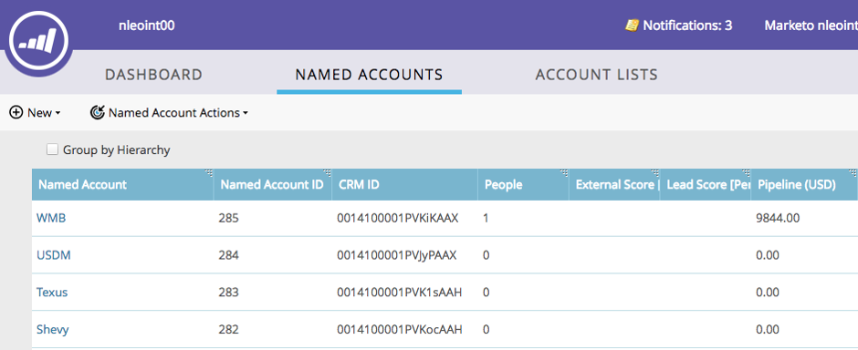
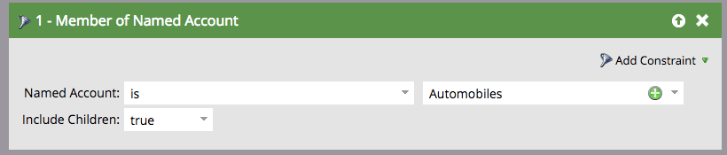

# ABM Hierarchies {#abm-hierarchies}

ABM Hierarchies - Marketo Docs - Product Documentation

Hierarchies give ABM users the ability to inherit the parent/child relationships between Named Accounts in their CRM.

#### What are ABM Hierarchies? {#abmhierarchies-whatareabmhierarchies?}

Companies can have multiple divisions and subsidiaries. Those companies often organize themselves through parent-child relationships called hierarchies. ABM can inherit these hierarchies from your SFDC or MSD integration and allow you to work with the different divisions as a single family.

#### Working with ABM Hierarchies {#abmhierarchies-workingwithabmhierarchies}

With ABM Hierarchies, you can quickly obtain information about an entire hierarchy or individual accounts in the Named Account Dashboard.

##### Not using Hierarchy {#abmhierarchies-notusinghierarchy}

##### Using Hierarchy {#abmhierarchies-usinghierarchy}

>[!NOTE]
>
>The Marketo interface will only show up to 10 levels down (child and grandchild accounts of the parent account), however there is no limit to the number of child accounts you can create.

Target and report on entire hierarchies with [one click](http://docs.marketo.com/display/DOCS/Account+Filters#AccountFilters-MemberofNamedAccount).

