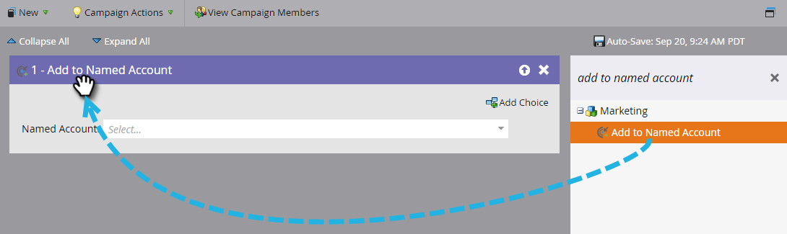

# Add People to a Named Account {#add-people-to-a-named-account}

Add People to a Named Account - Marketo Docs - Product Documentation

There are three different ways to manually add people to a named account in ABM.

### What's in this article? {#what-s-in-this-article}

[Single Flow Action](#addpeopletoanamedaccount-singleflowaction)  
[Smart Campaign Flow Step](#addpeopletoanamedaccount-smartcampaignflowstep)  
[List Import](#addpeopletoanamedaccount-listimport)

#### Single Flow Action {#addpeopletoanamedaccount-singleflowaction}

##### 1. Click Database. {#addpeopletoanamedaccount-clickdatabase.}

##### 2. Enter the person's email address and press enter. {#addpeopletoanamedaccount-entertheperson'semailaddressandpressenter.}

##### 3. Click the person to select it. Click the Person Actions drop-down, click Marketing and select Add to Named Account. {#addpeopletoanamedaccount-clickthepersontoselectit.clickthepersonactionsdrop-down-clickmarketingandselectaddtonamedaccount.}

##### 4. Click the Named Account drop-down, select the desired Named Account, and click Run Now. {#addpeopletoanamedaccount-clickthenamedaccountdrop-down-selectthedesirednamedaccount-andclickrunnow.}

#### Smart Campaign Flow Step {#addpeopletoanamedaccount-smartcampaignflowstep}

##### 1. Select your Smart Campaign and click Flow. {#addpeopletoanamedaccount-selectyoursmartcampaignandclickflow.}

##### 2. In the search box enter "Add to Named Account." {#addpeopletoanamedaccount-inthesearchboxenter"addtonamedaccount."}

##### 3. Drag the filter onto the canvas. {#addpeopletoanamedaccount-dragthefilterontothecanvas.}

##### 4. Click the Named Account drop-down and select the desired Named Account. {#addpeopletoanamedaccount-clickthenamedaccountdrop-downandselectthedesirednamedaccount.}

That's it! Next just schedule (or activate) your smart campaign, and the flow step will start adding qualifying people to the designated named account.

#### List Import {#addpeopletoanamedaccount-listimport}

##### 1. Select your list, click the List Actions drop-down and select Import List. {#addpeopletoanamedaccount-selectyourlist-clickthelistactionsdrop-downandselectimportlist.}

 

##### 2. After you choose your file and settings, click Next. {#addpeopletoanamedaccount-afteryouchooseyourfileandsettings-clicknext.}

 

##### 3. Map your desired fields. Make sure the Named Account field is mapped. {#addpeopletoanamedaccount-mapyourdesiredfields.makesurethenamedaccountfieldismapped.}

##### 4. Choose your desired settings, then click Import. {#addpeopletoanamedaccount-chooseyourdesiredsettings-thenclickimport.}

>[!NOTE]
>
>**Related Articles**
>
>[Lead to Account Matching](discover-accounts/lead-to-account-matching.md)

