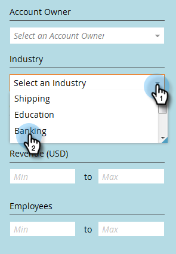
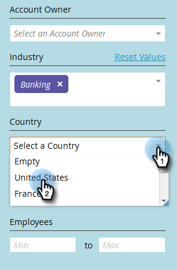

# Filtering in Named Accounts {#filtering-in-named-accounts}

Filtering in Named Accounts - Marketo Docs - Product Documentation

Filtering is a great way to narrow down data quickly.

>[!NOTE]
>
>Data in filter drop-downs reflects all available fields in your CRM that have been synced to Marketo.

##### 1. Click on the filter icon. {#filteringinnamedaccounts-clickonthefiltericon.}

>[!NOTE]
>
>There are a several search parameter combinations. In this example we locate: *Industry = Banking, Country = United States, Max Employees = 10000*.

##### 2. Click the Industry drop-down and select Banking. {#filteringinnamedaccounts-clicktheindustrydrop-downandselectbanking.}

##### 3. Click the Country drop-down and select United States. {#filteringinnamedaccounts-clickthecountrydrop-downandselectunitedstates.}

##### 4. Under Employees, type "0" in the Min field, "10000" in the Max field, then click Apply. {#filteringinnamedaccounts-underemployees-type"0"intheminfield-"10000"inthemaxfield-thenclickapply.}

And that's it! Your filtered results appear on the left side of the screen.

>[!NOTE]
>
>To add more filters to choose from, click **Add Filter** at the bottom left of the form.

