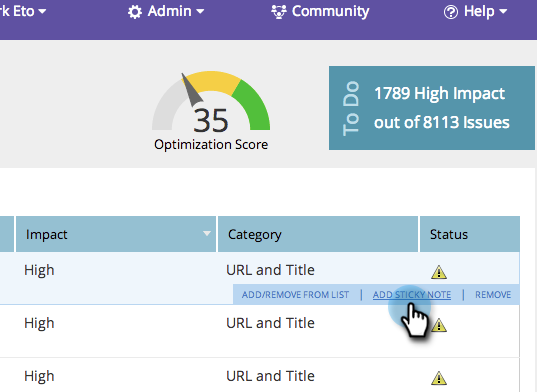

# SEO - Add Notes to Page Issues {#seo-add-notes-to-page-issues}

SEO - Add Notes to Page Issues - Marketo Docs - Product Documentation

Did you know you can add notes to page issues as personal reminders or team messages?

### What's in this article? {#what-s-in-this-article}

[Adding Notes in Page Issues Section](#seo-addnotestopageissues-addingnotesinpageissuessection)  
[Add Notes in Page Detail Drill Down](#seo-addnotestopageissues-addnotesinpagedetaildrilldown)

#### Adding Notes in Page Issues Section {#seo-addnotestopageissues-addingnotesinpageissuessection}

##### 1. Go to the Pages section. {#seo-addnotestopageissues-gotothepagessection.}

##### 2. On the pages tab, click Issues. {#seo-addnotestopageissues-onthepagestab-clickissues.}

##### 3. Hover over the issue you'd like to add a note to. Click ADD STICKY NOTE.  {#seo-addnotestopageissues-hoverovertheissueyou'dliketoaddanoteto.clickaddstickynote.}

##### 4. Enter a note in the yellow text box. Clicking outside of the text box will save the note.  {#seo-addnotestopageissues-enteranoteintheyellowtextbox.clickingoutsideofthetextboxwillsavethenote.}

>[!TIP]
>
>You can delete your note by clicking the small x in the upper left hand corner.

#### Add Notes in Page Detail Drill Down {#seo-addnotestopageissues-addnotesinpagedetaildrilldown}

1. Go to the Pages section.

   

1. Click on the page you wish to see details for.

   

1. Hover over the page issue you'd like to add a note to and click **ADD NOTE**.

   

1. Enter your note. Click **SAVE**.

   

   Groovy. Your note has been added.

   

