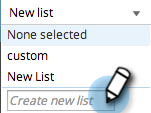

# SEO - Managing Lists {#seo-managing-lists}

SEO - Managing Lists - Marketo Docs - Product Documentation

You can add things to lists when you are adding keywords, pages, page issues, or inbound links. Lists help you stay organized and let you filter reports to only see data on that list. Here's how to make them:

1. Click **ADD KEYWORDS**.

   >[!NOTE]
   >
   >This works the same way when adding pages, pages issues, and inbound links.

   

1. Enter the keyword. Select a list to add it to from the drop-down.

   

   >[!TIP]
   >
   >`You can create a new list in the drop-down. Enter a title, hit the return key.`    >
   >

1. Click **SAVE**.

   

   Happy organizing!

