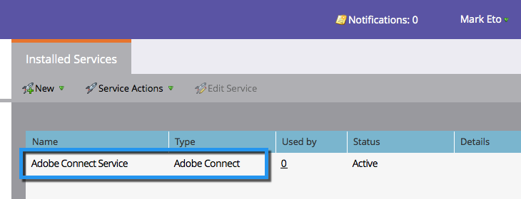

# Add Adobe Connect as a LaunchPoint Service {#add-adobe-connect-as-a-launchpoint-service}

Add Adobe Connect as a LaunchPoint Service - Marketo Docs - Product Documentation

Marketo manages your Adobe Connect webinar registration and attendance.

>[!NOTE]
>
>**Admin Permissions Required**

>[!NOTE]
>
>**Reminder**
>
>An existing subscription to Adobe Connect and administration rights are necessary for this step. Have the following settings at hand: username, password, participant password, and meeting folder URL.

>[!NOTE]
>
>Adobe Connect On Site is not currently supported.

##### 1. Go to Admin and click LaunchPoint. {#addadobeconnectasalaunchpointservice-gotoadminandclicklaunchpoint.}

##### 2. Select New and then New Service. {#addadobeconnectasalaunchpointservice-selectnewandthennewservice.}

##### 3. Enter a Display Name. Under Service, select Adobe Connect. {#addadobeconnectasalaunchpointservice-enteradisplayname.underservice-selectadobeconnect.}

##### 4. Enter your Username and Access Code. {#addadobeconnectasalaunchpointservice-enteryourusernameandaccesscode.}

##### 5. Complete the process by entering your Meeting Folder URL and Participant Password, then click Create. {#addadobeconnectasalaunchpointservice-completetheprocessbyenteringyourmeetingfolderurlandparticipantpassword-thenclickcreate.}

** 

**

>[!TIP]
>
>When you create the participant password, the value you choose is included in a query string when the links are sent out for the event. So, we suggest that you make it customer-friendly.

>[!NOTE]
>
>**Example**
>
>Once you've logged into your Adobe Connect account, select the **Seminars** tab. Without drilling down into any specific seminar, copy the URL from your browser bar into the **Meeting Folder URL **setting**.**

##### 6. Phenomenal! Your Adobe Connect Service is now synced with Marketo. {#addadobeconnectasalaunchpointservice-phenomenal!youradobeconnectserviceisnowsyncedwithmarketo.}

>[!NOTE]
>
>**Related Articles**
>
>Learn how to [create an event with Adobe Connect](../../../../welcome-to-marketo-docs/product-docs/demand-generation/events/create-an-event/create-an-event-with-adobe-connect.md).

