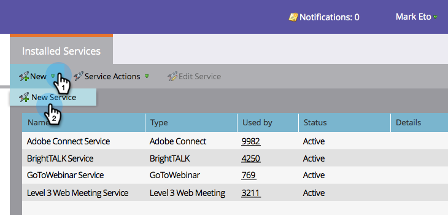
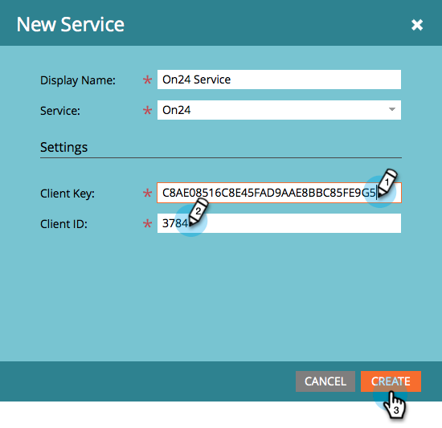
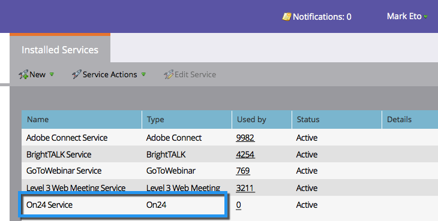

# Add ON24 as a LaunchPoint Service {#add-on-as-a-launchpoint-service}

Add ON24 as a LaunchPoint Service - Marketo Docs - Product Documentation

`Marketo manages` `your ON24 webinar registration and attendance.`

>[!NOTE]
>
>**Admin Permissions Required**

>[!NOTE]
>
>An existing subscription to ON24 and administration rights are necessary for this step. Have the following settings at hand: Client Key and Client ID. You can obtain the client ID and client key directly from your ON24 Account Manager.

`  
` 

##### 1. Go to Admin and click LaunchPoint. {#addon24asalaunchpointservice-gotoadminandclicklaunchpoint.}

##### 2. Select New and then New Service. {#addon24asalaunchpointservice-selectnewandthennewservice.}

##### 3. Enter a Display Name. Under Service, select ON24. {#addon24asalaunchpointservice-enteradisplayname.underservice-selecton24.}

##### 4. Complete the process by entering your Client Key and Client ID in Settings then click Create. {#addon24asalaunchpointservice-completetheprocessbyenteringyourclientkeyandclientidinsettingsthenclickcreate.}

##### 5. Your ON24 Account is now synced with Marketo.  {#addon24asalaunchpointservice-youron24accountisnowsyncedwithmarketo.}

>[!NOTE]
>
>**Related Articles**
>
>Learn how to [create your webinar event in ON24](../../../../welcome-to-marketo-docs/product-docs/demand-generation/events/create-an-event/create-an-event-with-the-marketo-on24-adapter/create-your-webinar-event-in-on24.md).

