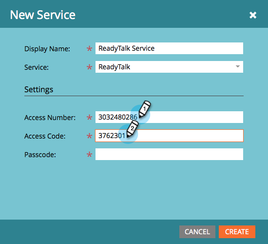

# Add ReadyTalk as a LaunchPoint Service {#add-readytalk-as-a-launchpoint-service}

Add ReadyTalk as a LaunchPoint Service - Marketo Docs - Product Documentation

`Marketo manages` `your ReadyTalk webinar registration and attendance.`

>[!NOTE]
>
>**Admin Permissions Required**

>[!NOTE]
>
>**Reminder**
>
>An existing subscription to ReadyTalk and administration rights are necessary for this step. Have the following settings at hand: Access Number, Access Code, and Passcode.

##### 1. Go to Admin and click ReadyTalk. {#addreadytalkasalaunchpointservice-gotoadminandclickreadytalk.}

##### 2. Select New and then New Service. {#addreadytalkasalaunchpointservice-selectnewandthennewservice.}

##### 3. Enter a Display Name. Under Service, select ReadyTalk. {#addreadytalkasalaunchpointservice-enteradisplayname.underservice-selectreadytalk.}

##### 4. Enter your Access Number and Access Code. {#addreadytalkasalaunchpointservice-enteryouraccessnumberandaccesscode.}

##### 5. Complete the process by entering your Passcode and click Create. {#addreadytalkasalaunchpointservice-completetheprocessbyenteringyourpasscodeandclickcreate.}

##### 6. Phenomenal! Your ReadyTalk account is now synced with Marketo. {#addreadytalkasalaunchpointservice-phenomenal!yourreadytalkaccountisnowsyncedwithmarketo.}

>[!NOTE]
>
>**Related Articles**
>
>Learn how to [create an event with ReadyTalk](../../../../welcome-to-marketo-docs/product-docs/demand-generation/events/create-an-event/create-an-event-with-readytalk.md).

