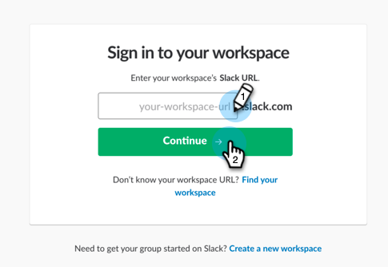
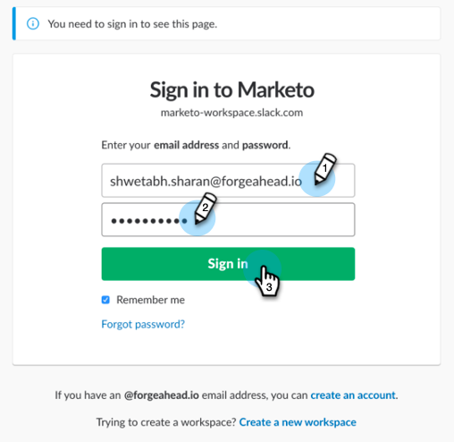

# Add Slack as a LaunchPoint Service {#add-slack-as-a-launchpoint-service}

Add Slack as a LaunchPoint Service - Marketo Docs - Product Documentation

There are two notification types included in the Slack integration:

* **System notifications**: Get Slack notifications regarding important events in your Marketo instance, like alerts about current campaign statuses and any issues that require immediate attention (CRM errors and API limits).
* **Interesting moments**: When a Marketo Insight has been triggered by a known individual from a sales account, lead owners can be notified via Slack. Notifications include lead information as well as details about the sales account.

>[!NOTE]
>
>**Admin Permissions Required**

>[!NOTE]
>
>**Prerequisites**
>
>If you don't have Slack System Notifications already enabled, please [contact Support](http://docs.marketo.com/cdn-cgi/l/email-protection#c4b7b1b4b4abb6b084a9a5b6afa1b0abeaa7aba9).

##### 1. Go to LaunchPoint, then under New click New Service. {#addslackasalaunchpointservice-gotolaunchpoint-thenundernewclicknewservice.}

##### 2. Enter a display name for your Slack integration. In the Service drop-down, select Slack. Click Create. {#addslackasalaunchpointservice-enteradisplaynameforyourslackintegration.intheservicedrop-down-selectslack.clickcreate.}

##### 3. Click Authorize. This opens Slack in a new tab, where you will complete the authorization and grant Marketo permission to pull information from Slack. {#addslackasalaunchpointservice-clickauthorize.thisopensslackinanewtab-whereyouwillcompletetheauthorizationandgrantmarketopermissiontopullinformationfromslack.}

##### 4. In the new Slack tab, enter your workspace's URL and click Continue. {#addslackasalaunchpointservice-inthenewslacktab-enteryourworkspace'surlandclickcontinue.}

##### 5. Enter your Slack credentials and click Sign in. {#addslackasalaunchpointservice-enteryourslackcredentialsandclicksignin.}

##### 6. In the Post to drop-down, select the channel where you want notifications from Marketo to be posted. Review the requested permissions, then click Authorize. {#addslackasalaunchpointservice-intheposttodrop-down-selectthechannelwhereyouwantnotificationsfrommarketotobeposted.reviewtherequestedpermissions-thenclickauthorize.}

##### 7. You should see the confirmation screen below. The tab closes automatically. {#addslackasalaunchpointservice-youshouldseetheconfirmationscreenbelow.thetabclosesautomatically.}

##### 8. Refresh the Marketo tab and confirm that Slack is now listed as an active service in LaunchPoint. {#addslackasalaunchpointservice-refreshthemarketotabandconfirmthatslackisnowlistedasanactiveserviceinlaunchpoint.}

Notifications will now begin posting to the channel you selected in step 6. They'll look something like this:

