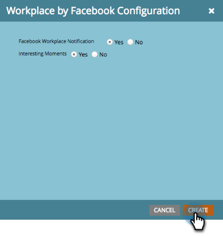

# Add Workplace By Facebook as a LaunchPoint Service {#add-workplace-by-facebook-as-a-launchpoint-service}

Add Workplace By Facebook as a LaunchPoint Service - Marketo Docs - Product Documentation

There are two notification types included in the Workplace integration:

* **System notifications**: Get Workplace notifications regarding important events in your Marketo instance, like alerts about current campaign statuses and any issues that require immediate attention (CRM errors and API limits).
* **Interesting moments**: When a Marketo Insight has been triggered by a known individual from a sales account, lead owners can be notified via Workplace. Notifications include lead information as well as details about the sales account.

>[!NOTE]
>
>**Admin Permissions Required**

>[!NOTE]
>
>**Prerequisites**
>
>If you don't have Workplace Notifications already enabled, please [contact Support](http://docs.marketo.com/cdn-cgi/l/email-protection#483b3d3838273a3c0825293a232d3c27662b2725).

##### 1. Go to LaunchPoint, then under New click New Service. {#addworkplacebyfacebookasalaunchpointservice-gotolaunchpoint-thenundernewclicknewservice.}

##### 2. Enter a display name for your Workplace integration. In the Service drop-down, select Workplace by Facebook. Click Create. {#addworkplacebyfacebookasalaunchpointservice-enteradisplaynameforyourworkplaceintegration.intheservicedrop-down-selectworkplacebyfacebook.clickcreate.}

##### 3. To receive system notifications and interesting moments, leave the options as is. Click Create. {#addworkplacebyfacebookasalaunchpointservice-toreceivesystemnotificationsandinterestingmoments-leavetheoptionsasis.clickcreate.}

##### 4. Click Authorize. This opens Workplace in a new tab, where you will complete the authorization and grant Marketo permission to pull information from Workplace. {#addworkplacebyfacebookasalaunchpointservice-clickauthorize.thisopensworkplaceinanewtab-whereyouwillcompletetheauthorizationandgrantmarketopermissiontopullinformationfromworkplace.}

##### 5. In the new Workplace tab, enter your business email or Workplace username and click Continue. {#addworkplacebyfacebookasalaunchpointservice-inthenewworkplacetab-enteryourbusinessemailorworkplaceusernameandclickcontinue.}

##### 6. Enter your Workplace credentials and click Log in. {#addworkplacebyfacebookasalaunchpointservice-enteryourworkplacecredentialsandclicklogin.}

##### 7. In the Workplace pop-up, choose a Facebook group where you want notifications from Marketo to be posted (e.g., Partner Integrations). Click Install. {#addworkplacebyfacebookasalaunchpointservice-intheworkplacepop-up-chooseafacebookgroupwhereyouwantnotificationsfrommarketotobeposted(e.g.-partnerintegrations).clickinstall.}

##### 8. You should see the confirmation notification below. The tab closes automatically. {#addworkplacebyfacebookasalaunchpointservice-youshouldseetheconfirmationnotificationbelow.thetabclosesautomatically.}

##### 9. Refresh the Marketo tab and confirm that Workplace is now listed as an active service in LaunchPoint. {#addworkplacebyfacebookasalaunchpointservice-refreshthemarketotabandconfirmthatworkplaceisnowlistedasanactiveserviceinlaunchpoint.}

Notifications will now begin posting to the Facebook group you selected in step 7. They'll look something like this:

