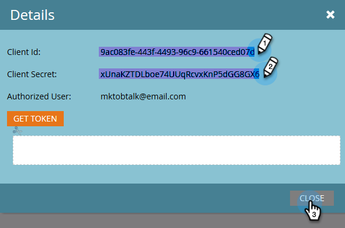

# Connect BrightTALK to Marketo {#connect-brighttalk-to-marketo}

Connect BrightTALK to Marketo - Marketo Docs - Product Documentation

Learn how to connect your BrightTALK channel to your Marketo instance. In order to do this, you must be an Admin for both.

>[!NOTE]
>
>**Admin Permissions Required**

#### Steps in BrightTALK {#connectbrighttalktomarketo-stepsinbrighttalk}

##### 1. Log-in to [business.brighttalk.com/demandcentral](http://business.brighttalk.com/demandcentral/login) and click Connect Now. {#connectbrighttalktomarketo-log-intobusiness.brighttalk.com/demandcentralandclickconnectnow.}

##### 2. Under Advanced Marketo Connector, click Connect. {#connectbrighttalktomarketo-underadvancedmarketoconnector-clickconnect.}

##### 3. You will come to the credentials screen, asking for: Client ID, Client Secret, Identity Service URL, and Rest Service URL. To get this information, log-in to Marketo. {#connectbrighttalktomarketo-youwillcometothecredentialsscreen-askingfor-clientid-clientsecret-identityserviceurl-andrestserviceurl.togetthisinformation-log-intomarketo.}

#### Steps in Marketo {#connectbrighttalktomarketo-stepsinmarketo}

>[!NOTE]
>
>At this point you'll be required to set up an API Only User Role and API User in order to restrict what permissions BrightTALK will have in your Marketo instance. Because we already have articles for those steps, we'll link you to them.

##### 4. Create an [API Only User Role](http://docs.marketo.com/x/iwMk). {#connectbrighttalktomarketo-createanapionlyuserrole.}

##### 5. [Create an API User](http://docs.marketo.com/x/jwMk), using the BrightTALK API Role you created during Step 4. {#connectbrighttalktomarketo-createanapiuser-usingthebrighttalkapiroleyoucreatedduringstep4.}

##### 6. Go back to the Admin area. {#connectbrighttalktomarketo-gobacktotheadminarea.}

##### 7. Under Integration, click LaunchPoint. {#connectbrighttalktomarketo-underintegration-clicklaunchpoint.}

##### 8. Click the New drop-down and select New Service. {#connectbrighttalktomarketo-clickthenewdrop-downandselectnewservice.}

##### 9. Enter a Display Name of your choice. Click the Service drop-down and select Custom (do not select BrightTALK). {#connectbrighttalktomarketo-enteradisplaynameofyourchoice.clicktheservicedrop-downandselectcustom(donotselectbrighttalk).}

>[!CAUTION]
>
>Remember to not select BrightTALK in the drop-down. It is a field we are in the process of removing, and selecting it could create significant issues with your Marketo/BrightTALK integration.

##### 10. Enter a Description of your choice. Click the API Only User drop-down and select the BrightTALK API User you created during Step 5. Click Create. {#connectbrighttalktomarketo-enteradescriptionofyourchoice.clicktheapionlyuserdrop-downandselectthebrighttalkapiuseryoucreatedduringstep5.clickcreate.}

##### 11. Click View Details for the custom service you just created. {#connectbrighttalktomarketo-clickviewdetailsforthecustomserviceyoujustcreated.}

##### 12. Copy (and save) the Client ID and Client Secret. Click Close. {#connectbrighttalktomarketo-copy(andsave)theclientidandclientsecret.clickclose.}

##### 13. Under Integration, select Web Services. {#connectbrighttalktomarketo-underintegration-selectwebservices.}

##### 14. Under Rest API, copy (and save) the Endpoint and Identity. {#connectbrighttalktomarketo-underrestapi-copy(andsave)theendpointandidentity.}

#### Steps in BrightTALK {#connectbrighttalktomarketo-stepsinbrighttalk.1}

##### 15. Return to the BrightTALK connector set-up screen from Step 3, and enter the credentials you saved from Steps 12 and 14.  {#connectbrighttalktomarketo-returntothebrighttalkconnectorset-upscreenfromstep3-andenterthecredentialsyousavedfromsteps12and14.}

After the credentials are authenticated, you've officially connected BrightTALK to Marketo. The next step is to determine [which data fields you'd like to sync](http://support.brighttalk.com/hc/en-us/articles/115005131274-BrightTALK-Connector-for-Marketo-Choose-the-Fields-to-Sync).
