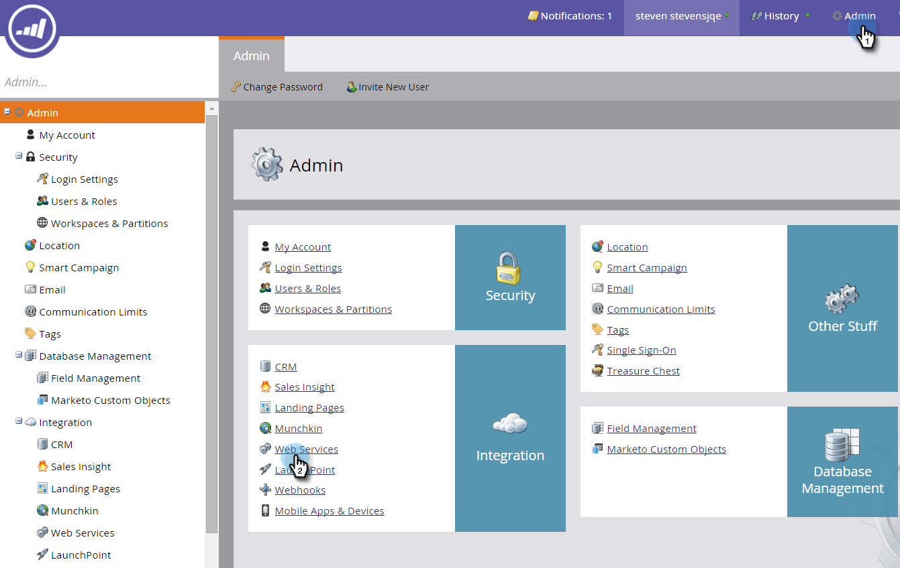

# Create a Whitelist for IP-Based API Access {#create-a-whitelist-for-ip-based-api-access}

Create a Whitelist for IP-Based API Access - Marketo Docs - Product Documentation

Sometimes, you want to give API access only to a specific IP address or a range of addresses. To do this, you first enable restrictions, then specify the IP addresses that are allowed to use the APIs.

>[!NOTE]
>
>**Admin Permissions Required**

##### 1. Go to Admin and click Web Services. {#createawhitelistforip-basedapiaccess-gotoadminandclickwebservices.}

##### 2. In the IP Restrictions area, click Edit, or click Edit IP Restrictions in the upper left. {#createawhitelistforip-basedapiaccess-intheiprestrictionsarea-clickedit-orclickeditiprestrictionsintheupperleft.}

##### 3. Check the Enable IP Restrictions box and enter the IP addresses you want to whitelist. {#createawhitelistforip-basedapiaccess-checktheenableiprestrictionsboxandentertheipaddressesyouwanttowhitelist.}

>[!NOTE]
>
>You can enter a single IP address or a range of them, or use a wildcard.

##### 4. Click Add to open additional fields to enter more IP addresses. {#createawhitelistforip-basedapiaccess-clickaddtoopenadditionalfieldstoentermoreipaddresses.}

##### 5. Click Save. {#createawhitelistforip-basedapiaccess-clicksave.}

