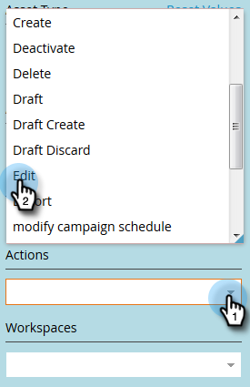

# Filtering in Audit Trail {#filtering-in-audit-trail}

Filtering in Audit Trail - Marketo Docs - Product Documentation

Filter by time frame, asset type, users, action taken, and more.

##### 1. Click Admin. {#filteringinaudittrail-clickadmin.}

##### 2. Under Security, select Audit Trail. {#filteringinaudittrail-undersecurity-selectaudittrail.}

##### 3. Click on the filter icon. {#filteringinaudittrail-clickonthefiltericon.}

>[!NOTE]
>
>There are a multitude of possible search parameter combinations. In this example we locate: *all emails - edited by anyone - in the previous seven days*.

##### 4. Click the Period drop-down and select Last 7 Days. {#filteringinaudittrail-clicktheperioddrop-downandselectlast7days.}

##### 5. Click the Asset Type drop-down and select Email. {#filteringinaudittrail-clicktheassettypedrop-downandselectemail.}

##### 6. Click the Actions drop-down and select Edit. {#filteringinaudittrail-clicktheactionsdrop-downandselectedit.}

##### 7. Click Apply. {#filteringinaudittrail-clickapply.}

##### 8. Filtered results appear on the left. {#filteringinaudittrail-filteredresultsappearontheleft.}

That's it!

>[!NOTE]
>
>If you have workspaces enabled, you will see audit data for all workspaces. If you apply a workspace filter, Marketo remembers the previous workspace value each time you use audit trail. Workspace permissions at the asset level are enforced.

>[!NOTE]
>
>**Related Articles**
>
>* [Change Details in Audit Trail](change-details-in-audit-trail.md)
>

