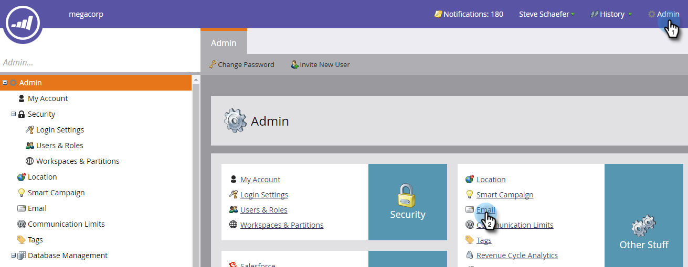
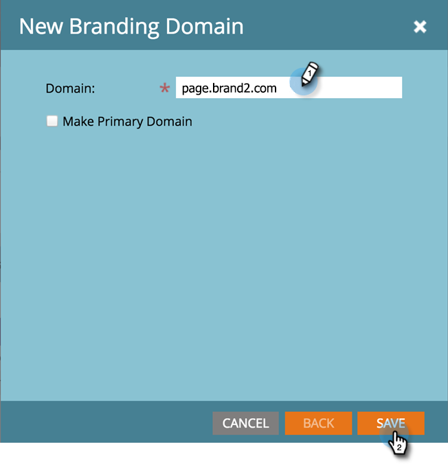

# Add an Additional Branding Domain {#add-an-additional-branding-domain}

Add an Additional Branding Domain - Marketo Docs - Product Documentation

Add an additional branding domain when you're running multiple brands out of a single Marketo instance and want them each to have their own branded tracking links.

>[!NOTE]
>
>**Prerequisites**
>
>You must [replace the generic tracking link](edit-your-default-branding-domain.md) with a branded domain before adding additional branded domains.

##### 1. In My Marketo, click Admin and then the Email link. {#addanadditionalbrandingdomain-inmymarketo-clickadminandthentheemaillink.}

##### 2. Click Add to add an additional branding domain. {#addanadditionalbrandingdomain-clickaddtoaddanadditionalbrandingdomain.}

##### 3. Enter the name of your new branding domain and click Save. {#addanadditionalbrandingdomain-enterthenameofyournewbrandingdomainandclicksave.}

>[!NOTE]
>
>You can choose to make this your primary domain, and all existing unsent emails set to “Default” and all newly created emails will default to the primary domain. You will be able to [overwrite this on a per-email basis](overwrite-primary-domain-for-emails.md).

>[!NOTE]
>
>**Related Articles**
>
>* [Edit Your Default Branding Domain](edit-your-default-branding-domain.md)
>

