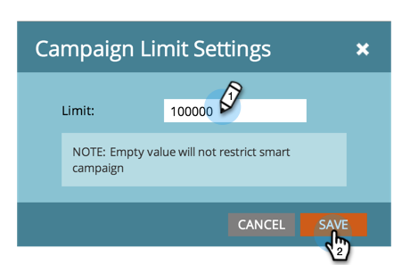

# Enable Person Restrictions for Smart Campaigns {#enable-person-restrictions-for-smart-campaigns}

Enable Person Restrictions for Smart Campaigns - Marketo Docs - Product Documentation

>[!NOTE]
>
>**FYI**
>
>Marketo is now standardizing language across all subscriptions, so you may see lead/leads in your subscription and person/people in docs.marketo.com. These terms mean the same thing; it does not affect article instructions. There are some other changes, too. [Learn more](http://docs.marketo.com/display/DOCS/Updates+to+Marketo+Terminology).

There is a feature in Marketo to limit the ***maximum ***number of people that can qualify for a smart campaign. This avoids accidentally emailing your whole database.

>[!NOTE]
>
>**Admin Permissions Required**

>[!CAUTION]
>
>This applies only to batch campaigns and email programs.

1. Click **Admin **and then **Smart Campaign**.

   

   Click **Edit**.

   

   >[!CAUTION]
   >
   >
   >If the number of people that qualify to run through a smart campaign exceeds the limit set, then it will not run at all.

   Enter a limit and then click **Save**.

   

   >[!TIP]
   >
   >
   >Disable this feature by making this field blank.

   >[!CAUTION]
   >
   >
   >`This limit is applied to all the smart campaigns but can be overridden at campaign level. Learn how to` [override person restrictions in a smart campaign](../../../../welcome-to-marketo-docs/product-docs/core-marketo-concepts/smart-campaigns/using-smart-campaigns/override-person-restrictions-in-a-smart-campaign.md).

`Bingo! You just turned on the safety switch. Good idea, right?` 

>[!NOTE]
>
>**Related Articles**
>
>* [Override Person Restrictions in a Smart Campaign](../../../../welcome-to-marketo-docs/product-docs/core-marketo-concepts/smart-campaigns/using-smart-campaigns/override-person-restrictions-in-a-smart-campaign.md)
>

