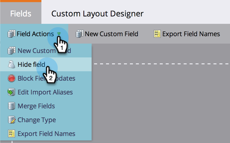

# Delete a Custom Field in Marketo {#delete-a-custom-field-in-marketo}

Delete a Custom Field in Marketo - Marketo Docs - Product Documentation

>[!NOTE]
>
>**Admin Permissions Required**

You may want to get rid of a field you created in the past if you no longer have a use for it. Unfortunately you can't delete fields in Marketo, but you *can* hide them from the user interface.

1. In **Admin**, go to **Field Management **and select your field. Under **Field Actions**, click **Hide Field**.

   

   For detailed step-by-step instructions, see [hide and unhide a field](hide-and-unhide-a-field.md).

