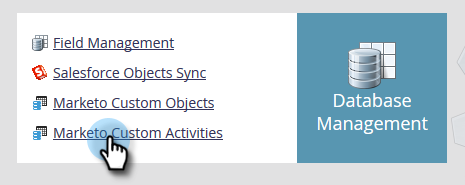
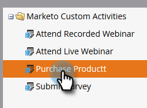

# Edit a Custom Activity {#edit-a-custom-activity}

Edit a Custom Activity - Marketo Docs - Product Documentation

Need to make changes to a custom activity you've already created? Here's how.

##### 1. Click Admin. {#editacustomactivity-clickadmin.}

##### 2. In Database Management click Custom Activities. {#editacustomactivity-indatabasemanagementclickcustomactivities.}

##### 3. Select the custom activity you want to edit. {#editacustomactivity-selectthecustomactivityyouwanttoedit.}

##### 4. Click Custom Activity Actions and select Edit Activity. {#editacustomactivity-clickcustomactivityactionsandselecteditactivity.}

Edit Activity Type appears. In this example we're fixing a typo.

##### 5. Enter your new info and click Submit. {#editacustomactivity-enteryournewinfoandclicksubmit.}

Your custom activity is now edited!

>[!NOTE]
>
>If your activity was a draft at the time of editing, it remains a draft. If it was published, the status changes to Published with Draft.

